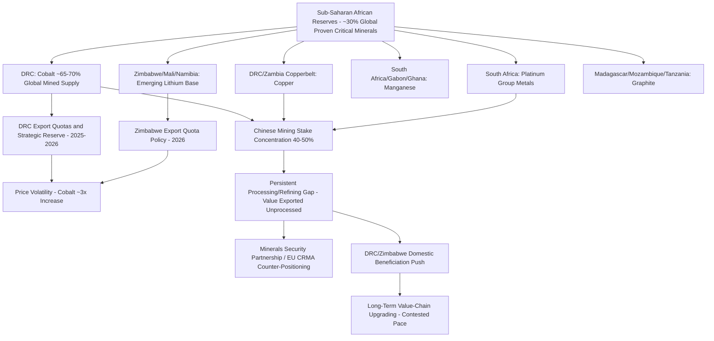

## Sub-Saharan Africa's Role in Critical Mineral Supply Chains

### Structural Position in Global Reserves and Production

Sub-Saharan Africa holds an outsized share of global proven critical mineral reserves relative to its share of global GDP or industrial capacity, with the region estimated to hold about 30 percent of the volume of proven critical mineral reserves globally, positioning it as structurally indispensable to the global energy transition even though the bulk of downstream processing, refining, and value-added manufacturing occurs elsewhere — a "resource-rich, processing-poor" pattern that defines the region's current and contested-future position in critical mineral supply chains.

The core minerals of concern span cobalt, lithium, copper, manganese, platinum group metals (PGMs), and increasingly graphite, each with distinct geographic concentration, market structure, and geopolitical dynamics within the region.

### Cobalt: The Democratic Republic of Congo's Dominant and Volatile Position

The Democratic Republic of Congo (DRC) is overwhelmingly the world's dominant cobalt supplier: the DRC produced approximately 320,000 tonnes of mined cobalt in 2025, roughly two-thirds of the world's supply from a single country, extracted substantially as a byproduct of copper mining in the Katangan Copperbelt spanning the DRC and Zambia, where cobalt occurs as a byproduct of copper extraction, creating cost efficiencies unavailable in dedicated cobalt mining operations elsewhere.

This extreme single-country concentration has become an active and volatile policy variable rather than a stable supply assumption: in February 2025 the DRC introduced export restrictions that effectively acted as a ban before being modified into a quota system, a move the Cobalt Institute said significantly reduced cobalt availability to global markets in 2025. The policy escalated further in 2026 — the DRC government established a strategic mineral reserve in April 2026 with the discretionary power to withhold or release volumes depending on prevailing prices, and for 2026 the DRC announced an annual quota of 96,600 tonnes of cobalt, of which 87,000 tonnes goes pro rata to producers and 9,600 tonnes is held by the regulator ARECOMS. The market impact was substantial: cobalt metal prices responded by approaching USD 58,000 per tonne in early 2026, more than three times the level of a year earlier.

The DRC's strategic intent behind these export restrictions is explicit value-chain upgrading: the DRC is implementing strategies to capture more value domestically, developing refining capacity to convert cobalt hydroxide into higher-value cobalt metal, with ethical production, traceability and environmental standards emphasized to position the country as a responsible supplier — an approach structurally analogous to Indonesia's nickel export ban strategy, using upstream resource leverage to compel downstream processing investment rather than continuing to export unprocessed or semi-processed material.

### Lithium: Emerging Production Base and Zimbabwe's Policy Shift

Africa produced 124,230 tons of lithium carbonate equivalent (LCE) in 2024, primarily from hard rock spodumene deposits, with African lithium output rising 44 percent in 2025 alone, reflecting rapid capacity ramp-up from a low base. Zimbabwe leads the continent's output, with Mali, Namibia, South Africa, Ghana and the DRC ramping up production, and the continent holds 26.7 million tons of identified lithium resources, representing 5% of the global total — a meaningfully smaller share of global reserves than the region holds for cobalt, copper, or manganese.

Following the DRC's cobalt export-restriction template, Zimbabwe moved decisively in 2026 to restrict raw lithium exports: in a letter dated 2 April 2026, Zimbabwe's mines ministry told producers it would introduce lithium concentrate export quotas, also requiring commitments for more local processing before exports could resume — a policy explicitly modeled on the precedent set by the DRC's cobalt restrictions, with analysts noting the quota approach mirrored the DRC's earlier shift from outright ban to managed volumes, signaling Harare's intent to force investment in domestic beneficiation rather than eliminate export revenue entirely. Zimbabwe commissioned the continent's first lithium refining facility in the first half of 2026, representing the initial concrete downstream-processing outcome of this policy direction. For producers, the new conditions meant offtake contracts signed before 2026 were suddenly subject to renegotiation, with miners lacking local processing partners facing the longest delays — illustrating the direct commercial disruption this policy pattern imposes on established supply agreements.

### Copper, Manganese, and Platinum Group Metals

The DRC and Zambia together are identified by the IEA's Global Critical Minerals Outlook 2026 as the largest single contributors to narrowing the world's copper supply gap, reflecting copper's dual role in traditional electrical applications and accelerating demand from electrification and data center/AI infrastructure buildout. Africa also leads global supply of mined manganese ore, responsible for three quarters of this in 2025, with South Africa, Gabon and Ghana collectively accounting for the majority of that production — manganese being a critical input for both steel alloying and increasingly for LFP and other battery cathode chemistries. South Africa additionally holds a globally dominant position in platinum group metals, with reserves described in industry analysis as representing a substantial majority of global platinum reserves, critical for catalytic converter and, increasingly, hydrogen fuel cell electrolyzer applications. [Unverified] Specific reserve percentage figures for PGMs and manganese vary somewhat across sourcing and should be checked against current USGS or equivalent geological survey data rather than treated as fixed.

Emerging graphite supply is concentrated in East African deposits: Madagascar, Mozambique, and Tanzania could collectively supply roughly one-third of the world's mined natural graphite by 2040, up from approximately 11 percent in 2025, positioning East Africa as an increasingly important node in battery anode material supply chains even as China is projected to account for approximately 90 percent of battery-grade graphite production (processing) in 2040 — illustrating the same extraction/processing bifurcation pattern seen across the region's other critical minerals.

### The Processing Gap and Chinese Investment Concentration

The defining structural feature of Sub-Saharan Africa's position in critical mineral supply chains is that the majority of these minerals are exported for processing outside of the region, meaning the region captures a comparatively small share of the value chain relative to its dominance in raw extraction. This processing gap has been filled predominantly by Chinese capital and technical investment: as of 2023, Chinese entities controlled or maintained significant stakes in approximately 40-50% of major mining operations across Sub-Saharan Africa, with cumulative Chinese investment in African mining operations exceeding $10 billion through 2023, concentrated primarily in DRC copper-cobalt, Zambian copper, and South African platinum operations.

[Inference] This Chinese processing and mining-stake dominance creates a structural complication for Western "friend-shoring" battery and EV supply chain diversification objectives directly analogous to the Indonesia nickel dynamic: African critical minerals are geographically outside China, but a substantial share of the associated extraction and processing investment is Chinese-controlled or Chinese-financed, meaning raw geographic sourcing diversity does not straightforwardly translate into reduced Chinese influence over the resulting processed material supply chain.

### Western and Multilateral Counter-Positioning

Western governments have established alternative frameworks to counter Chinese mineral dominance, most prominently the **Minerals Security Partnership**, established in 2022, which coordinates with allied nations including Canada, Australia, Belgium, Finland, France, Germany, Japan, South Korea, Norway, Sweden, and the United Kingdom to reduce dependence on Chinese processing capacity, alongside the EU's Critical Raw Materials Act implementation extending diversification-supporting engagement into African supply relationships, though quantitative impact data on these Western counter-initiatives remains comparatively limited relative to the scale of existing Chinese investment. [Inference] Given the years-long capital intensity and technical lead time required to build competing processing infrastructure, Western counter-positioning initiatives launched from 2022 onward should be understood as still in an early build-out phase relative to established Chinese processing capacity, and their eventual scale of impact remains genuinely uncertain.

### Economic Development Stakes and Revenue Projections

The scale of potential economic upside for the region is substantial by IMF analysis: global revenues from the extraction of just four key minerals — copper, nickel, cobalt, and lithium — are estimated to total $16 trillion over the next 25 years, in 2023-dollar terms, with Sub-Saharan Africa estimated to reap over 10 percent of these cumulated revenues, potentially corresponding to an increase in the region's GDP by 12 percent or more by 2050 — figures that assume, notably, effective governance, infrastructure development, and (implicitly) some degree of successful value-chain upgrading beyond raw extraction, none of which are guaranteed outcomes. [Unverified] These are long-horizon IMF projections dependent on numerous demand, price, and policy assumptions holding over multiple decades, and should be treated as an illustrative upper-bound scenario rather than a base-case forecast.

### Sub-Saharan Africa Critical Minerals Supply Chain Structure

### Key Points

- The DRC's cobalt export restrictions (February 2025 ban, subsequent quota system, April 2026 strategic reserve) represent an active and consequential supply-chain policy variable, not a stable background condition — cobalt prices approaching $58,000/tonne in early 2026, more than triple the prior year, directly reflect this policy-driven volatility.
- Zimbabwe's 2026 lithium export quota policy explicitly follows the DRC's cobalt-restriction template, signaling a broader regional pattern of resource-nationalist beneficiation policy rather than an isolated DRC-specific decision.
- Chinese entities' 40-50% stake concentration in major Sub-Saharan African mining operations means geographic supply diversification away from China does not automatically reduce Chinese influence over the resulting processed material, a structural parallel to the Indonesia nickel dynamic covered in the ASEAN manufacturing profile.
- The region's core structural challenge is capturing value from processing and refining rather than raw extraction alone — current policy shifts (DRC cobalt metal conversion, Zimbabwe's first lithium refinery) represent early, contested steps toward addressing this gap rather than an accomplished transition.
- Long-horizon revenue and GDP-impact projections (IMF's $16 trillion cumulative mineral revenue estimate, 10%+ African share) depend on multiple decades of demand, governance, and infrastructure assumptions holding, and should be read as illustrative scenario analysis rather than confident forecasting.

**Related Topics**

- DRC-Zambia Copperbelt cobalt-copper byproduct economics and extraction cost structure
- Minerals Security Partnership project pipeline in African critical mineral processing
- Indonesia nickel export ban as a comparative resource-nationalist policy model
- Battery-grade graphite processing concentration in China versus East African extraction growth
- Artisanal and small-scale cobalt mining conditions and traceability/ethical sourcing initiatives
- EU Critical Raw Materials Act engagement with African supply partnerships