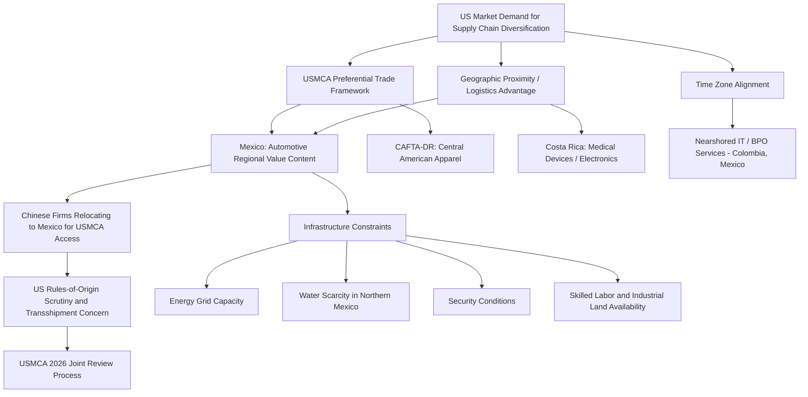

## Latin America and the Nearshoring Opportunity

### Definition and Structural Drivers

Nearshoring refers to the relocation or diversification of manufacturing and supply chain activity to geographically proximate countries rather than distant low-cost locations, distinguished from "China plus one" offshoring diversification (typically directed toward Southeast Asia) by the centrality of geographic proximity, time-zone alignment, and — particularly for the US market — existing preferential trade agreement architecture as the primary competitive advantages rather than labor cost alone. Latin America, and Mexico specifically, has emerged as the principal nearshoring beneficiary for supply chains oriented toward the US market, driven by a convergence of factors distinct from the drivers underlying Southeast Asian or South Asian diversification.

Core structural drivers include the **USMCA** (United States-Mexico-Canada Agreement, the 2020 successor to NAFTA) providing preferential tariff treatment and increasingly stringent regional content requirements (particularly in automotive rules of origin) that favor North American-integrated production; substantially shorter shipping times and lower logistics costs and carbon footprint to the US market relative to Asian manufacturing origins; overlapping or adjacent time zones facilitating real-time coordination for supply chain management, customer service, and increasingly nearshored software/IT services; and rising Chinese labor costs combined with US-China trade tension creating a comparative cost and political-risk rationale for shifting production geographically closer to the end market.

### Mexico: The Principal Nearshoring Destination

Mexico has captured the dominant share of Latin American nearshoring interest and investment, building on an already substantial pre-existing manufacturing base (particularly automotive and electronics maquiladora operations along the US border) developed over decades under NAFTA and its predecessor trade arrangements. Mexico's automotive sector — anchored by long-established US, Japanese, German, and Korean automaker and supplier investment — has been a particular beneficiary of USMCA's tightened regional value content and labor-value-content requirements (mandating a rising minimum wage threshold for a portion of vehicle content to qualify for preferential tariff treatment), which structurally favor North American-integrated production networks over externally sourced content.

**Electronics and appliance manufacturing**: Mexico has also captured substantial electronics and household appliance assembly investment, benefiting from proximity to the US consumer market and established supplier ecosystems in border manufacturing hubs (Tijuana, Ciudad Juárez, and other border-region industrial clusters).

**The Chinese "back-door" transshipment concern**: A structurally significant and increasingly scrutinized dynamic is Chinese firms themselves establishing Mexican manufacturing operations partly to access USMCA-preferential US market access — auto parts, electronics, and other manufacturers relocating final assembly or even substantial value-add stages to Mexico specifically to qualify goods as "Mexican-origin" for USMCA tariff preference despite substantial underlying Chinese ownership, components, or technical inputs. This has drawn increasing US trade policy scrutiny and proposed rules-of-origin tightening aimed at closing this channel, treated by US policymakers as a direct analog to the transshipment concerns raised regarding Vietnam-routed Chinese goods, and represents an active point of trilateral USMCA negotiation and enforcement tension, particularly given USMCA's scheduled 2026 joint review process among the three member governments.

### Structural Constraints on Mexican Nearshoring Absorption

Despite substantial investment interest, Mexico's capacity to fully absorb nearshoring demand faces genuine infrastructure and governance constraints: **energy grid capacity and reliability** in key industrial regions has struggled to keep pace with rapid manufacturing investment growth, particularly given Mexico's national energy policy under recent administrations emphasizing state utility (CFE) primacy in ways that have at times complicated private and renewable energy investment needed to power expanding industrial demand; **water scarcity** in northern industrial regions (overlapping with major manufacturing hubs) constrains water-intensive manufacturing expansion, notably in semiconductor-adjacent and certain heavy industrial processes; **security conditions** in specific regions, linked to organized criminal activity, create logistics and personnel-safety risk considerations for some investors and supply chain routes; and **industrial land, housing, and skilled labor availability** in the most nearshoring-favored border and central industrial corridors have shown signs of capacity strain as investment interest has accelerated, generating rising real estate and wage costs in the most sought-after locations. [Inference] These constraints suggest Mexico's nearshoring absorption, while substantial, is likely to be geographically uneven and gradual rather than an immediate wholesale capacity expansion, concentrated in already-established industrial corridors with existing infrastructure rather than spreading evenly across the country.

### Beyond Mexico: Other Latin American Nearshoring Participants

**Costa Rica**: Has developed a notable position in medical device manufacturing and increasingly semiconductor-adjacent and electronics assembly, leveraging a comparatively skilled workforce, political stability, and established free-trade-zone infrastructure, positioning it as a smaller-scale but higher-value-add nearshoring destination relative to broader labor-cost-driven manufacturing.

**Central American nations more broadly (Guatemala, Honduras, El Salvador, Dominican Republic)**: Have captured textile and apparel nearshoring investment substantially under the **CAFTA-DR** (Central America-Dominican Republic Free Trade Agreement) framework, which provides preferential US market access for regionally produced apparel meeting yarn-forward rules of origin, positioning the region as an alternative to Asian apparel manufacturing for US-bound retailers seeking shorter lead times and reduced geopolitical supply chain risk, though generally at smaller absolute scale than Mexican manufacturing investment.

**Brazil and South American nations**: Have captured comparatively less direct US-market-oriented nearshoring investment relative to Mexico and Central America, given greater geographic distance from the US and the absence of a USMCA-equivalent preferential trade framework, though Brazil's substantial existing manufacturing base (particularly automotive, aerospace via Embraer, and increasingly relevant lithium and other critical mineral reserves) positions it more as an independent manufacturing and resource power in its own right than as a US-nearshoring-dependent destination.

**Nearshored services and IT/BPO**: A parallel and increasingly significant dimension of Latin American nearshoring extends beyond physical manufacturing into services — Colombia, Mexico, Argentina, and other countries have captured substantial nearshored software development, IT services, and business process outsourcing investment, leveraging time-zone alignment with US business hours (a meaningful advantage over India/Philippines-based BPO for real-time collaboration needs) and a growing pool of Spanish/English-bilingual technical talent.

### Nearshoring Supply Chain and Policy Architecture

### Trade Policy Uncertainty and the USMCA Review

A significant near-term structural consideration for Latin American nearshoring is the **USMCA's built-in joint review mechanism**, scheduled for 2026, under which the three member governments must formally review and affirm continuation of the agreement, with provisions allowing for renegotiation of specific terms. [Inference] The outcome of this review — particularly regarding potential further tightening of automotive and other rules of origin specifically targeting Chinese-linked "back-door" investment in Mexico — represents a material source of uncertainty for nearshoring investment planning, since firms making multi-year manufacturing location decisions must account for the possibility of trade rule changes emerging from this review process; this uncertainty itself may create a countervailing drag on nearshoring investment commitment pending greater clarity on the review's outcome.

### Currency and Macroeconomic Considerations

Nearshoring investment flows have contributed to notable currency appreciation pressure in Mexico (the peso experienced substantial strengthening in the 2022-2024 period, partly attributed by analysts to nearshoring-driven capital inflows alongside relatively high Mexican interest rate differentials), which [Inference] creates a partially self-limiting dynamic — currency appreciation erodes some of the labor and input cost advantage that initially attracts nearshoring investment, meaning sustained nearshoring flows may generate their own moderating pressure on Mexico's cost competitiveness over time, a dynamic distinct from and potentially more immediate than the infrastructure constraints discussed above.

### Key Points

- Nearshoring is analytically distinct from Southeast Asian "China plus one" diversification primarily through the centrality of USMCA preferential trade architecture and geographic/logistics proximity to the US market, rather than labor cost alone as the dominant driver.
- Mexico is the overwhelmingly dominant Latin American nearshoring beneficiary, but faces genuine and likely binding infrastructure constraints (energy grid capacity, water scarcity, security conditions, skilled labor availability) that will shape the pace and geographic distribution of absorption rather than an unconstrained capacity expansion.
- The Chinese "back-door" transshipment dynamic in Mexico — Chinese firms establishing Mexican operations specifically to access USMCA preference — is a structurally significant and actively contested issue, directly analogous to Vietnam-routed transshipment concerns in the ASEAN context, and is a leading candidate for tightening in the scheduled 2026 USMCA joint review.
- CAFTA-DR-governed Central American apparel manufacturing and Costa Rican medical device/electronics manufacturing represent smaller-scale but distinct nearshoring niches beyond Mexico's dominant position.
- Peso appreciation linked partly to nearshoring capital inflows illustrates a potentially self-limiting dynamic, where nearshoring's own success in attracting investment may erode some of the cost competitiveness that initially motivated the shift.

**Related Topics**

- USMCA 2026 joint review process and proposed rules-of-origin tightening
- Chinese auto parts and EV component manufacturer Mexican investment patterns
- Mexican energy grid capacity constraints under CFE-primacy national energy policy
- CAFTA-DR yarn-forward rules of origin for Central American apparel
- Nearshored IT/BPO growth in Colombia and Mexico versus traditional India/Philippines outsourcing
- Peso appreciation and its effect on Mexican manufacturing cost competitiveness