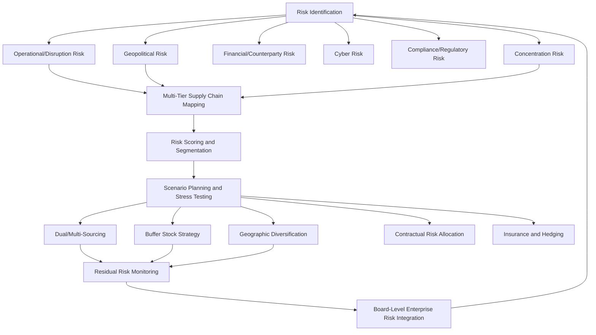

## Supply Chain Risk Management as a Discipline

### Definition and Evolution of the Field

Supply chain risk management (SCRM) is the systematic discipline of identifying, assessing, prioritizing, and mitigating risks that could disrupt the flow of goods, information, or capital across a firm's extended supply network, spanning suppliers, logistics providers, manufacturing sites, and distribution channels. SCRM has evolved substantially from a narrow, insurance-and-contingency-planning function historically embedded within procurement or logistics departments into an increasingly board-level strategic discipline, a shift driven substantially by a sequence of high-visibility disruption events — the 2011 Thailand floods and Japan earthquake/tsunami disrupting automotive and electronics supply chains, the 2020-2021 COVID-19 pandemic's near-simultaneous global demand and supply shocks, the 2021 Suez Canal Ever Given blockage, and the accelerating pattern of geopolitically driven trade restriction and sanctions risk since 2018.

[Inference] This evolution reflects a broader recognition that supply chain risk is no longer adequately addressed through localized, single-tier supplier risk assessment alone, given the demonstrated capacity of disruptions at obscure sub-tier suppliers (a single specialized chemical plant, a concentrated semiconductor sub-component supplier) to cascade into major production halts across seemingly unrelated end-product categories — a dynamic that has pushed the discipline toward multi-tier visibility and network-level risk modeling rather than first-tier-supplier-only assessment.

### Risk Taxonomy

**Operational/disruption risk**: Natural disasters (earthquakes, floods, hurricanes), industrial accidents (plant fires, chemical spills), and infrastructure failures (port congestion, power grid failures) that physically interrupt production or logistics capacity at a specific node.

**Geopolitical risk**: Trade policy shifts (tariffs, export controls, sanctions), armed conflict, expropriation risk, and diplomatic rupture affecting cross-border flows — a category that has grown substantially in relative importance and analytical sophistication requirement since roughly 2018.

**Financial/counterparty risk**: Supplier insolvency, currency volatility affecting contract economics, and credit risk within the supply chain's financial layer (including trade finance counterparty risk, covered separately under trade finance).

**Cyber and information risk**: Ransomware and other cyberattacks targeting supply chain participants (a growing vector given increasing digital integration between buyers and suppliers via EDI, cloud-based supply chain platforms, and IoT-enabled logistics tracking), alongside data integrity and visibility-platform security risk.

**Compliance and regulatory risk**: Forced labor and human rights compliance (increasingly enforced through import detention mechanisms — see below), environmental regulation, and product safety/quality regulatory requirements varying by destination market.

**Concentration risk**: Single-source or single-region dependency for critical inputs, components, or manufacturing capacity, distinct from acute disruption risk in that it represents a standing structural vulnerability rather than an event-triggered one — this is the risk category most directly addressed by diversification, friend-shoring, and reshoring strategies covered elsewhere in this course.

**Reputational and ESG risk**: Supply chain practices (labor conditions, environmental impact, sourcing from conflict-affected or high-risk areas) that create brand and stakeholder risk independent of direct operational disruption, increasingly formalized through mandatory due diligence regulation (see below).

### Risk Assessment Methodologies

**Supplier risk scoring and segmentation**: Systematic evaluation of suppliers across financial health, geographic/geopolitical exposure, single-source dependency, quality/compliance history, and criticality to end-product function, typically resulting in tiered risk categorization (e.g., critical/high-risk suppliers requiring dual-sourcing or enhanced monitoring versus lower-priority commodity suppliers).

**Multi-tier mapping**: Extending visibility beyond direct (Tier 1) suppliers to Tier 2, Tier 3, and beyond, attempting to identify concentration points and single points of failure that may not be visible from direct contractual relationships alone — a methodologically difficult but increasingly emphasized practice given documented cases of critical vulnerabilities existing several tiers removed from direct buyer visibility (e.g., a specialized chemical or component sub-supplier feeding multiple ostensibly diversified Tier 1 suppliers).

**Scenario planning and stress testing**: Modeling the operational and financial impact of discrete disruption scenarios (a specific port closure, a named country's export restriction, a major supplier's failure) to quantify exposure and evaluate mitigation option cost-effectiveness before an actual disruption occurs.

**Value-at-risk and quantitative exposure modeling**: Increasingly sophisticated quantitative approaches attempting to express supply chain risk in financial terms comparable to other enterprise risk categories (analogous to financial value-at-risk modeling), supporting more direct integration of SCRM into enterprise risk management and capital allocation frameworks, though [Inference] the underlying probability distributions for many supply chain disruption categories (geopolitical events particularly) are inherently harder to model with statistical rigor than financial market risk, given limited historical sample sizes for many specific disruption types and the non-stationary nature of geopolitical risk environments.

### Mitigation Strategies

**Dual and multi-sourcing**: Deliberately maintaining qualified alternative suppliers for critical inputs, trading off the cost efficiency of single-source volume concentration against resilience, a trade-off that has shifted toward greater resilience weighting across many industries following COVID-19-era single-source failures.

**Inventory and buffer stock strategy**: Rebalancing from pure just-in-time (JIT) inventory minimization toward "just-in-case" buffer stock for critical, hard-to-substitute inputs — a strategic shift widely discussed following pandemic-era semiconductor and component shortages, though [Inference] the practical extent of this shift varies substantially by industry and input criticality, since blanket buffer-stock increases carry real working-capital and obsolescence cost that most firms cannot uniformly absorb across their full input base.

**Geographic diversification**: Distributing production or sourcing across multiple countries/regions to reduce single-jurisdiction concentration risk, directly connecting to the "China plus one," nearshoring, and friend-shoring strategies covered in the regional profiles sections of this course.

**Contractual risk allocation**: Force majeure clause design, supply continuity and capacity-reservation contract terms, and increasingly explicit geopolitical-risk-sharing or price-adjustment mechanisms built into long-term supply agreements.

**Insurance and financial hedging**: Trade credit insurance, political risk insurance (see trade finance and SWF materials), and business interruption insurance, alongside financial hedging instruments for currency and commodity price exposure embedded in supply contracts.

**Supply chain mapping technology investment**: Deployment of dedicated supply chain visibility platforms (leveraging supplier self-reporting, satellite/logistics tracking data, and increasingly AI-assisted document and shipment data analysis) to achieve the multi-tier visibility described above at a scale not feasible through manual mapping alone.

### Regulatory and Compliance Drivers

**Forced labor import enforcement**: The **US Uyghur Forced Labor Prevention Act (UFLPA)**, effective 2022, establishes a rebuttable presumption that goods manufactured wholly or in part in China's Xinjiang region are produced with forced labor and are therefore barred from US import absent clear and convincing evidence to the contrary — a mechanism enforced through US Customs and Border Protection (CBP) detention of shipments, placing substantial due diligence burden on importers to document supply chain provenance, particularly for cotton, polysilicon (solar), and tomato products with documented Xinjiang supply chain linkages.

**EU Corporate Sustainability Due Diligence Directive (CSDDD)**: EU legislation requiring large companies operating in the EU to conduct human rights and environmental due diligence across their value chains, with civil liability exposure for failures, representing a more comprehensive mandatory due diligence regime than the sector/region-specific UFLPA approach, [Unverified] though the CSDDD's implementation scope, timeline, and specific compliance thresholds have been subject to ongoing EU legislative simplification discussion, so current requirements should be checked against the latest adopted text and transposition status rather than assumed fixed from initial adoption.

**EU Deforestation Regulation (EUDR)**: Requires due diligence demonstrating that specified commodities (palm oil, soy, cattle, cocoa, coffee, rubber, wood) imported into the EU are not linked to deforestation, illustrating the broader trend of supply chain regulation extending beyond labor/human rights into environmental provenance requirements.

### SCRM Process Architecture

### Organizational and Governance Integration

**Chief Supply Chain Officer (CSCO) elevation**: A notable organizational trend has been the elevation of supply chain leadership to C-suite and board-reporting status at many large multinationals, reflecting recognition that supply chain risk carries strategic and financial materiality comparable to other traditionally board-level risk categories (financial, cybersecurity, legal/regulatory).

**Cross-functional integration**: Effective SCRM increasingly requires structured coordination across procurement, legal/compliance, finance, and government affairs/geopolitical risk functions, given that many contemporary supply chain risks (export controls, sanctions, forced labor compliance) sit at the intersection of operational and regulatory/legal domains rather than being addressable through procurement expertise alone.

**Third-party risk management platforms and standards**: Growing use of standardized supplier risk assessment frameworks and third-party risk intelligence platforms (aggregating financial health data, sanctions/watchlist screening, geopolitical risk scoring, and ESG compliance data) to scale risk assessment across large, complex supplier bases beyond what manual assessment processes can support.

### Persistent Tensions and Open Challenges

**Cost-resilience trade-off**: The central and unresolved tension in SCRM practice remains balancing efficiency-oriented supply chain design (cost minimization through concentration, JIT inventory, and single-sourcing) against resilience-oriented design (diversification, buffer stock, redundant capacity) — [Inference] the post-pandemic period has generally shifted sentiment toward greater resilience weighting, but competitive cost pressure means this shift is uneven across industries and firms, and a reversion toward efficiency-weighted decision-making during periods without acute disruption remains a recognized risk to sustained resilience investment.

**Measurement and ROI difficulty**: Quantifying the return on SCRM investment (a disruption avoided or mitigated is inherently a counterfactual, difficult to demonstrate with the same clarity as a realized cost saving) creates a persistent internal budgetary challenge for SCRM functions relative to more directly measurable procurement cost-reduction initiatives.

**Sub-tier visibility limits**: Despite growing investment in multi-tier mapping technology, genuine full visibility into Tier 3+ suppliers remains difficult to achieve comprehensively across a large firm's full supplier base, meaning [Inference] most firms' SCRM programs likely still carry meaningful blind spots at deeper supply chain tiers even where Tier 1 and Tier 2 visibility has improved substantially.

### Key Points

- SCRM has evolved from a narrow contingency-planning function into a board-level strategic discipline, driven by a sequence of high-visibility disruptions (2011 Japan/Thailand, COVID-19, Suez blockage) demonstrating the cascading financial materiality of supply chain risk.
- Multi-tier supply chain visibility, extending risk assessment beyond direct Tier 1 suppliers, is an increasingly emphasized but methodologically difficult practice, given that critical vulnerabilities are frequently documented several tiers removed from direct buyer contractual relationships.
- The cost-resilience trade-off (efficiency-oriented JIT/single-sourcing versus resilience-oriented diversification/buffer stock) remains the discipline's central unresolved tension, with post-pandemic sentiment shifting toward resilience but implementation remaining uneven across industries.
- Regulatory compliance risk (UFLPA forced labor enforcement, EU CSDDD, EU Deforestation Regulation) has become a first-order SCRM driver in its own right, requiring documented supply chain provenance rather than only operational disruption risk assessment.
- Measuring SCRM's return on investment remains structurally difficult given the counterfactual nature of avoided disruption, creating a persistent internal resource-allocation challenge for the discipline.

**Related Topics**

- UFLPA enforcement mechanics and CBP forced labor detention statistics
- Multi-tier supply chain mapping technology and AI-assisted visibility platforms
- EU CSDDD implementation timeline and corporate compliance scope
- Just-in-time versus just-in-case inventory strategy shift post-COVID-19
- Chief Supply Chain Officer role evolution and board-level risk reporting
- Scenario planning methodologies for geopolitical supply chain disruption