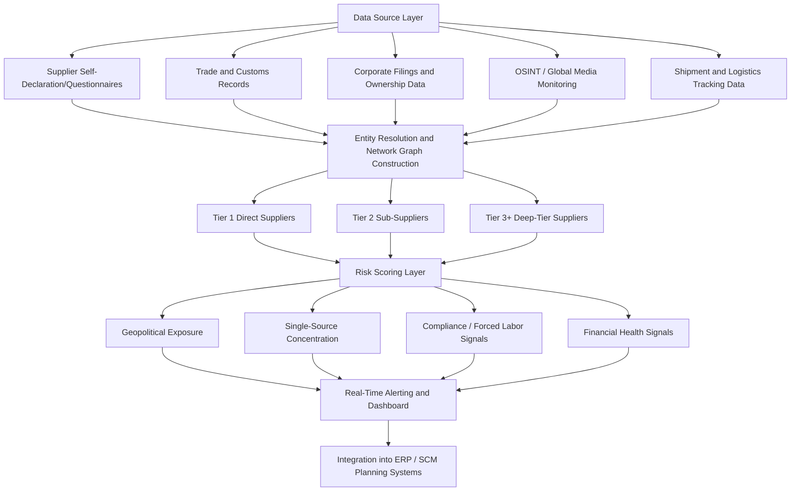

## N-Tier Supplier Mapping and Visibility Tools

### Definition and Strategic Rationale

N-tier supplier mapping refers to the practice and supporting technology of extending supply chain visibility beyond a firm's direct (Tier 1) suppliers into Tier 2, Tier 3, and deeper sub-tier relationships, aiming to identify hidden dependencies, single points of failure, and concentration risks that are invisible from direct contractual relationships alone. The discipline exists because disruption events empirically originate disproportionately at deeper tiers rather than at the directly contracted supplier level: n-tier visibility matters because disruptions typically occur deeper in the chain — a semiconductor shortage at a tier-3 supplier, a natural disaster affecting a raw materials producer at tier-4 — meaning risk assessment confined to Tier 1 relationships systematically misses the layer where many of the most consequential disruptions actually originate.

The scale of the underlying visibility gap across industry is substantial: in a McKinsey survey, 45% of respondents said they have no visibility into their upstream supply chain or can only see as far as first-tier suppliers, indicating that despite growing awareness of multi-tier risk, a large share of large organizations still operate with materially incomplete supply chain visibility as a baseline condition.

### Core Technical Approaches to N-Tier Mapping

**Supplier self-declaration and questionnaire-based mapping**: The traditional foundational method, in which Tier 1 suppliers are contractually or voluntarily required to disclose their own key sub-suppliers, which are then in turn asked to disclose theirs — a cascading disclosure approach that provides genuine mapping depth where compliance is high but suffers from significant practical limitations: supplier reluctance to disclose their own supplier relationships (viewed as competitively sensitive information), incomplete or stale data given the administrative burden of maintaining current disclosures, and a natural compliance drop-off at each successive tier as the requesting firm's direct leverage over increasingly distant sub-tier suppliers diminishes.

**AI and open-source intelligence (OSINT)-driven mapping**: A more recent and increasingly prominent approach uses artificial intelligence, natural language processing, and large-scale data aggregation (trade/customs records, corporate filings, news and media monitoring, shipping and logistics data) to infer and construct supplier network maps without requiring full voluntary disclosure at every tier. This category includes AI-powered mapping using real-time data from global media in multiple languages to identify key suppliers, assess vulnerabilities, and support real-time risk detection extending into deeper tiers that traditional questionnaire-based tools miss, reflecting the premise that Tier 1 visibility is no longer enough and that effective risk detection must extend into deeper tiers using data sources beyond direct supplier disclosure.

**Trade and customs data-based inference**: Leveraging import/export shipment records, bills of lading, and customs declarations (where publicly available or commercially licensed) to reconstruct actual physical trade flows between entities, providing an evidentiary trail of realized transactions rather than relying solely on self-reported relationships — a method particularly relevant to compliance use cases (forced labor provenance under UFLPA, sanctioned-entity screening) where independent verification of stated supply chain claims is required rather than accepting supplier attestation alone.

### Representative Vendor Landscape (as of 2026)

[Unverified] The following reflects a synthesis of current market coverage; specific vendor capabilities, pricing, and market positioning change frequently in this space and should be verified against current vendor documentation before procurement decisions.

**Sphera N-Tier**: Sphera, a Chicago-based enterprise sustainability management (ESM) software provider that acquired riskmethods in 2022 to expand into supply chain risk management, launched its N-Tier solution in 2025 as part of its Supply Chain Transparency product line, characterized by the vendor as a holistic solution enabling companies to parse tier-two and tier-three supplier relationships and beyond, combining multi-tier mapping with integrated risk monitoring capabilities designed to scale with growing organizations.

**Altana**: Identified in independent buyer-guide analysis as a leading choice specifically for n-tier supplier risk visibility, specializing (alongside Resilinc) in mapping deep supplier relationships and monitoring risk signals across the full network, positioned as a specialist alternative to broader supply chain planning suites for organizations whose primary need is deep-tier mapping rather than integrated planning/execution functionality.

**Resilinc**: A long-established supply chain risk and resilience-focused platform, noted alongside Altana as specializing in multi-tier relationship mapping and risk signal monitoring, generally positioned within the risk-management-specialist category rather than the broader transportation-visibility or planning-suite categories.

**Tradeverifyd**: Positioned as an enterprise-level supply chain risk and transparency platform emphasizing mapping every supplier relationship rather than just the Tier 1 supplier offered by other supply chain software providers, combining multi-tier mapping with AI-driven supplier scoring and predictive intelligence features aimed at anticipating disruption signals before they materialize.

**Semantic Visions**: An AI-powered mapping solution focused specifically on uncovering hidden risks and visualizing supply chains across all tiers using real-time open-source intelligence and global media monitoring across multiple languages, representing the OSINT-driven mapping approach described above as a distinct methodology from questionnaire- or trade-data-based approaches.

**e2open**: Positioned by independent analysts as offering particular strength for large enterprises that need end-to-end visibility across a complex, multi-tier supply chain rather than just shipment tracking, differentiating it from transportation-visibility specialists more narrowly focused on in-transit freight tracking.

**Broader adjacent categories**: Transportation visibility specialists (project44, FourKites, Shippeo) focus primarily on real-time in-transit shipment tracking and predictive ETAs rather than deep supplier-network mapping per se, while large ERP/planning suite vendors (SAP Integrated Business Planning, Oracle Supply Chain & Manufacturing, Kinaxis, Blue Yonder, o9 Solutions) increasingly incorporate visibility and risk-monitoring modules within broader supply chain planning and execution platforms — meaning organizations evaluating this space typically must decide whether to adopt a dedicated n-tier mapping specialist, a broader planning-suite vendor's embedded module, or an integration layer combining multiple point solutions.

### N-Tier Mapping Data Flow Architecture

### Integration with Broader Supply Chain and Compliance Systems

**PLM-SCM integration gap**: Independent buyer-guide analysis identifies the interface between Product Lifecycle Management (PLM) and Supply Chain Management (SCM) systems as one of the most strategically underinvested integration points relevant to n-tier visibility: PLM manages engineering change orders that affect component specifications, while SCM manages supplier qualification and supply continuity for those components, and when an engineering change order changes a part specification, the SCM system needs to know which suppliers qualify for the new spec and whether supply continuity is maintained — a data flow that most point integrations do not currently provide well, representing a genuine gap between design-engineering visibility and supply-continuity visibility that n-tier mapping tools alone do not resolve without this additional integration layer.

**Compliance use-case integration**: N-tier mapping capability is increasingly a functional prerequisite for regulatory compliance obligations covered under broader SCRM practice — UFLPA forced labor provenance documentation and EU CSDDD/EUDR due diligence requirements both functionally require the kind of sub-tier visibility that n-tier mapping tools are designed to provide, meaning compliance obligation is an increasingly direct commercial driver for n-tier tool adoption rather than risk management alone being the primary business case.

**ESG and sustainability data layers**: Several platforms in this category (IntegrityNext notably) combine multi-tier mapping explicitly with ESG and regulatory risk detection, reflecting convergence between supply chain risk mapping and sustainability/human-rights due diligence functionality within a single tool category rather than these remaining separate procurement decisions.

### Persistent Limitations and Open Challenges

**Entity resolution accuracy**: A fundamental technical challenge underlying all n-tier mapping approaches is accurately matching and de-duplicating entity records across disparate data sources with inconsistent naming conventions, subsidiary/ownership structures, and jurisdiction-specific corporate registration formats — errors here propagate into inaccurate network graphs regardless of how sophisticated the downstream risk-scoring layer is.

**Data currency and dynamism**: Supply chain relationships change continuously (new supplier qualification, capacity shifts, supplier financial distress), and [Inference] even well-resourced n-tier mapping programs likely operate with some degree of structural lag between actual current-state supplier relationships and what the mapping platform reflects, particularly at deeper tiers where data refresh cadence is typically lower than for Tier 1 relationships.

**Depth versus actionability trade-off**: Achieving genuine Tier 4+ or Tier 5+ visibility for a large, complex product's full bill of materials is technically demanding and often yields a volume of mapped relationships that exceeds an organization's practical capacity to monitor or act upon meaningfully, meaning [Inference] mature n-tier programs typically apply depth-of-mapping effort selectively — concentrating deep-tier mapping resources on identified critical or single-source component categories rather than attempting uniform maximum-depth mapping across an entire supplier base.

### Key Points

- The core justification for n-tier mapping investment is empirical: documented disruptions recurringly originate at Tier 2/3+ suppliers rather than Tier 1, while a substantial share of large organizations (roughly 45% per McKinsey survey data) report visibility limited to Tier 1 or below, creating a persistent and quantifiable blind spot.
- Two broad and complementary mapping methodologies exist — supplier self-declaration/questionnaire cascading and AI/OSINT-driven inference from external data sources — with the latter increasingly prominent as a way to construct maps without depending entirely on voluntary multi-tier disclosure compliance.
- The vendor landscape spans dedicated n-tier risk specialists (Altana, Resilinc, Sphera N-Tier, Tradeverifyd, Semantic Visions), broader planning suites with embedded visibility modules (SAP IBP, Oracle, Kinaxis, e2open), and transportation-visibility specialists (project44, FourKites) focused on a narrower in-transit tracking use case — selection should be driven by whether the primary need is deep-tier risk mapping, integrated planning, or shipment tracking.
- Regulatory compliance (UFLPA, EU CSDDD/EUDR) has become a direct commercial driver for n-tier tool adoption, converging supply chain risk mapping and ESG/human-rights due diligence into overlapping tool functionality.
- Entity resolution accuracy, data currency lag at deeper tiers, and the practical trade-off between mapping depth and actionable monitoring capacity remain unresolved structural limitations across the current generation of n-tier mapping tools.

**Related Topics**

- UFLPA and EU CSDDD compliance-driven n-tier mapping requirements
- PLM-SCM integration gap and engineering-change-order supply continuity risk
- OSINT and AI-driven supply chain intelligence methodology
- Supplier risk scoring frameworks and third-party risk intelligence platforms
- Entity resolution challenges in corporate ownership and subsidiary network mapping
- Semiconductor and critical component single-source concentration case studies