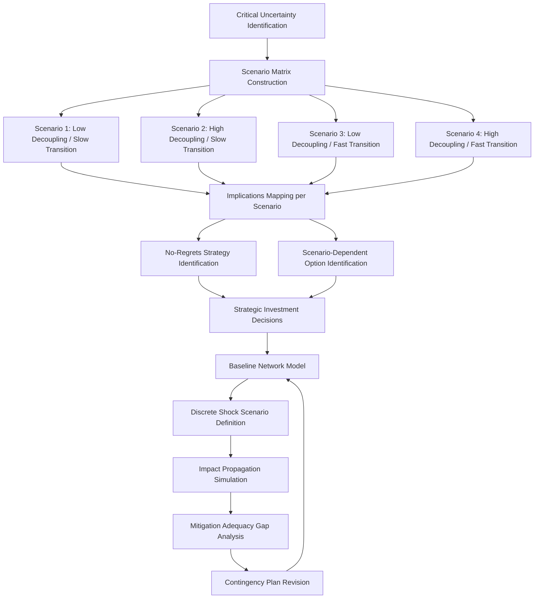

## Scenario Planning and Stress Testing Supply Networks

### Definition and Distinction from Other Risk Practices

Scenario planning and stress testing are complementary but analytically distinct disciplines within supply chain risk management aimed at understanding a supply network's behavior under adverse or discontinuous future conditions, distinguished from routine risk scoring or monitoring (covered under SCRM as a discipline) by their forward-looking, hypothesis-driven structure — rather than assessing current known risk exposure, these methods construct and test explicit "what if" futures to evaluate network resilience, quantify potential impact, and validate the adequacy of existing mitigation strategies before an actual disruption occurs.

**Scenario planning** constructs multiple internally consistent, plausible future narratives (typically 3-5 distinct scenarios spanning a plausibility range) to explore strategic decision robustness across different possible futures, generally used for longer-horizon strategic decisions (facility location, sourcing strategy redesign, capital investment) where the goal is decision robustness across an uncertain future rather than precise prediction of a single outcome.

**Stress testing** applies a specific, often more acute and shorter-horizon shock (a named supplier failure, a specific port closure, a defined tariff imposition) to a defined current-state network model to quantify the operational and financial impact and test the adequacy of existing contingency responses, borrowing methodological lineage from financial-sector stress testing (post-2008 banking regulatory stress tests) adapted to physical and logistics network contexts.

### Scenario Planning Methodology

**Driving forces and uncertainty identification**: The foundational step involves identifying the critical uncertainties most likely to shape future supply chain conditions — for contemporary supply chain scenario planning, common driving forces include US-China relations trajectory, energy transition pace, regional conflict escalation risk, and trade policy direction — and distinguishing predetermined elements (trends reasonably certain to continue, such as continued automation adoption) from genuine uncertainties (outcomes that could plausibly diverge substantially, such as the pace and scope of further decoupling).

**Scenario matrix construction**: A common technique crosses two critical, largely independent uncertainty axes to generate a 2x2 or similar scenario matrix — for example, crossing "degree of US-China economic decoupling" (low to high) against "pace of energy transition" (slow to fast) to generate four distinct narrative scenarios, each requiring internally consistent elaboration of how supply chains, trade policy, and technology adoption would plausibly co-evolve under that combination.

**Narrative development and implications mapping**: Each scenario is developed into a coherent narrative describing the plausible sequence of events and end-state conditions, followed by systematic mapping of implications for the specific organization's supply chain — which sourcing regions, product categories, or logistics routes would face increased or decreased risk under each scenario, and which strategic options would perform well or poorly across the scenario set.

**Robustness and no-regrets strategy identification**: The ultimate strategic output of scenario planning is identifying which strategic choices perform acceptably across most or all constructed scenarios ("no-regrets" moves — for instance, multi-tier supplier mapping investment plausibly adds value regardless of which geopolitical scenario materializes) versus which choices are highly scenario-dependent and therefore warrant staged, option-preserving investment approaches rather than full upfront commitment.

### Stress Testing Methodology

**Baseline network modeling**: Constructing a quantitative representation of the current supply network — nodes (suppliers, manufacturing sites, distribution centers, ports), flows (volume, lead time, cost), and dependencies (which end products or revenue streams depend on which specific nodes) — sufficiently detailed to simulate the propagation of a disruption through the network.

**Shock scenario definition**: Specifying a discrete, well-defined disruption event with explicit parameters — duration (a two-week port closure versus a six-month facility loss), severity (full capacity loss versus partial degradation), and scope (a single supplier, an entire region, or a specific transportation mode) — designed to be specific enough to model concretely while remaining representative of a genuine plausible risk category rather than an arbitrary or unrealistically narrow edge case.

**Impact propagation and quantification**: Simulating how the defined shock propagates through the network — which downstream production lines lose input availability, over what timeframe, and with what resulting revenue, cost, or customer service-level impact — typically requiring bill-of-materials-level detail to trace which end products depend on which specific stressed nodes, since aggregate-level modeling without this granularity tends to understate the concentrated impact of losing a single critical component supplier.

**Mitigation adequacy testing**: Evaluating whether existing contingency plans (alternate suppliers, safety stock, rerouting options) would actually be sufficient to absorb the modeled shock within acceptable impact thresholds, and if not, identifying the specific gap between current mitigation capacity and what the stress scenario demands — this gap-identification function is generally considered the most operationally valuable output of stress testing, since it converts an abstract risk awareness into a specific, actionable capability gap.

### Common Scenario and Stress Test Categories in Contemporary Practice

**Geopolitical conflict scenarios**: Taiwan Strait contingency scenarios (given Taiwan's concentration of advanced semiconductor fabrication capacity) represent among the most widely modeled geopolitical stress scenarios in technology-sector supply chain planning, alongside broader US-China decoupling acceleration scenarios and regional conflict scenarios affecting key logistics chokepoints (Strait of Hormuz, South China Sea, Red Sea/Suez corridor following the 2023-2024 Houthi shipping attacks).

**Trade policy shock scenarios**: Modeling the impact of specific tariff escalation scenarios, export control expansion, or sanctions regime changes on cost structure and sourcing feasibility, an increasingly central category given the demonstrated frequency of significant trade policy shifts since 2018 relative to the multi-decade stability of the preceding trade policy environment.

**Climate and natural disaster scenarios**: Extending traditional natural catastrophe modeling (earthquake, flood, hurricane risk at specific facility locations) to incorporate longer-term climate change trajectory scenarios affecting the frequency and severity of extreme weather events at key manufacturing and logistics nodes, alongside water stress scenarios relevant to water-intensive manufacturing processes (semiconductor fabrication notably).

**Single-node failure scenarios**: The most granular and operationally common stress test category — modeling the specific impact of losing a named critical supplier, port, or facility, often prioritized based on prior criticality/concentration risk scoring (covered under SCRM as a discipline and n-tier mapping) to focus stress testing effort on the highest-concentration-risk nodes rather than attempting uniform stress testing across an entire supplier base.

### Scenario Planning and Stress Testing Process Flow

### Quantitative and Modeling Approaches

**Monte Carlo simulation**: Applying probabilistic modeling across multiple uncertain input variables simultaneously (disruption probability, duration distributions, demand variability) to generate a distribution of potential outcomes rather than a single point estimate, supporting value-at-risk-style quantification of supply chain exposure analogous to financial risk modeling, though [Inference] the underlying probability distributions for many geopolitical and rare-event disruption categories are inherently less statistically grounded than financial market risk distributions, given limited historical sample sizes and the non-stationary nature of the geopolitical risk environment — meaning Monte Carlo outputs for these categories should be treated as structured sensitivity exploration rather than actuarially precise risk quantification.

**Digital twin and network simulation platforms**: Increasingly sophisticated supply chain digital twin tools allow dynamic simulation of network behavior under varying shock conditions, incorporating real-time or near-real-time data feeds to continuously update baseline network state rather than relying on periodically refreshed static models — representing a maturation from static spreadsheet-based scenario modeling toward continuously updated simulation capability, though full digital twin fidelity (accurately representing real-world network behavior including second-order effects like supplier capacity reallocation decisions) remains a genuinely difficult and only partially achieved technical goal across most current implementations.

**War-gaming and tabletop exercises**: A complementary qualitative method to quantitative modeling, involving structured cross-functional exercises in which teams role-play organizational and counterparty responses to a defined disruption scenario in real time, valuable for surfacing decision-making and coordination gaps (who has authority to activate contingency plans, how quickly cross-functional communication occurs) that purely quantitative network models do not capture.

### Organizational Integration and Cadence

**Frequency and triggering**: Mature SCRM practice typically combines scheduled periodic scenario planning refresh (often annual, tied to broader strategic planning cycles) with event-triggered ad hoc scenario development in response to emerging specific risks (a sudden escalation in a relevant geopolitical situation, an early-warning signal about a critical supplier's financial distress), recognizing that a purely calendar-driven cadence risks missing rapidly emerging risk developments that warrant more immediate scenario analysis.

**Cross-functional participation requirement**: Effective scenario planning and stress testing require substantive participation beyond the supply chain function alone — finance (for cost and revenue impact quantification), legal/compliance (for regulatory and contractual implication assessment), and government affairs/geopolitical risk functions (for informed judgment on the plausibility and likely trajectory of geopolitical scenario branches) each contribute expertise that a supply-chain-function-only exercise would lack.

**Translating scenario analysis into standing capability**: [Inference] The most common failure mode observed in less mature scenario planning practice is treating scenario planning as an episodic analytical exercise that produces a report but does not translate into concrete, funded changes to sourcing strategy, safety stock policy, or contractual terms — meaning organizational governance structures that explicitly require scenario planning outputs to feed into budget and strategic planning decision processes are likely a necessary (though not sufficient) condition for the practice to generate durable resilience improvement rather than remaining a periodic compliance exercise.

### Key Points

- Scenario planning (multiple plausible long-horizon futures, used for strategic robustness) and stress testing (a specific defined shock applied to a current-state network model, used for operational gap identification) are complementary but methodologically distinct practices serving different decision horizons.
- The most operationally valuable output of stress testing is identifying the specific gap between existing contingency capacity and what a modeled shock scenario demands, converting abstract risk awareness into an actionable capability deficit.
- Common contemporary scenario categories center on geopolitical conflict (Taiwan Strait contingencies prominently), trade policy shock, climate/natural disaster trajectory, and single-node critical supplier failure, with prioritization typically informed by prior n-tier mapping and concentration risk scoring.
- Quantitative approaches (Monte Carlo simulation, digital twin modeling) have matured substantially but face genuine limitations in statistical grounding for rare, non-stationary geopolitical risk categories, and should be treated as structured sensitivity exploration rather than precise actuarial quantification for these categories specifically.
- The most common failure mode in scenario planning practice is producing analytical output that does not translate into funded changes to sourcing, inventory, or contractual strategy — governance structures linking scenario outputs directly to strategic planning and budget decisions are likely necessary for durable resilience impact.

**Related Topics**

- Taiwan Strait contingency scenario modeling in semiconductor-dependent industries
- Digital twin technology maturity for supply chain network simulation
- Monte Carlo methods and their limitations for geopolitical risk quantification
- Cross-functional war-gaming exercise design for supply chain disruption response
- Integration of scenario planning outputs into capital allocation and strategic planning cycles
- Red Sea/Suez shipping disruption as a realized stress-test case study (2023-2024 Houthi attacks)