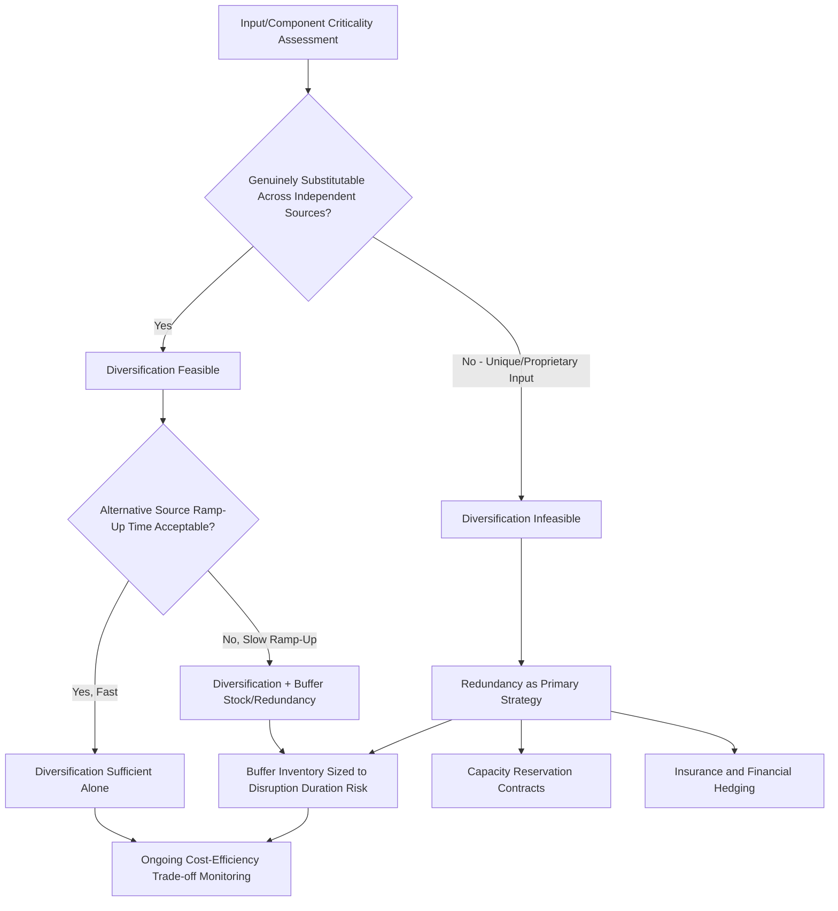

## Diversification Versus Redundancy as Resilience Strategies

### Conceptual Distinction

Diversification and redundancy are the two principal structural strategies firms employ to build supply chain resilience against disruption, and while frequently discussed together or even conflated in practitioner discourse, they represent analytically distinct mechanisms with different cost structures, risk-coverage profiles, and implementation logic.

**Diversification** reduces risk by spreading sourcing, production, or logistics dependency across multiple geographically, politically, or organizationally distinct entities, such that a disruption affecting one no longer threatens the entire supply — the underlying mechanism is reducing correlation of failure across sources (a factory fire, a regional conflict, or a trade policy action in one location does not simultaneously affect a diversified source elsewhere).

**Redundancy** reduces risk by maintaining excess capacity, inventory, or capability beyond what is needed for baseline operations, such that a disruption to the primary source or channel can be absorbed by drawing on the reserve — the underlying mechanism is not reducing the probability of disruption at any given node, but rather absorbing the impact of a disruption once it occurs through a buffer that does not depend on the disrupted node continuing to function.

[Inference] A useful distinguishing heuristic: diversification asks "if this source fails, do I have an independent alternative source already in place?" while redundancy asks "if this source fails, do I have enough of a buffer (inventory, capacity, time) to absorb the disruption while I respond?" A firm can pursue either strategy independently, but they address overlapping risk in structurally different ways and are frequently combined rather than treated as substitutes.

### Diversification: Mechanisms and Trade-offs

**Geographic diversification**: Distributing sourcing or production across multiple countries or regions to avoid single-jurisdiction concentration risk — the core logic underlying "China plus one," nearshoring, and friend-shoring strategies covered in the regional supply chain profiles sections of this course. Effectiveness depends critically on the genuine independence of the diversified locations' risk exposure: diversifying assembly location from China to Vietnam provides limited protection against a shock that affects both similarly (a region-wide component shortage, or — as covered in the ASEAN profile — persistent underlying Chinese intermediate input dependency even in the "diversified" location).

**Supplier diversification (multi-sourcing)**: Qualifying and maintaining active relationships with multiple suppliers for a given input, trading off the cost efficiency and negotiating leverage of volume concentration with a single supplier against the resilience benefit of independent alternative sourcing — the classic and most direct application of the diversification principle at the individual-input level.

**Modal and logistics diversification**: Maintaining multiple transportation modes or routing options (ocean versus air, multiple port options, multiple carrier relationships) to avoid dependency on a single logistics chokepoint or provider, relevant to chokepoint risk exposure (Suez, Panama Canal, Strait of Hormuz, Strait of Malacca) covered in broader trade infrastructure discussion.

**Costs and limitations of diversification**: Diversification typically increases baseline operating cost through lost volume-concentration efficiencies (reduced bulk purchasing leverage, duplicated supplier qualification and quality-assurance overhead, more complex logistics coordination across multiple sourcing points), and its risk-reduction benefit depends entirely on genuine independence between diversified sources — a limitation frequently underappreciated in practice, since apparent geographic diversification can mask underlying shared dependency (as with Vietnam assembly still relying on Chinese components, or multiple "different" suppliers ultimately sourcing a critical sub-component from the same tier-3 producer, a risk only detectable through the n-tier mapping practices covered separately).

### Redundancy: Mechanisms and Trade-offs

**Inventory buffer stock**: Maintaining safety stock beyond calculated baseline demand-variability requirements specifically to absorb supply disruption risk — the primary mechanism underlying the widely discussed post-COVID shift in framing from "just-in-time" toward "just-in-case" inventory philosophy for critical or hard-to-substitute inputs.

**Capacity redundancy**: Maintaining manufacturing or logistics capacity in excess of routine operational need, either through owned excess capacity or contractual reserved-capacity arrangements with suppliers or logistics providers, enabling rapid scale-up or shift of production if a primary capacity source is disrupted.

**Financial and contractual redundancy**: Maintaining financial buffers (credit facilities, insurance coverage) or contractual options (capacity-reservation agreements, options-based supply contracts) that do not require active dual-sourcing but provide a fallback resource to draw upon if needed — a form of redundancy that trades ongoing carrying cost for contingent-activation cost.

**Costs and limitations of redundancy**: Redundancy carries direct and continuous carrying costs — inventory holding cost, capital tied up in excess capacity, insurance premiums — regardless of whether a disruption ever materializes, meaning redundancy strategies are inherently "insurance-like" in their cost-benefit structure (a known ongoing cost against an uncertain future benefit). Redundancy also has intrinsic limits for disruptions exceeding the buffer's coverage — inventory buffers provide time-limited protection (a 60-day safety stock does not protect against a 6-month disruption), and capacity redundancy is often geographically concentrated with the primary capacity source (backup capacity at the same facility or region provides no protection against region-wide disruption), which is where redundancy's limitations most directly point back toward the complementary need for diversification.

### The Complementary Relationship and Combined Application

[Inference] In practice, the most resilient supply chain configurations typically combine both strategies rather than relying on either exclusively, since each addresses a distinct failure mode the other does not: diversification protects against a specific source's outright failure but assumes some lead time exists to shift volume to the alternative source, while redundancy (buffer stock, reserved capacity) covers the gap during that shift period even when diversification exists, and separately provides protection when true diversification is infeasible (a genuinely unique, non-substitutable input or process with no viable alternative source). A firm with diversified sourcing but zero buffer inventory may still experience a costly production gap during the lead time required to ramp up the alternative source following a primary-source disruption; a firm with substantial buffer inventory but a single source risks exhausting that buffer if the disruption outlasts the buffer's coverage duration.

### Resilience Strategy Selection Framework

### Sector and Input-Specific Application Patterns

**High-value, long-lead-time, highly specialized inputs** (advanced semiconductors, specialized aerospace components): Diversification is often genuinely difficult or infeasible given the small number of capable global suppliers and multi-year qualification timelines for alternatives, pushing firms toward redundancy-weighted strategies (strategic stockpiling, long-term capacity reservation agreements, and — at a national policy level — the strategic reserve and stockpiling policies covered in the critical minerals and CHIPS Act discussions) as the more available resilience lever.

**Commodity or standardized inputs with multiple qualified global producers**: Diversification is comparatively more feasible and cost-effective relative to redundancy, since qualifying and maintaining relationships with multiple capable suppliers carries lower overhead than for highly specialized inputs, making multi-sourcing the more commonly favored primary resilience strategy for this input category.

**Perishable or high-obsolescence-risk inputs** (certain electronics components subject to rapid technology cycling, temperature-sensitive materials): Redundancy through buffer inventory carries disproportionately higher cost and waste risk given obsolescence or spoilage exposure, pushing these categories toward diversification-weighted strategies or toward redundancy expressed through capacity/contractual reservation rather than physical inventory buffering.

### National Policy-Level Application

The diversification-versus-redundancy distinction operates at the national industrial policy level as well as the firm level, and several strategies covered elsewhere in this course map cleanly onto one or the other category: friend-shoring and Minerals Security Partnership-style allied-source diversification (covered under US reindustrialization and critical minerals topics) represents diversification logic applied at the national strategic level, while strategic petroleum and mineral reserves, and pandemic-era medical supply stockpiling policy, represent redundancy logic applied at the national level — national strategic stockpiles function analogously to firm-level buffer inventory, providing time-limited absorption capacity against a supply disruption without requiring an alternative source to already be operational.

[Inference] This parallel suggests the same combined-strategy logic likely applies at the national policy level as at the firm level: a country pursuing supply diversification (allied-sourced critical minerals, for instance) without complementary strategic reserves may still face an acute gap during the lead time required to activate alternative supply relationships following a disruption, while a country relying solely on strategic reserves without diversification efforts risks exhausting those reserves against a disruption that outlasts reserve coverage — mirroring precisely the firm-level combined-strategy rationale described above.

### Key Points

- Diversification reduces the probability that a single disruption affects the entire supply, while redundancy provides a buffer to absorb the impact of a disruption that does occur — the two address different points in the risk-response chain and are complementary rather than substitutable.
- Diversification's effectiveness depends critically on genuine independence between diversified sources; apparent geographic or supplier diversification can mask underlying shared dependency (as documented in the ASEAN and Mexico nearshoring profiles), a limitation only reliably detectable through rigorous n-tier mapping.
- Redundancy carries continuous carrying cost regardless of whether disruption materializes and has intrinsic coverage limits (buffer duration, geographic concentration of backup capacity), which is precisely where its limitations point back toward the complementary need for diversification.
- Input characteristics shape which strategy is more cost-effective as the primary lever: highly specialized, long-lead-time inputs tend to favor redundancy-weighted approaches given diversification infeasibility, while standardized commodity inputs with multiple qualified producers favor diversification as the more cost-effective primary strategy.
- The same diversification-versus-redundancy logic and combined-strategy rationale that applies at the firm level maps directly onto national industrial policy — friend-shoring represents diversification logic, while strategic reserves and stockpiles represent redundancy logic, and both are typically necessary rather than either alone being sufficient.

**Related Topics**

- Just-in-time versus just-in-case inventory philosophy shift post-COVID-19
- N-tier mapping as a prerequisite for verifying genuine (versus apparent) supplier diversification
- National strategic reserves and stockpiling policy (petroleum, critical minerals, pharmaceuticals)
- Friend-shoring and Minerals Security Partnership as diversification-strategy national policy
- Capacity reservation and options-based supply contract structuring
- Semiconductor and aerospace component sourcing as cases of diversification-constrained inputs