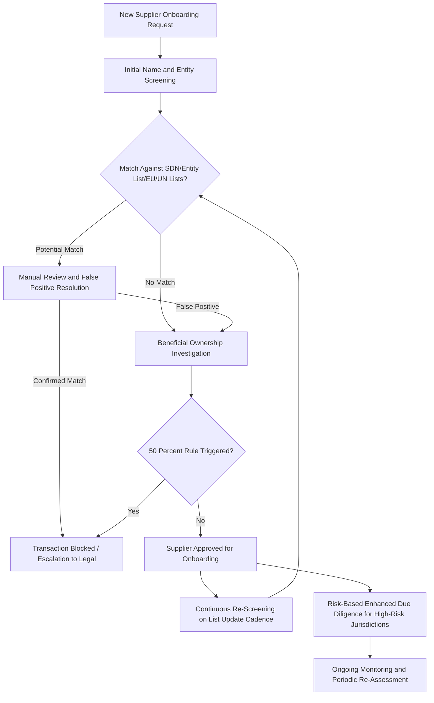

## Supplier Watchlist Screening and Sanctions Compliance

### Definition and Regulatory Foundation

Supplier watchlist screening is the systematic process of checking a firm's suppliers, customers, and other business counterparties against government-maintained restricted-party lists to identify and prevent transactions with sanctioned, denied, or otherwise legally restricted entities, forming the operational core of corporate sanctions compliance programs. The discipline sits at the intersection of supply chain risk management and legal/regulatory compliance, and has grown substantially in scope and enforcement intensity as the frequency and complexity of geopolitically driven sanctions and export control regimes has increased since roughly 2014 (Russia/Crimea sanctions), accelerating markedly following the 2022 Russian invasion of Ukraine and the parallel expansion of US-China technology export controls.

The regulatory foundation varies by jurisdiction but centers on several major list-maintaining authorities: the **US Treasury's Office of Foreign Assets Control (OFAC)**, which maintains the Specially Designated Nationals (SDN) List and administers comprehensive country-based sanctions programs (Iran, North Korea, Cuba, Syria, and others) alongside targeted sectoral and individual designations; the **US Commerce Department's Bureau of Industry and Security (BIS) Entity List**, restricting export, re-export, and transfer of specified items to listed entities, distinct from OFAC's broader transaction-prohibition scope in that Entity List restrictions apply specifically to controlled items and technology rather than all transactions; the **EU's consolidated sanctions list** and equivalent UK (OFSI), and UN Security Council sanctions regimes, each maintaining overlapping but not identical designated-party lists; and China's own **Unreliable Entity List** and export control mechanisms, representing a reciprocal restricted-party framework that Western-facing multinationals operating in China increasingly must also account for.

### Screening Methodology and Technical Architecture

**Name and entity matching**: Automated screening systems compare supplier and counterparty names (and increasingly beneficial-ownership and corporate-structure data) against restricted-party lists using fuzzy-matching algorithms designed to catch name variations, transliteration differences (particularly relevant for non-Latin-script entity names), and deliberate obfuscation attempts, while managing the trade-off between false-negative risk (missing a genuine match due to overly strict matching criteria) and false-positive burden (generating excessive manual review workload from overly loose matching criteria).

**Beneficial ownership and the 50% rule**: A critical and frequently underappreciated dimension of OFAC compliance is the "50 Percent Rule," under which any entity owned 50% or more in the aggregate by one or more blocked/sanctioned persons is itself considered blocked, regardless of whether that derivative entity separately appears by name on the SDN List — meaning effective screening requires beneficial-ownership investigation beyond simple name-matching against published lists, a substantially more data- and investigation-intensive requirement that has driven demand for specialized ownership-structure intelligence tools and databases.

**Continuous/ongoing screening versus point-in-time screening**: Given that restricted-party lists are updated frequently (OFAC designations can be added with immediate effect and no advance notice), mature compliance programs implement continuous or high-frequency re-screening of the existing supplier base rather than only screening at initial supplier onboarding — a distinction of significant practical importance, since a supplier that was compliant at onboarding can become sanctioned subsequently without any change in the buyer's own conduct.

**Risk-based screening depth**: Given the practical impossibility of exhaustive deep-tier screening across an entire large supplier base, mature programs typically apply risk-based prioritization — more intensive screening depth (including beneficial ownership investigation and enhanced due diligence) for suppliers in higher-risk jurisdictions, sectors subject to sectoral sanctions, or transaction types with elevated typical risk (indirect intermediaries, complex ownership structures) — rather than uniform maximum-depth screening applied indiscriminately.

### Watchlist Screening and Compliance Workflow

### Extraterritorial Reach and Secondary Sanctions Risk

**Extraterritorial application of US sanctions**: A structurally important feature of the US sanctions regime, connecting directly to the trade finance discussion covered elsewhere in this course, is its substantial extraterritorial reach — because global trade finance and settlement flows overwhelmingly clear through USD-denominated correspondent banking relationships often touching US financial institutions, non-US companies can face significant US enforcement exposure even without any direct US nexus in the underlying transaction, a dynamic that has driven substantial de-risking behavior among non-US financial institutions and corporates handling transactions with any plausible sanctions-adjacent exposure.

**Secondary sanctions**: Beyond direct transaction prohibitions (primary sanctions), certain US sanctions authorities (particularly regarding Iran and, increasingly, Russia-related trade) impose secondary sanctions risk — the possibility of being sanctioned oneself for engaging in significant transactions with already-sanctioned parties, even where the underlying transaction has no direct US nexus — creating a powerful deterrent effect that extends well beyond direct US legal jurisdiction and has been a significant factor in third-country financial institutions' reluctance to process transactions with Russian, Iranian, or North Korean counterparties even where not strictly legally required to refuse.

**Foreign Direct Product Rule (FDPR)**: Extends US export control jurisdiction extraterritorially to foreign-made products that incorporate US-origin technology or were produced using US-origin equipment or software, a mechanism prominently applied in the semiconductor export control context (covered under US reindustrialization and China's evolving trade strategy) to capture equipment manufactured by allied-nation firms (ASML, Tokyo Electron) using US-origin underlying technology, requiring supply chain screening to account for embedded US technology content in ostensibly non-US-origin products, not merely the immediate transacting counterparty's identity.

### Enforcement Trends and Penalty Exposure

Sanctions enforcement actions have grown substantially in both frequency and penalty scale over the past decade, with major settlements spanning financial institutions, energy companies, and increasingly technology and logistics firms found to have inadequate screening controls or willful sanctions violations. [Unverified] Specific penalty figures and enforcement case counts shift with each OFAC and BIS annual enforcement reporting cycle and should be checked against the most recent Treasury/Commerce enforcement releases rather than relied upon from potentially dated figures. Enforcement risk is generally assessed based on whether violations reflect willful conduct, reckless disregard, or a good-faith compliance program failure, with OFAC's published enforcement guidelines explicitly crediting the existence, quality, and remediation response of a firm's sanctions compliance program as a mitigating factor in penalty determination — creating a direct regulatory incentive for firms to invest in and document robust screening programs independent of any specific violation risk.

**Voluntary self-disclosure incentives**: OFAC and BIS enforcement frameworks both provide substantial penalty mitigation credit for voluntary self-disclosure of identified violations, creating a structured incentive for firms discovering internal compliance gaps to proactively disclose rather than remain silent, a factor that shapes internal compliance program design toward robust internal audit and escalation processes capable of surfacing violations for potential self-disclosure before external discovery.

### Integration with Broader Supply Chain Risk and Compliance Technology

**Convergence with n-tier mapping and third-party risk platforms**: Sanctions screening functionality is increasingly integrated within the broader third-party risk management and n-tier supplier mapping platforms covered in the corresponding topic in this course, reflecting the practical reality that sanctions risk is one of several compliance and risk dimensions (alongside forced labor provenance, financial health, and ESG factors) that firms increasingly seek to assess through a unified supplier risk data layer rather than maintaining entirely separate sanctions-specific and general supply-chain-risk-specific systems.

**AI and automated adverse-media screening**: Growing use of AI-driven adverse media and open-source intelligence monitoring to identify emerging sanctions risk signals (pending designations, regulatory investigations, or geopolitical developments suggesting elevated near-term sanctions risk for a specific entity or jurisdiction) before formal listing occurs, extending screening practice from purely reactive list-matching toward more anticipatory risk signal detection — though [Inference] this anticipatory capability inherently trades some precision for earlier warning, since pre-designation risk signals are probabilistic indicators rather than the definitive legal triggers that formal list additions represent.

### Persistent Challenges

**List fragmentation across jurisdictions**: Multinational firms operating across US, EU, UK, and other jurisdictions must reconcile screening against multiple overlapping but non-identical restricted-party lists, since a given entity may appear on one jurisdiction's list but not another's, requiring either the most conservative combined-list screening approach or jurisdiction-specific compliance calibration depending on where specific transactions or entities are legally exposed.

**Deep-tier and indirect exposure**: As with n-tier supply chain mapping more broadly, sanctions compliance screening applied only to direct (Tier 1) counterparties may miss exposure arising from indirect relationships — a Tier 1 supplier itself sourcing from or transacting with a sanctioned Tier 2 or Tier 3 entity — creating an area of genuine overlap and shared technical challenge between sanctions compliance and the broader multi-tier visibility problem covered separately in this course.

**Sanctions regime volatility and compliance program adaptability**: The pace of sanctions regime change (new Russia-related sectoral sanctions expansions, evolving China-related export control scope) has accelerated substantially since 2022, requiring compliance programs to maintain meaningfully higher update and re-screening cadence than the historically more stable sanctions environment of prior decades demanded, placing sustained pressure on both screening technology infrastructure and compliance staffing capacity to keep pace.

### Key Points

- Effective sanctions compliance requires screening beyond simple name-matching against published lists — the OFAC 50 Percent Rule means beneficial-ownership investigation is necessary to catch derivatively blocked entities not separately named on any list.
- US sanctions extraterritorial reach (via USD correspondent banking clearance) and secondary sanctions risk mean non-US companies face genuine enforcement exposure even absent direct US transactional nexus, a dynamic directly connected to the correspondent banking de-risking phenomenon covered under trade finance.
- The Foreign Direct Product Rule extends screening obligations beyond counterparty identity alone to embedded US-origin technology content in foreign-made products, most consequentially applied in semiconductor equipment export control enforcement.
- OFAC and BIS enforcement frameworks explicitly credit robust compliance program design and voluntary self-disclosure as penalty-mitigating factors, creating direct regulatory incentive for proactive screening investment independent of specific violation risk.
- Sanctions screening increasingly converges technically with broader n-tier supply chain mapping and third-party risk platforms, reflecting that deep-tier and indirect exposure is a shared challenge across both compliance domains rather than a sanctions-specific problem alone.

**Related Topics**

- OFAC 50 Percent Rule and beneficial ownership investigation methodology
- Correspondent banking de-risking and its link to sanctions extraterritoriality
- Foreign Direct Product Rule application to semiconductor equipment export controls
- China's Unreliable Entity List as a reciprocal restricted-party framework
- Voluntary self-disclosure programs and OFAC/BIS enforcement penalty mitigation
- Integration of sanctions screening within n-tier supplier mapping platforms