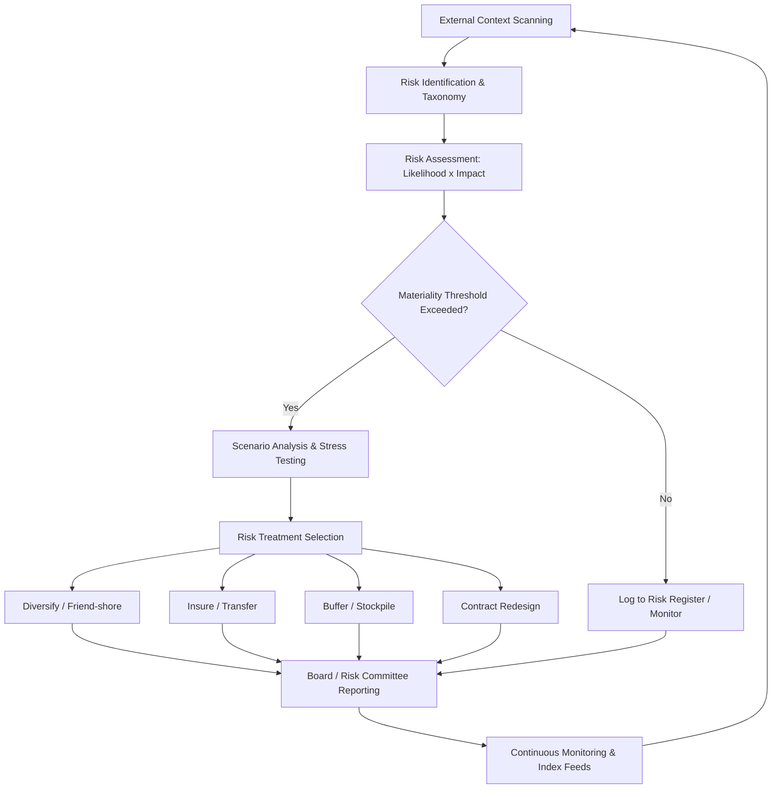

## Enterprise Risk Management Frameworks for Geopolitical Risk

### Overview

Enterprise Risk Management (ERM) frameworks provide the structural backbone for how multinational organizations identify, assess, quantify, and respond to geopolitical risk — a risk category distinguished from conventional operational or financial risk by its origin in state action, interstate conflict, and shifts in the international order rather than market mechanics alone. Geopolitical risk is non-diversifiable in the traditional portfolio sense (it correlates across asset classes and geographies simultaneously), exhibits fat-tailed and regime-shifting behavior, and frequently violates the historical-base-rate assumptions that actuarial and VaR-style models depend on.

### Foundational ERM Standards

**ISO 31000:2018 (Risk Management Guidelines)**

- Principle-based, not certifiable; provides a common vocabulary and process architecture (establish context → risk assessment → risk treatment → monitoring/review → communication/consultation)
- Geopolitical risk maps onto ISO 31000's "external context" establishment step, requiring PESTEL-style environmental scanning to be formalized rather than ad hoc

**COSO ERM 2017 ("Enterprise Risk Management — Integrating with Strategy and Performance")**

- Explicitly links risk to strategy-setting and performance, a shift from the 2004 cube model
- Five components: Governance & Culture, Strategy & Objective-Setting, Performance, Review & Revision, Information/Communication/Reporting
- Geopolitical risk is typically embedded in the "Strategy & Objective-Setting" component via scenario analysis and "risk appetite" statements tied to specific geographies or supply chain nodes

**NIST-adjacent and sector frameworks**

- For supply chain specifically, ISO 28000 (supply chain security management) and ISO 31000 are often run in parallel, with geopolitical risk registers feeding into supplier qualification and business continuity planning (ISO 22301)

### Core Structural Components of a Geopolitical Risk Framework

**1. Risk Identification and Taxonomy**

Geopolitical risk is typically decomposed into sub-categories to make it tractable within a broader ERM register:

- **State-to-state conflict risk** — interstate war, proxy conflict, militarized disputes
- **Intrastate/political stability risk** — coups, civil unrest, regime transitions, succession crises
- **Policy and regulatory risk** — export controls, sanctions regimes, tariffs, expropriation/nationalization, investment screening (e.g., CFIUS-equivalent bodies)
- **Alliance and bloc realignment risk** — shifts in trade blocs, technology-sharing agreements, standard-setting bodies
- **Resource nationalism** — critical mineral export restrictions, energy supply weaponization
- **Cyber-geopolitical risk** — state-sponsored cyber operations targeting supply chain infrastructure

**2. Risk Assessment and Scoring**

Because geopolitical events are low-frequency/high-severity and lack the dense historical time series used in credit or market risk, most frameworks substitute **structured expert judgment** and **composite indices** for pure statistical modeling.

Common quantitative/semi-quantitative inputs:

- **Likelihood × Impact matrices**, often on 5x5 grids, with likelihood informed by analyst judgment rather than frequency data
- **Composite geopolitical risk indices** — e.g., the Caldara-Iacoviello Geopolitical Risk (GPR) Index (news-based text analysis of geopolitical tension), the Economist Intelligence Unit's political risk ratings, Verisk Maplecroft indices, and Control Risks' RiskMap
- **Country risk scoring models** blending sovereign credit metrics (rule of law, expropriation history, currency convertibility) with event-based indicators

[Inference] Firms increasingly weight these composite indices against internal "exposure concentration" metrics (e.g., percentage of Tier-1/Tier-2 suppliers, or percentage of revenue, tied to a single jurisdiction) — a practice not yet standardized across ERM literature but visible in supply-chain-resilience consulting outputs.

**3. Scenario Analysis and Stress Testing**

Given the inadequacy of historical base rates, geopolitical risk frameworks lean heavily on forward-looking scenario construction rather than backward-looking statistical inference:

- **Scenario planning (Shell-style)** — constructing 2-4 internally consistent, plausible futures (not predictions) to pressure-test strategy robustness across divergent worlds
- **Red-teaming / wargaming** — simulating adversarial state or competitor actions against the firm's supply chain footprint
- **Reverse stress testing** — starting from an unacceptable outcome (e.g., loss of access to a critical input) and working backward to identify the triggering event chain

**Key Points**

- Geopolitical risk frameworks differ from financial risk frameworks primarily in their reliance on qualitative/structured-judgment inputs alongside quantitative indices
- Scenario analysis substitutes for statistical modeling where historical data is sparse or non-stationary
- Effective frameworks tie geopolitical risk directly to supply chain exposure metrics (single-sourcing, geographic concentration, chokepoint dependency)

### Governance Structures

- **Board-level oversight** — many large multinationals now maintain a board risk committee with explicit geopolitical risk mandate, distinct from audit or financial risk committees
- **Chief Risk Officer (CRO) / Geopolitical Risk function** — a growing number of firms (particularly in extractives, semiconductors, and defense-adjacent sectors) have stood up dedicated geopolitical intelligence units, often staffed with former government/intelligence analysts
- **Cross-functional risk committees** — integrating procurement, legal/compliance, trade compliance, treasury, and corporate security, since geopolitical shocks propagate across all these functions simultaneously
- **Three lines of defense model** — (1) business units owning day-to-day exposure, (2) risk/compliance functions setting policy and monitoring, (3) internal audit providing independent assurance — adapted for geopolitical risk by embedding trade compliance and sanctions screening into line one

### Risk Treatment Strategies Specific to Geopolitical Exposure

- **Diversification / "friend-shoring" / "China+1"** — deliberately reducing geographic concentration in sourcing and manufacturing footprints
- **Dual/multi-sourcing** — maintaining qualified alternate suppliers across differing jurisdictions to decorrelate exposure
- **Strategic inventory buffers** — trading carrying cost for supply continuity on critical inputs (particularly relevant for semiconductors, rare earths, active pharmaceutical ingredients)
- **Contractual risk transfer** — force majeure clauses, political risk insurance (PRI) via MIGA, OPIC/DFC successors, or private insurers (Lloyd's syndicates)
- **Trade compliance infrastructure** — automated denied-party screening, export control classification (ECCN/HS code mapping), and sanctions list monitoring integrated into ERP/procurement systems
- **Localization** — establishing regional production hubs to serve regional demand independent of cross-border flows

### Illustrative Framework Architecture

### Example: Applying the Framework to a Semiconductor Supply Chain

**Input**: A firm sources advanced logic chips predominantly from a single foundry region subject to elevated interstate tension.

**Application**:

1. **Identification** — flagged under "state-to-state conflict risk" and "resource nationalism" (export control exposure on lithography equipment)
2. **Assessment** — high impact (revenue-critical input), moderate-to-high likelihood per composite index trend lines; concentration ratio flagged as exceeding internal risk appetite threshold
3. **Scenario analysis** — three scenarios constructed: status quo, escalation with export restriction, escalation with kinetic disruption to shipping lanes
4. **Treatment** — qualification of a second foundry in a geographically decorrelated jurisdiction, strategic buffer stock sized to bridge a 6-9 month disruption, contractual force majeure renegotiation
5. **Governance** — quarterly reporting to board risk committee with index-based early-warning triggers

### Limitations and Critiques

- Composite indices can lag fast-moving events and are subject to media-coverage bias (more coverage ≠ proportionally higher risk)
- Likelihood estimation for rare, high-impact events is inherently subject to expert cognitive biases (availability heuristic, recency bias)
- Over-reliance on quantitative scoring can create false precision; many practitioners argue geopolitical risk is better handled through robust/adaptive strategy design than point-estimate forecasting [Speculation — this is a live debate in the risk management literature without consensus resolution]

**Related Topics**

- Political risk insurance mechanisms (MIGA, DFC, Lloyd's syndicates)
- Geopolitical risk indices: Caldara-Iacoviello GPR methodology
- Scenario planning and wargaming methodologies for corporate strategy
- Supply chain chokepoint analysis (Strait of Malacca, Taiwan Strait, Suez/Red Sea)
- Sanctions compliance architecture and denied-party screening systems
- Friend-shoring and China+1 diversification strategies
- Critical minerals and resource nationalism