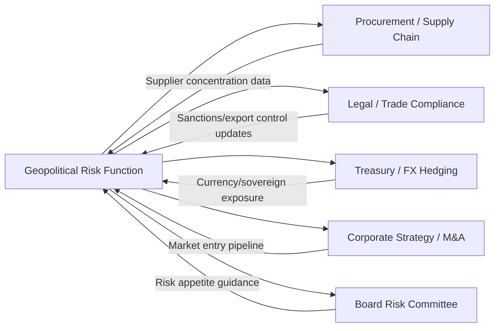

## Building a Geopolitical Risk Function within a Corporation

### Overview

A dedicated geopolitical risk function is the organizational mechanism by which a corporation moves from ad hoc, reactive political risk awareness to systematic, forward-looking analysis embedded in strategic and operational decision-making. Unlike traditional risk management functions that lean on actuarial or market data, a geopolitical risk function operates closer to an in-house intelligence unit — synthesizing open-source intelligence, expert networks, and structured analytic techniques to produce decision-relevant outputs for procurement, treasury, legal, and the board.

### Organizational Placement and Reporting Lines

**Common models**:

- **Embedded within Enterprise Risk Management (ERM) / Chief Risk Officer's office** — geopolitical risk treated as one workstream among several (credit, market, operational, geopolitical); benefits from shared governance infrastructure but risks being under-resourced relative to its distinct methodological needs
- **Standalone function reporting to General Counsel or Chief Legal Officer** — common where trade compliance, sanctions, and export control obligations dominate the mandate
- **Standalone function reporting directly to CEO/COO or board risk committee** — signals strategic priority; typical in extractives, defense, semiconductors, and other sectors with high state-exposure
- **Embedded within Corporate Security / Global Security function** — historical model, often blending physical security, executive protection, and political risk; increasingly seen as too narrow for supply-chain-relevant geopolitical analysis
- **Hybrid "hub and spoke"** — a small central team sets methodology and produces top-down assessments, while regional business units and procurement teams act as distributed "spokes" feeding in localized intelligence

[Inference] The trend among large multinationals with complex supply chains appears to favor direct board/CEO-level reporting lines or close integration with the CRO's office, reflecting the recognition that geopolitical shocks now materially affect enterprise value rather than being a peripheral compliance matter — though this is based on observed organizational design patterns rather than a formally benchmarked industry standard.

### Core Mandate and Scope

A well-scoped function typically owns:

1. **Horizon scanning and early warning** — continuous monitoring of political, regulatory, and conflict developments relevant to the firm's footprint
2. **Country and market risk assessment** — standardized scoring/rating of jurisdictions where the firm has operations, suppliers, or customers
3. **Scenario planning support** — facilitating structured scenario exercises for strategic planning cycles and board briefings
4. **Deal and transaction due diligence** — political risk input into M&A, market entry, and major capital allocation decisions
5. **Crisis response support** — providing real-time analysis during acute events (coups, sanctions announcements, conflict escalation) to inform business continuity decisions
6. **Trade compliance liaison** — coordinating with legal/compliance on sanctions, export controls, and investment screening regimes, though execution of compliance itself often remains with legal

### Staffing and Talent Model

**Typical composition**:

- **Geopolitical/regional analysts** — often drawn from government, intelligence community, diplomatic, or think-tank backgrounds; bring structured analytic technique fluency and regional/linguistic expertise
- **Supply chain/operations liaisons** — translate geopolitical assessments into operational exposure terms (which suppliers, which routes, which facilities)
- **Data/quantitative analysts** — build and maintain composite risk scoring models, index tracking, and exposure-mapping dashboards
- **Function lead (Head of Geopolitical Risk / Chief Geopolitical Officer — an emerging title)** — typically senior, with credibility to brief the board and challenge business unit assumptions

**Key Points**

- Effective functions blend "outside-in" geopolitical expertise with "inside-out" knowledge of the firm's actual operational and supply chain footprint — neither alone is sufficient
- A common failure mode is hiring only regional/political experts without embedding them close enough to procurement and operations data to make outputs actionable

### Analytical Methodology and Tooling

**Structured Analytic Techniques (SATs)** — borrowed from intelligence community tradecraft, commonly adapted for corporate use:

- **Analysis of Competing Hypotheses (ACH)** — systematically evaluating multiple explanations for ambiguous developments rather than anchoring on the first plausible narrative
- **Key Assumptions Check** — periodically re-examining the assumptions underpinning existing risk assessments
- **Indicators and Warning (I&W) frameworks** — pre-defined observable indicators that, if triggered, escalate an event from "monitoring" to "active risk"
- **Red team / devil's advocacy reviews** — dedicated challenge function for high-stakes assessments feeding major decisions

**Data and tooling stack**:

- Composite index subscriptions (Verisk Maplecroft, Control Risks RiskMap, EIU, S&P Global Market Intelligence country risk)
- News/OSINT aggregation and NLP-based event detection (monitoring for sanctions announcements, conflict escalation, regulatory shifts)
- Supply chain mapping tools providing Tier-1 through Tier-N visibility, cross-referenced against country risk layers
- Internal risk register/GRC (Governance, Risk, Compliance) platforms for logging, scoring, and tracking treatment status

### Integration with Existing Enterprise Functions

Without this bidirectional data flow, a geopolitical risk function tends to produce reports that are analytically sound but operationally disconnected — a commonly cited failure mode where outputs are read but not acted upon.

### Building the Function: Phased Approach

**Example: Phase-based build-out**

- **Phase 1 — Foundation (0-6 months)**: Establish mandate and reporting line; hire function lead; inventory existing geopolitical exposure via supply chain and revenue concentration mapping; subscribe to baseline index/data feeds
- **Phase 2 — Methodology (6-12 months)**: Develop standardized country/market risk scoring methodology; establish risk register and escalation thresholds; run first board-level scenario planning exercise
- **Phase 3 — Integration (12-24 months)**: Embed risk triggers into procurement qualification and M&A due diligence workflows; formalize crisis response protocols with defined roles; establish regular (e.g., quarterly) board reporting cadence
- **Phase 4 — Maturity (24+ months)**: Predictive/anticipatory posture — indicators and warning frameworks trigger pre-positioned contingency plans rather than reactive scrambling; function contributes to proactive strategy (e.g., informing where new capacity is sited) rather than only defensive risk mitigation

### Measuring Function Effectiveness

Common challenges and candidate metrics:

- **Difficulty of counterfactual measurement** — success often means an avoided loss, which is inherently hard to quantify [Inference — this measurement challenge is widely acknowledged in risk management practice, though no single standardized metric has achieved consensus adoption]
- Proxy metrics used in practice: time-to-detection for material events, percentage of supply chain with active alternate sourcing, board engagement/utilization rates of risk outputs, reduction in single-jurisdiction revenue/sourcing concentration over time

### Common Pitfalls

- **Under-resourcing relative to mandate** — a two-person team asked to cover global geopolitical exposure for a Fortune 500 supply chain
- **Analysis without operational translation** — producing country risk reports that procurement teams cannot map to specific supplier decisions
- **Reporting lines that dilute authority** — burying the function too deep in a hierarchy to influence major capital decisions
- **Overreliance on lagging indices** — treating composite scores as leading indicators when they are often constructed from recent news flow and thus reactive by design

**Related Topics**

- Enterprise risk management frameworks for geopolitical risk
- Structured analytic techniques (SATs) in corporate intelligence
- Supply chain mapping and Tier-N supplier visibility
- Scenario planning and wargaming methodologies for corporate strategy
- Sanctions compliance architecture and denied-party screening systems
- Political risk insurance mechanisms (MIGA, DFC, Lloyd's syndicates)