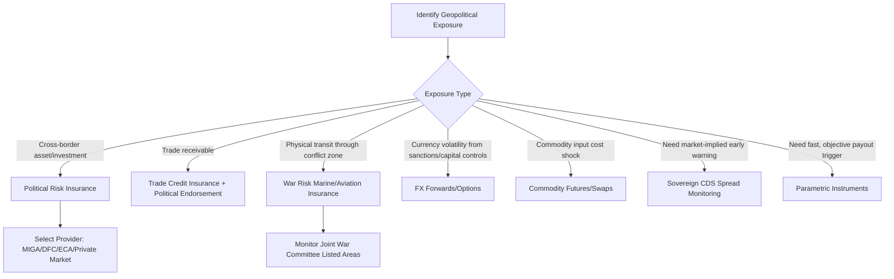

## Insurance, Hedging, and Financial Instruments for Geopolitical Risk

### Overview

Financial risk transfer and hedging mechanisms form the capital-markets layer of geopolitical risk management, complementing operational strategies like diversification and buffer stock. These instruments allow firms to convert uncertain, potentially catastrophic geopolitical exposures into known, budgetable costs (insurance premiums) or to offset exposure through correlated financial positions (hedging). Geopolitical risk instruments differ meaningfully from standard commercial insurance and hedging in that the underlying peril is state action or interstate conflict — perils that are systemic, difficult to model actuarially, and often subject to war exclusion clauses in conventional policies.

### Political Risk Insurance (PRI)

**Core coverage categories**:

- **Expropriation/nationalization** — government seizure of assets without adequate compensation, including "creeping expropriation" (regulatory actions that de facto strip asset value without formal seizure)
- **Currency inconvertibility and transfer restriction** — inability to convert local currency earnings or repatriate profits/dividends due to government-imposed capital controls
- **Political violence** — war, civil war, terrorism, sabotage, and revolution coverage for physical assets and business interruption
- **Breach of contract** — government failure to honor contractual obligations (e.g., power purchase agreements), typically requiring an arbitral award before claims trigger
- **Non-honoring of sovereign financial obligations** — sovereign or sub-sovereign default on guaranteed obligations

**Major providers**:

- **MIGA (Multilateral Investment Guarantee Agency)** — World Bank Group member providing PRI primarily to encourage foreign direct investment into developing/emerging markets; caps and pricing linked to development mandate
- **DFC (U.S. International Development Finance Corporation)** — successor to OPIC; U.S. government agency providing PRI alongside development finance, tied to U.S. foreign policy priorities and eligible-country lists
- **Export credit agencies (ECAs)** — e.g., UK Export Finance, Euler Hermes (Germany), Nippon Export and Investment Insurance (Japan) — often bundle PRI with export financing
- **Private market (Lloyd's of London syndicates, Berkshire Hathaway Specialty, Chubb, AIG, Zurich)** — offers more flexible terms and faster underwriting than multilaterals, generally at higher premium cost and lower per-risk capacity
- **Berne Union** — the international association of export credit and investment insurers; publishes aggregate exposure data used as a market-sizing reference

**Key Points**

- PRI typically covers *cross-border* investment exposure (i.e., a firm's outbound investment into a foreign jurisdiction), not purely domestic political risk within the insured's home country
- Multilateral providers (MIGA, DFC) often carry an implicit "deterrent effect" — host governments may be less likely to expropriate assets insured by an institution with sovereign-level relationships, an effect frequently cited in PRI literature though difficult to isolate empirically [Inference]

### Trade Credit Insurance with Political Risk Extensions

- Standard trade credit insurance (protecting against buyer non-payment) is frequently extended with **political risk endorsements** covering non-payment caused by government action (import/export bans, currency controls) rather than pure commercial default
- Relevant to supply chain finance where suppliers or buyers sit in politically volatile jurisdictions

### War Risk and Marine/Aviation-Specific Coverage

- **War risk insurance (marine hull and cargo)** — standard marine policies typically exclude war perils via the Institute War and Strikes Clauses; separate war risk policies (often priced dynamically, sometimes daily, based on current threat assessments) are purchased for transit through high-risk zones (e.g., Red Sea/Bab-el-Mandeb, Strait of Hormuz)
- **Additional premium (AP) zones** — insurers designate "listed areas" where war risk premiums spike based on real-time conflict developments; shipping through these zones requires separate underwriting
- **Aviation war risk** — similarly segmented from standard hull/liability coverage, critical for air cargo routes over or near conflict zones

[Unverified] Specific current premium rates and listed-area boundaries change frequently with the conflict landscape and are not reliably summarized from static training data; current rates should be confirmed with a marine/aviation war risk underwriter or via Lloyd's Market Association Joint War Committee listed areas.

### Hedging Instruments (Financial Markets Layer)

Unlike insurance (indemnity-based, requiring proof of loss), hedging instruments derive value from market prices correlated with geopolitical exposure, settling regardless of whether the firm suffers an actual loss.

**Currency hedging**:

- **Forwards and futures** — locking in exchange rates for anticipated foreign currency cash flows, relevant where geopolitical events drive currency volatility (sanctions-driven currency collapse, capital flight)
- **Options (currency puts/calls)** — providing downside protection while retaining upside, at the cost of an upfront premium — often preferred for genuinely uncertain geopolitical scenarios where a firm wants asymmetric protection rather than a locked rate

**Commodity hedging**:

- **Futures and forwards on energy and metals** — hedging input cost exposure to commodities subject to geopolitical supply shocks (oil, natural gas, rare earths, semiconductor-grade materials)
- **Swaps** — fixing a floating commodity price exposure, commonly used for energy-intensive manufacturers exposed to gas price spikes from supply disruption

**Sovereign and credit-linked instruments**:

- **Credit Default Swaps (CDS) on sovereign debt** — while primarily a credit risk instrument, sovereign CDS spreads are widely used as a *market-implied geopolitical risk indicator* even by firms not holding the underlying debt — spread widening often precedes or accompanies geopolitical stress
- **Catastrophe bonds and parametric instruments** — increasingly explored for geopolitical/conflict-adjacent perils, paying out based on a predefined trigger (e.g., an index crossing a threshold) rather than proof of loss, enabling faster claims settlement

### Parametric Risk Transfer

- **Parametric insurance** pays a predetermined amount when an objectively measurable trigger is met (e.g., a conflict-intensity index, a shipping-route closure index, a specific event occurrence) rather than requiring loss adjustment
- Advantages: faster payout, reduced claims disputes, applicable to perils (like supply chain disruption from a chokepoint closure) that are hard to adjust under traditional indemnity insurance
- Limitations: **basis risk** — the trigger may fire without the firm suffering a proportional loss, or the firm may suffer a loss without the trigger firing, since the index is a proxy rather than a direct loss measure

### Instrument Selection Framework

### Example: Structuring Coverage for a Manufacturing Investment

**Scenario**: A firm is building a manufacturing facility in a jurisdiction with elevated expropriation and currency-control risk, sourcing inputs via sea freight through a strait subject to intermittent closure risk.

**Applied instrument stack**:

1. **PRI (MIGA or DFC)** covering expropriation and currency inconvertibility on the capital investment itself, term-matched to the investment horizon
2. **War risk marine insurance** for cargo transiting the high-risk strait, with monitoring of Joint War Committee listed-area status to anticipate premium changes
3. **FX forward contracts** hedging anticipated repatriated profit against currency devaluation risk
4. **Parametric trigger (if available)** tied to a shipping-route disruption index, providing rapid liquidity to fund alternate logistics routing without waiting for traditional claims adjustment

**Conclusion**

No single instrument fully addresses geopolitical risk; effective programs layer indemnity-based insurance (for defined, provable losses), market hedges (for continuously priced exposures like currency and commodities), and increasingly parametric instruments (for speed and objectivity where basis risk is acceptable). Instrument selection should be matched to the specific *transmission mechanism* of the geopolitical risk — asset seizure, currency freeze, physical transit disruption, or input cost shock each call for a different instrument class rather than a single "geopolitical risk policy."

**Related Topics**

- Enterprise risk management frameworks for geopolitical risk
- Building a geopolitical risk function within a corporation
- Sovereign credit risk and CDS spread analysis
- Maritime chokepoints and shipping route risk (Strait of Hormuz, Bab-el-Mandeb, Taiwan Strait)
- Export credit agencies and trade finance structures
- Sanctions compliance architecture and denied-party screening systems