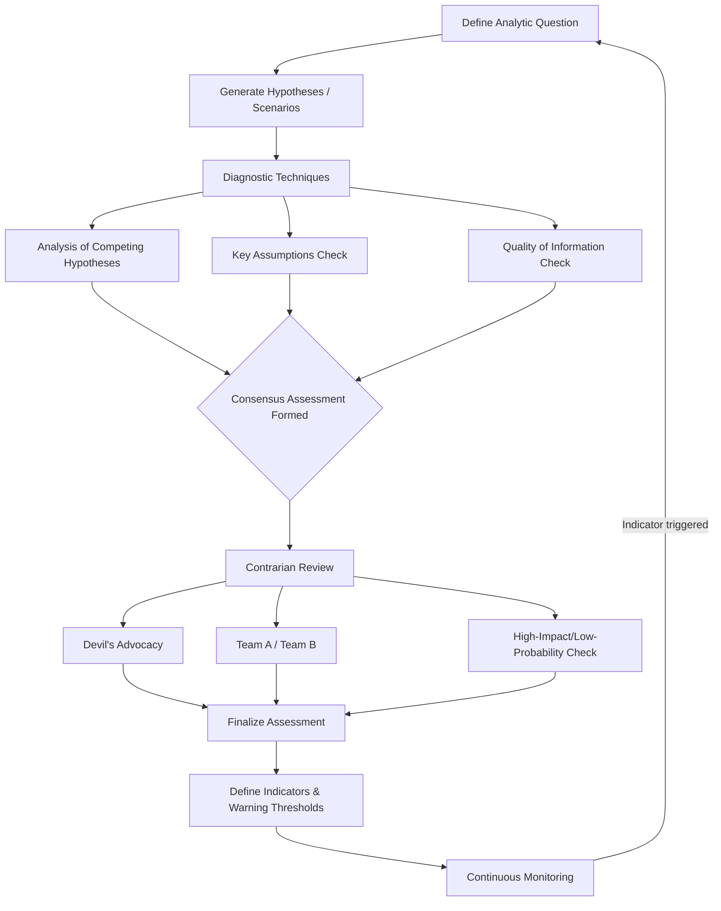

## Structured Analytic Techniques for Geopolitical Forecasting

### Overview

Structured Analytic Techniques (SATs) are formalized reasoning procedures developed largely within the intelligence community — most notably codified in Richards Heuer's *Psychology of Intelligence Analysis* and the U.S. Government's *A Tradecraft Primer* — designed to counteract cognitive biases, mirror-imaging, and premature closure in analytic judgments. In corporate geopolitical risk practice, SATs provide the methodological discipline that substitutes for the dense historical datasets available in financial risk modeling, imposing structure on inherently qualitative, judgment-based forecasting.

### Why Structure Is Necessary

Unstructured ("gut feel") analysis is vulnerable to well-documented cognitive failure modes:

- **Anchoring** — over-weighting the first piece of information encountered
- **Confirmation bias** — selectively attending to evidence that supports an existing hypothesis
- **Mirror-imaging** — assuming foreign actors will behave as the analyst's own culture/organization would
- **Groupthink** — premature consensus in group settings that suppresses dissenting analysis
- **Availability heuristic** — overweighting vivid or recent events relative to their actual base rate

SATs impose explicit, often written, procedural steps that force consideration of alternatives and surface unstated assumptions, making the reasoning process auditable rather than a black box.

### Diagnostic Techniques

**Analysis of Competing Hypotheses (ACH)**

- Developed by Heuer specifically to counter confirmation bias
- Procedure: (1) brainstorm all plausible hypotheses, (2) list diagnostic evidence, (3) build a matrix scoring each piece of evidence against *each* hypothesis for consistency/inconsistency, (4) identify the hypothesis with the *least* inconsistent evidence (rather than the most confirming evidence — a deliberate inversion designed to fight confirmation bias)
- Particularly suited to ambiguous situations with multiple plausible state actors or motives (e.g., attributing responsibility for an infrastructure attack or an unexplained trade policy shift)

**Key Assumptions Check**

- Systematic listing and interrogation of the assumptions underpinning a current assessment
- Each assumption is tested: is it well-founded? What would have to be true for it to be false? Has new evidence undermined it?
- Commonly run on a scheduled cadence (e.g., quarterly) for standing risk assessments, since assumptions that were valid at assessment creation can silently decay

**Quality of Information Check**

- Systematic evaluation of source reliability and information credibility, distinguishing corroborated multi-source reporting from single-source or unverified claims
- Critical in OSINT-heavy corporate geopolitical analysis where source quality varies enormously (state media, independent journalism, social media, satellite imagery, expert networks)

### Contrarian Techniques

**Devil's Advocacy**

- A designated individual or team formally argues against the prevailing/consensus assessment, regardless of personal belief, to stress-test its robustness
- Distinguished from genuine dissent by being structurally assigned rather than organically arising

**Team A / Team B Analysis**

- Two independent teams analyze the same question from differing starting assumptions or analytic frameworks, then compare conclusions
- Useful where there is legitimate, unresolved debate about an actor's intentions (e.g., whether a state's rhetoric reflects genuine strategic intent or domestic political signaling)

**High-Impact/Low-Probability Analysis**

- Deliberately allocates analytic attention to low-likelihood but severe-consequence scenarios that would otherwise be discounted under standard likelihood-weighted prioritization
- Directly relevant to geopolitical risk given the fat-tailed nature of interstate conflict and sanctions escalation

**"What If?" Analysis**

- Assumes a given (currently unlikely) event *has* occurred and works backward to construct a plausible causal pathway, surfacing indicators that might otherwise be dismissed as noise

### Imaginative Techniques

**Scenario Analysis / Alternative Futures**

- Constructing multiple internally consistent, divergent future states (not predictions, but bounding cases) — commonly built along two orthogonal axes of highest uncertainty (e.g., "degree of great-power decoupling" × "domestic political stability") to produce a 2x2 scenario matrix
- Distinct from forecasting: the goal is strategic robustness across scenarios, not picking the single most likely one

**Indicators and Warning (I&W) / Indicator Generation**

- For each scenario or hypothesis, analysts pre-define observable indicators that would signal movement toward that outcome
- Enables continuous, lower-effort monitoring against a fixed indicator list rather than re-analyzing the full situation on every news cycle
- Indicators are typically tiered (e.g., "watch," "warning," "critical") with pre-agreed escalation triggers tied to each tier

**Red Team Analysis / Red Teaming**

- Structured simulation of an adversarial actor's decision-making, often role-played, to anticipate actions a "blue team" (the firm's own planning) might not naturally consider
- Distinguished from devil's advocacy by focusing on *actor behavior simulation* rather than critiquing an existing assessment

### Process Architecture

**Key Points**

- SATs are process disciplines, not predictive models — they improve the *reliability and auditability* of judgment, not its certainty
- Diagnostic techniques (ACH, Key Assumptions Check) are best applied early, to form an assessment; contrarian techniques (devil's advocacy, red teaming) are best applied to *stress-test* an assessment already formed
- Indicators and Warning frameworks are what operationalize SAT output into ongoing corporate monitoring, converting a one-time analytic exercise into a living early-warning system

### Example: Applying ACH to a Trade Policy Question

**Question**: Will Country X impose new export restrictions on a critical mineral within the next two quarters?

**Hypotheses generated**:

1. Restrictions imposed as retaliatory trade measure
2. Restrictions imposed for genuine domestic resource-security reasons, independent of trade relations
3. No restrictions; current rhetoric is domestic political signaling only

**Matrix approach**: Each piece of evidence (statements by officials, recent precedent in adjacent sectors, domestic stockpile levels, timing relative to unrelated diplomatic events) is scored for consistency/inconsistency against all three hypotheses — not just the initially favored one. The hypothesis surviving with the fewest inconsistencies (rather than the most supporting evidence) becomes the working assessment, with indicators defined to monitor for disconfirming evidence going forward.

### Limitations

- SATs mitigate but do not eliminate cognitive bias; poorly facilitated ACH matrices, for instance, can still be gamed by an analyst backfilling consistency scores to support a preferred hypothesis
- Techniques requiring multiple analysts or teams (Team A/B, red teaming) are resource-intensive and often impractical for smaller geopolitical risk functions
- [Speculation] Some practitioners argue that heavy proceduralization can slow response time during genuinely fast-moving crises, where a lighter-weight adapted version of these techniques may be more appropriate than the full intelligence-community process — this trade-off is debated rather than resolved in the corporate risk literature

**Related Topics**

- Building a geopolitical risk function within a corporation
- Indicators and Warning (I&W) framework design
- Scenario planning and wargaming methodologies for corporate strategy
- Cognitive bias in forecasting and decision-making
- OSINT collection and source evaluation for corporate intelligence