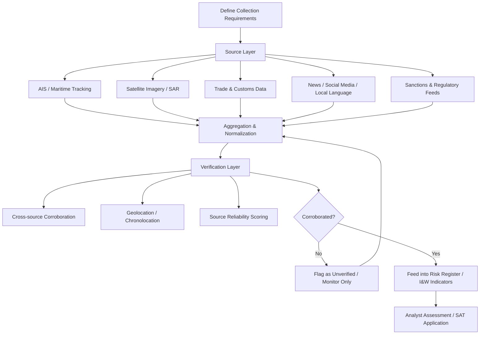

## Open Source Intelligence Methods for Supply Chain Monitoring

### Overview

Open Source Intelligence (OSINT) refers to the systematic collection, evaluation, and synthesis of publicly available information — as opposed to classified, proprietary, or covertly obtained data — to produce decision-relevant intelligence. In the supply chain geopolitics context, OSINT provides the raw observational layer feeding into structured analytic techniques, indicators-and-warning frameworks, and enterprise risk registers. Its distinguishing methodological challenge is not data scarcity but data *abundance*: the core discipline is collection planning, source triage, and corroboration rather than acquisition itself.

### OSINT Source Categories Relevant to Supply Chain Monitoring

**1. Maritime and Logistics Tracking**

- **AIS (Automatic Identification System) vessel tracking** — mandatory transponder data broadcasting vessel position, speed, heading, and identity; aggregated by commercial platforms (MarineTraffic, Vessel Finder, Lloyd's List Intelligence, Kpler, Windward)
- **"Dark fleet" / AIS spoofing detection** — vessels disabling or manipulating AIS transponders to obscure movements (common in sanctions-evasion shipping); detected via satellite imagery correlation, radar (SAR) cross-referencing, and anomaly-detection algorithms comparing expected vs. actual signal gaps
- **Port congestion and dwell-time data** — publicly reported or commercially aggregated port throughput statistics serving as early indicators of chokepoint disruption

**2. Satellite Imagery and Remote Sensing**

- **Commercial satellite imagery providers** (Planet Labs, Maxar, BlackSky) — enabling near-daily revisit rates over critical infrastructure (ports, refineries, mines, manufacturing facilities)
- **Synthetic Aperture Radar (SAR)** — penetrates cloud cover and operates at night, valuable for monitoring activity in regions with persistent cloud cover or for detecting vessel activity independent of AIS reporting
- **Nighttime lights data** (e.g., NASA/NOAA VIIRS) — used as a proxy indicator for industrial activity levels, sometimes cited in sanctions-effectiveness or economic-activity research [Inference — a widely used but imperfect proxy, since correlation with actual production output varies by sector and region]
- **Thermal/infrared imagery** — used to infer facility operational status (e.g., blast furnace activity, refinery throughput) from heat signatures

**3. Trade and Customs Data**

- **Bill-of-lading and customs records** — aggregated by commercial trade data providers (Panjiva/S&P Global, ImportGenius, TradeAtlas) to reveal shipment-level buyer-supplier relationships, often the primary method for mapping sub-Tier-1 supply chain relationships that firms themselves may not formally disclose
- **National customs/trade statistics** — official government trade data (UN Comtrade, national customs agencies) for aggregate flow analysis and trend detection

**4. Corporate and Financial Disclosures**

- Public filings (10-Ks, annual reports, supplier disclosure requirements under regulations like the UK Modern Slavery Act or EU Corporate Sustainability Due Diligence Directive)
- Beneficial ownership registries (where available) for identifying ultimate ownership behind opaque supplier entities, relevant to sanctions-exposure screening

**5. News, Social Media, and Local-Language Sources**

- Local and regional news monitoring, particularly for early signals of labor unrest, regulatory announcements, or infrastructure incidents that precede international wire coverage
- Social media monitoring (with appropriate verification discipline, given high rates of misinformation) for real-time event detection — protests, border closures, facility incidents
- Telegram, regional forums, and niche platforms increasingly relevant for tracking conflict-adjacent developments in regions with limited traditional press access [Inference]

**6. Government and Multilateral Publications**

- Sanctions lists and designations (OFAC SDN list, EU consolidated list, UK OFSI list) — essential for denied-party screening
- Export control classification updates (BIS Entity List, Commerce Control List changes)
- Multilateral reporting (UN Panel of Experts reports, IAEA, World Bank logistics performance indices)

### Verification and Source Evaluation Methodology

**Key Points**

- OSINT tradecraft's central discipline is *not finding information* but *evaluating its reliability* — corroboration across independent sources, assessment of source motive/bias, and geolocation/chronolocation verification for imagery and social media content
- A single-source, unverified claim should never independently trigger a material risk escalation; corroboration standards (e.g., requiring two independent, non-derivative sources) are standard tradecraft practice

**Verification techniques**:

- **Geolocation** — confirming the claimed location of an image/video via visual landmark matching against satellite imagery or mapping platforms
- **Chronolocation** — establishing the actual time of an event via shadow analysis, weather-condition cross-referencing, or metadata (where available and not stripped)
- **Reverse image search** — detecting recycled or mislabeled imagery being presented as current
- **Cross-source corroboration** — triangulating a claim across independent outlets with differing institutional interests, reducing the risk of amplifying a single propaganda or disinformation source

### OSINT Collection Architecture for Supply Chain Monitoring

### Example: Detecting Sanctions-Evasion Shipping Patterns

**Objective**: Identify whether a supplier's raw material inputs are being sourced via sanctions-evading transshipment.

**Applied method**:

1. **AIS anomaly detection** — flag vessels with AIS gaps exceeding a threshold duration in relevant maritime corridors
2. **SAR cross-referencing** — confirm vessel presence during AIS-dark periods using radar imagery unaffected by transponder status
3. **Ship-to-ship transfer detection** — satellite imagery identifying vessels positioned alongside one another in open water, a common pattern for transferring sanctioned cargo to a "clean" vessel
4. **Trade data cross-check** — compare declared cargo origin in customs/bill-of-lading records against the vessel's actual tracked port calls
5. **Corroboration** — cross-reference findings against published sanctions-evasion reports (e.g., UN Panel of Experts, specialized maritime risk intelligence providers) before escalating to a formal compliance finding

### Tooling Landscape

- **Commercial maritime intelligence platforms**: Windward, Kpler, Lloyd's List Intelligence, MarineTraffic (tiered commercial/free access)
- **Trade data platforms**: Panjiva (S&P Global Market Intelligence), ImportGenius, TradeAtlas
- **Satellite imagery access**: Planet Labs, Maxar, Sentinel Hub (Copernicus/ESA, free-tier access to Sentinel satellite data)
- **OSINT aggregation/verification frameworks**: Bellingcat's published methodology (widely referenced as a public-domain OSINT tradecraft standard, though Bellingcat itself is a journalism organization rather than a commercial monitoring vendor)
- **Sanctions/PEP screening platforms**: Dow Jones Risk & Compliance, Refinitiv World-Check, LexisNexis — typically integrated into procurement/KYC workflows rather than standalone OSINT tools

### Limitations and Risks

- **Signal-to-noise ratio** — the volume of available open source data can overwhelm analytic capacity without disciplined collection requirements defined in advance
- **Disinformation exposure** — state and non-state actors actively seed false or misleading open source content, particularly on social media, requiring rigorous verification discipline
- **Legal and ethical boundaries** — OSINT collection must respect platform terms of service and, where applicable, privacy regulations (e.g., GDPR considerations for social media monitoring involving identifiable individuals); this is a jurisdiction-dependent constraint firms should confirm with legal counsel rather than assume [Unverified — specific regulatory boundaries vary by jurisdiction and evolve, and should not be treated as settled without current legal review]
- **Commercial data provider reliability** — aggregated datasets (AIS, trade data) inherit gaps and errors from underlying reporting systems; treating vendor data as ground truth without spot-checking is a common analytic pitfall

**Related Topics**

- Structured analytic techniques for geopolitical forecasting
- Sanctions compliance architecture and denied-party screening systems
- Supply chain mapping and Tier-N supplier visibility
- Maritime chokepoints and shipping route risk
- Satellite imagery analysis for infrastructure monitoring
- Indicators and Warning (I&W) framework design