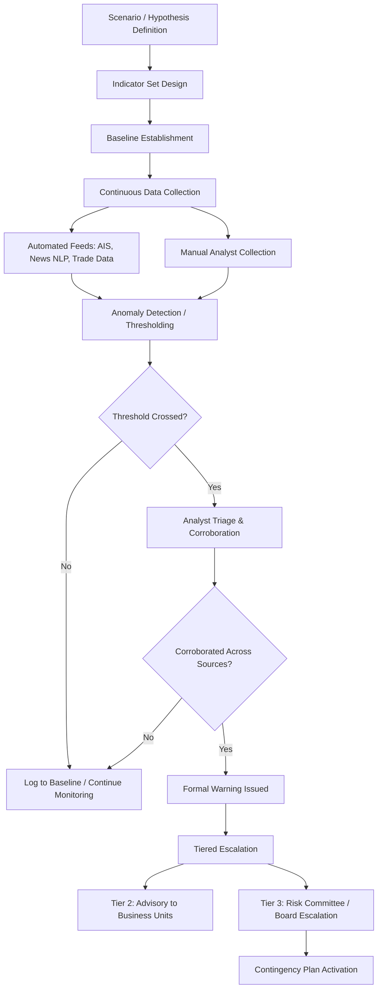

## Early Warning Indicators and Signal Detection

### Overview

Early warning indicator systems convert the output of structured analytic techniques and OSINT collection into a continuously monitored, operationally actionable framework. Rather than re-running full analytic assessments on every incoming development, an indicators-and-warning (I&W) system defines a fixed set of observable, pre-agreed signals in advance, so that monitoring becomes a matter of tracking known variables against known thresholds rather than repeated ad hoc judgment. This is the mechanism that closes the loop between intelligence tradecraft and operational risk response in a supply chain context.

### Core Conceptual Architecture

**Indicators vs. Warnings**

- An **indicator** is an observable, ideally quantifiable variable believed to correlate with movement toward a defined risk scenario (e.g., "frequency of official rhetoric referencing export restrictions on Commodity X")
- A **warning** is the analytic judgment that a threshold of indicators has been crossed such that a scenario's likelihood has materially increased, typically triggering a defined organizational response
- The distinction matters operationally: indicators are tracked continuously (often automatable), while warnings require analyst judgment to confirm that indicator movement is meaningful rather than noise

**Indicator properties for a well-constructed I&W system**:

- **Observable** — derived from a real, accessible data source rather than an abstract concept
- **Specific** — tied to a defined scenario or hypothesis rather than generically "risk-related"
- **Timely** — available with enough lead time to inform a decision before the risk materializes
- **Diagnostic** — capable of distinguishing between competing scenarios, not just confirming a single expected outcome (an indicator that would be present under any scenario has low diagnostic value)
- **Non-redundant** — a well-designed indicator set avoids multiple indicators that are just restatements of the same underlying signal, which can create false confidence through apparent corroboration

### Indicator Tiering and Escalation Thresholds

Most mature I&W frameworks organize indicators into tiers with corresponding organizational responses:

- **Tier 1 — Watch/Baseline**: Indicator present but within historical normal range; logged for trend purposes, no action triggered
- **Tier 2 — Elevated/Advisory**: Indicator has moved beyond a defined threshold; triggers increased monitoring frequency and internal advisory notification to relevant business units
- **Tier 3 — Warning/Critical**: Multiple corroborating indicators crossed, or a single high-diagnostic-value indicator triggered; triggers formal escalation to risk committee/board and activation of pre-defined contingency response

[Inference] The specific number of tiers and their labels vary considerably across organizations and no single naming convention is a formal industry standard — three- and four-tier models are both commonly observed in corporate and intelligence-community practice.

### Indicator Categories for Supply Chain Geopolitical Risk

**Political/diplomatic indicators**:

- Frequency and tone shift in official state rhetoric toward a trading partner or sector
- Diplomatic personnel changes (ambassador recalls, embassy staffing reductions)
- Cancellation or postponement of scheduled bilateral trade/diplomatic engagements

**Economic/regulatory indicators**:

- New draft legislation or regulatory consultations referencing export controls, foreign investment screening, or critical mineral designations
- Currency reserve and capital control announcements
- Sovereign CDS spread widening (market-implied risk signal, as noted in financial hedging contexts)

**Military/security indicators**:

- Military posture changes (troop movements, exercise announcements, force posture statements)
- Naval activity changes in strategic maritime corridors
- Cyber activity attribution reports targeting critical infrastructure sectors

**Operational/logistics indicators**:

- AIS "dark fleet" activity increases in relevant shipping corridors
- Port congestion or customs processing time anomalies
- Supplier-reported force majeure notifications or unusual order pattern changes

**Social indicators**:

- Labor unrest frequency and severity trends near key production facilities
- Localized protest activity near critical infrastructure or transit routes

### Signal Detection Methodology

**Distinguishing signal from noise** is the central technical challenge, given the volume of continuously updating OSINT and news flow feeding an I&W system:

- **Baseline establishment** — before an indicator can be meaningfully monitored, its normal historical range/frequency must be characterized; without a baseline, any movement appears anomalous
- **Statistical anomaly detection** — for quantifiable indicators (shipping volumes, customs delays, sentiment-scored news volume), control-chart-style methods (e.g., flagging deviations beyond a set number of standard deviations from a rolling baseline) can automate initial triage
- **NLP-based event and sentiment detection** — automated text classification/topic modeling applied to news and social media flow to detect thematic shifts (e.g., rising frequency of "export restriction" language) at a scale beyond manual monitoring capacity
- **Human-in-the-loop confirmation** — automated detection typically feeds a triage queue for analyst review rather than triggering escalation autonomously, given known false-positive rates in NLP-based event detection [Inference — reflects common practice in operational intelligence systems, though exact human-review thresholds are organization-specific]

### System Architecture

**Key Points**

- I&W systems are only as good as their indicator design — poorly chosen indicators (non-diagnostic, redundant, or with insufficient lead time) produce either alert fatigue (too many false positives) or missed warnings (indicators that move too late to inform action)
- The system's value lies in *pre-committing* to response thresholds before a crisis, reducing the decision paralysis and ad hoc scrambling common when organizations react only after an event has already materialized

### Example: I&W Set for a Critical Mineral Export Restriction Scenario

**Scenario**: Country Y imposes export restrictions on a mineral critical to the firm's manufacturing input.

**Indicator set**:

1. Official statements referencing "resource security" or "strategic mineral" terminology (Tier 1 baseline tracking via NLP sentiment/topic monitoring)
2. Domestic stockpile-building announcements or subsidized domestic-industry investment in the mineral's downstream processing (Tier 2 — suggests preparation for restricting raw exports in favor of value-added domestic processing)
3. Precedent-setting restrictions announced in an adjacent mineral/sector by the same government (Tier 2)
4. Formal notification, draft legislation, or WTO notification of an impending export licensing regime (Tier 3 — triggers immediate contingency activation: alternate sourcing qualification, buffer stock drawdown planning)

### Common Pitfalls

- **Indicator proliferation without prioritization** — tracking dozens of low-diagnostic-value indicators dilutes analyst attention from the few that actually matter
- **Static indicator sets** — failing to periodically revisit and retire indicators that have lost diagnostic value as the underlying situation evolves (directly related to the Key Assumptions Check SAT)
- **Escalation threshold ambiguity** — defining tiers without clear, pre-agreed organizational response actions attached, such that a "warning" is issued but no one is clear what should happen next
- **Automation over-reliance** — treating NLP/statistical anomaly detection output as a finished warning rather than a triage input requiring human corroboration

**Related Topics**

- Structured analytic techniques for geopolitical forecasting
- Open source intelligence methods for supply chain monitoring
- Building a geopolitical risk function within a corporation
- Scenario planning and wargaming methodologies for corporate strategy
- Crisis response and business continuity activation protocols