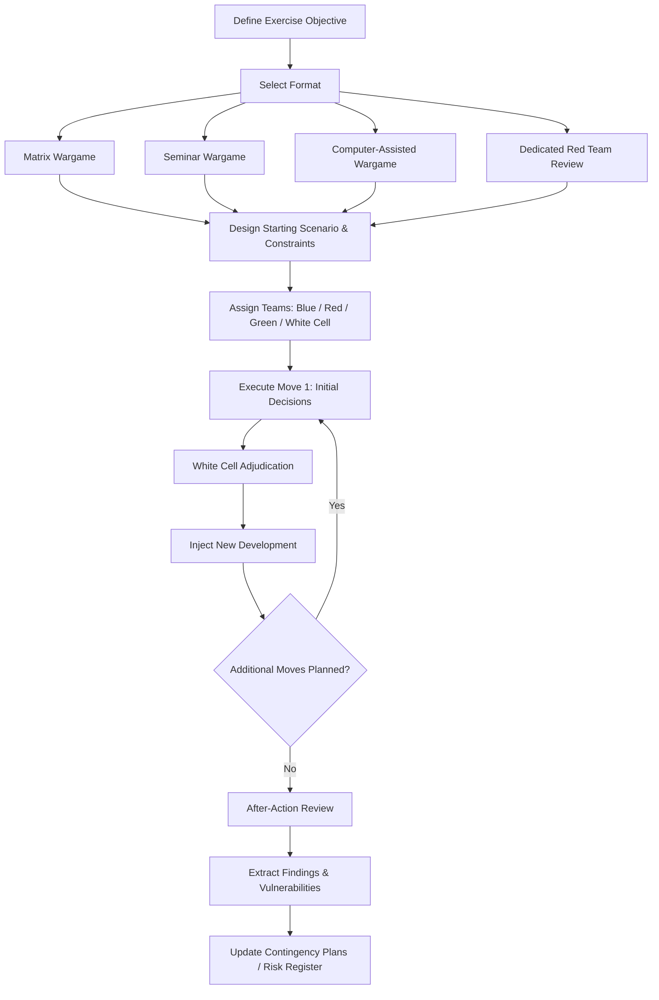

## Wargaming and Red Teaming for Supply Chain Scenarios

### Overview

Wargaming and red teaming are simulation-based structured analytic techniques that move beyond static scenario documents into interactive, adversarial exercises. Where scenario planning produces a set of narrative futures to reason about, wargaming and red teaming actively simulate the *decision-making behavior* of adversarial or competing actors — state actors, competitors, or even internal stakeholders with divergent incentives — surfacing second- and third-order effects that linear analysis tends to miss. In a supply chain geopolitics context, these exercises are used to pressure-test contingency plans, sourcing strategies, and crisis response protocols against realistic, actively opposing dynamics rather than passive scenario conditions.

### Distinguishing Wargaming from Red Teaming from Scenario Planning

**Key Points**

- **Scenario planning** constructs static, internally consistent alternative futures for strategic reasoning — participants reason *about* the scenario, not *within* it
- **Red teaming** assigns a dedicated team to actively simulate an adversary's decision-making and actions against the firm's existing plans, typically to identify vulnerabilities in a specific plan or posture
- **Wargaming** is a broader, often multi-move, interactive simulation involving multiple teams (which may represent the firm itself, competitors, state actors, and sometimes neutral "control" functions) making sequential decisions in response to each other, with outcomes evolving turn-by-turn rather than being fixed in advance

These techniques are complementary rather than substitutes: scenario planning often generates the starting conditions that a wargame or red team exercise then interactively stress-tests.

### Wargaming Methodology

**Core structural elements**:

- **Scenario/starting conditions** — the initial state of the world at exercise start, including the specific supply chain configuration, geopolitical tensions, and constraints in play
- **Teams** — typically include a "Blue Team" (the firm/friendly actors), one or more "Red Teams" (adversarial or competing state/corporate actors), and sometimes a "Green Team" (neutral third parties — regulators, other market participants) and a "White Cell" (control/facilitation team adjudicating outcomes and injecting new developments)
- **Moves/turns** — structured decision points where each team commits to actions based on available information, followed by adjudication of outcomes before the next move
- **Adjudication** — the White Cell determines the consequences of each team's actions, often combining pre-built rule sets with facilitator judgment, then feeds resulting conditions into the next move
- **Injects** — unexpected developments introduced by the White Cell mid-exercise to test adaptability (e.g., a sudden port closure, an unrelated cyber incident compounding the primary scenario)

**Format variants**:

- **Matrix wargames** — lightweight, discussion-based format where teams propose actions and a group collectively argues probability/plausibility of outcomes, avoiding the need for a complex rules engine; well suited to corporate settings without dedicated wargaming infrastructure
- **Seminar wargames** — primarily discussion-driven, lower-intensity, often used for senior executive/board-level exercises where the goal is strategic sensitization rather than detailed tactical testing
- **Computer-assisted/quantitative wargames** — incorporate modeled outcomes (e.g., logistics simulation, supply-demand modeling) to adjudicate moves more rigorously; more resource-intensive to build and run
- **Crisis simulation exercises** — compressed-timeline, high-pressure format specifically testing crisis response protocols and decision-making speed under realistic time constraints

### Red Teaming Methodology

**Core approach**:

- A dedicated team is tasked with adopting an adversarial mindset — genuinely trying to identify how a stated plan could fail, be exploited, or be circumvented, rather than offering generic critique
- Distinguished from devil's advocacy (which challenges a *conclusion*) by focusing on *actively simulating adversary behavior* against a *plan or system*
- Often most effective when red team members have genuine subject-matter or regional expertise enabling realistic adversary emulation — a red team lacking this expertise risks producing generic rather than actor-specific insights [Inference]

**Application to supply chain contingency plans**:

- Red team is given the firm's actual contingency plan (e.g., "if Supplier A's facility is disrupted, shift volume to Supplier B within 30 days") and tasked with identifying how an adversarial state actor or competitor could specifically target or exploit the plan's assumptions (e.g., could the same actor apply pressure on Supplier B's home jurisdiction simultaneously, defeating the diversification assumption?)

### Exercise Design Process

### Example: Wargaming a Chokepoint Closure Scenario

**Objective**: Test the firm's contingency plan for a sudden closure of a critical maritime chokepoint used for both inbound raw materials and outbound finished goods.

**Setup**:

- **Blue Team**: Firm's own supply chain and crisis management leadership, operating only with information realistically available in the first hours of such an event
- **Red Team**: Simulates the state actor(s) whose action precipitated the closure, deciding whether and how to escalate, signal duration, or offer selective exemptions
- **White Cell**: Adjudicates logistics consequences (alternate routing lead times, cost impacts, inventory drawdown rates) using pre-built reference data on alternate shipping routes and current buffer stock levels

**Move sequence**:

1. **Move 1**: Closure announced; Blue Team must decide initial response (activate buffer stock drawdown, initiate alternate routing, communicate with customers) with incomplete information on closure duration
2. **Inject**: White Cell introduces an unexpected complication — a key alternate route also experiences congestion due to other firms simultaneously diverting
3. **Move 2**: Blue Team must revise plan under resource contention; Red Team decides whether to extend closure duration or offer conditional exemptions to extract concessions
4. **After-Action Review**: Facilitated debrief identifying where Blue Team's original contingency plan assumptions broke down (e.g., alternate route capacity assumptions did not account for simultaneous multi-firm diversion)

**Output**: Specific, concrete revisions to the contingency plan — e.g., pre-negotiated alternate-route capacity reservations rather than relying on spot-market availability during a crisis, informed directly by a failure mode the exercise surfaced that static scenario planning had not identified.

### Facilitation and Governance Considerations

- **Psychological safety** — participants must be able to propose realistic adversarial actions or admit plan vulnerabilities without organizational repercussions; exercises run under a punitive lens tend to produce sanitized, less useful outputs
- **Facilitator/White Cell neutrality** — adjudication credibility depends on the White Cell being perceived as impartial rather than steering toward a predetermined "correct" outcome
- **Appropriate seniority mix** — senior leadership participation increases the exercise's influence on actual strategy, but can also suppress candid junior-analyst input if not carefully facilitated
- **Cadence** — one-off exercises provide value but mature programs typically run wargames/red team reviews on a recurring cadence (e.g., annually for major scenarios, more frequently for fast-evolving specific risks) to keep contingency plans current as conditions change

### Limitations

- Resource-intensive relative to desk-based scenario analysis, particularly for computer-assisted formats requiring underlying simulation models
- Outcomes are sensitive to team composition and facilitator skill; a poorly designed exercise can produce a false sense of preparedness if red team play is insufficiently rigorous or adversarial
- [Speculation] Some practitioners argue that findings from a single wargame iteration should be treated cautiously given path-dependency (different move sequences within the same starting scenario could plausibly produce materially different findings) — suggesting value in running variant iterations rather than treating one playthrough as definitive, though this adds further resource cost and is not universal practice

**Related Topics**

- Structured analytic techniques for geopolitical forecasting
- Early warning indicators and signal detection
- Enterprise risk management frameworks for geopolitical risk
- Crisis response and business continuity activation protocols
- Maritime chokepoints and shipping route risk