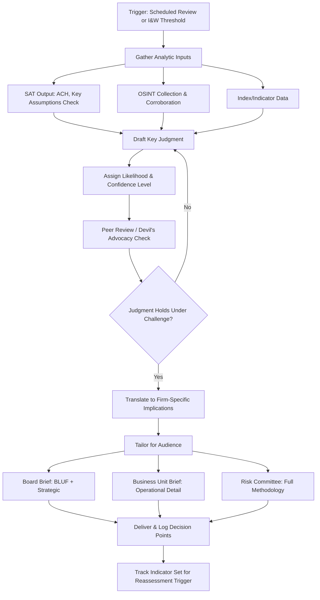

## Building and Briefing a Geopolitical Risk Assessment

### Overview

A geopolitical risk assessment is the terminal work product of the analytic process — the document and briefing through which collected intelligence, structured analytic technique output, and indicator monitoring are synthesized into a decision-relevant judgment for a specific audience. The discipline of *building* an assessment (structuring analysis for clarity, calibrated confidence, and actionability) is distinct from, and as important as, the analytic tradecraft that precedes it. A methodologically rigorous analysis that is poorly communicated fails to influence decisions; this is a widely cited failure mode in both intelligence and corporate risk practice.

### Assessment Structure and the "Bottom Line Up Front" Principle

**BLUF (Bottom Line Up Front)** — the foundational structural convention borrowed from intelligence and military writing:

- The core judgment/conclusion is stated in the first sentence or paragraph, *before* supporting analysis
- Inverts academic/narrative writing convention (build-up to conclusion) because decision-makers need the judgment immediately and may not read past the opening
- Followed by supporting analysis, evidence, and alternative perspectives in decreasing order of relevance

**Typical assessment structure**:

1. **Key judgment(s)** — the core assessment, stated with an explicit confidence level
2. **What's changed / why now** — context on why this assessment is being issued (new development, scheduled review, escalation trigger)
3. **Supporting analysis** — the reasoning and evidence underpinning the key judgment
4. **Alternative scenarios / what would change this assessment** — explicit acknowledgment of the leading alternative hypothesis and the indicators that would shift the judgment toward it (directly reflecting ACH and Key Assumptions Check tradecraft)
5. **Implications for the firm** — translation of the geopolitical judgment into firm-specific operational/financial relevance (this step is frequently the weakest link in corporate assessments, as noted in the "Building a Geopolitical Risk Function" discussion of operational translation)
6. **Recommended actions / decision points** — what the audience is being asked to do or decide, if anything

### Calibrated Language and Confidence Expression

**Key Points**

- Precise, standardized language for expressing likelihood and confidence prevents the common failure mode where vague terms ("likely," "significant risk") are interpreted inconsistently by different readers
- Many intelligence-derived frameworks use a standardized probability lexicon (e.g., the U.S. Intelligence Community's yardstick: "almost no chance," "very unlikely," "unlikely," "roughly even chance," "likely," "very likely," "almost certain," each mapped to an approximate percentage range) — corporate functions adapting this convention should define and consistently apply their own explicit scale rather than using probability language loosely
- **Confidence level** (low/moderate/high) should be reported *separately* from likelihood — an analyst can hold a high-confidence judgment that an event is unlikely, or a low-confidence judgment that it is likely; conflating the two obscures important nuance about the underlying evidence quality

**Common failure modes in confidence/likelihood communication**:

- Using hedge words ("could," "might," "may") without any accompanying structured likelihood estimate, leaving the reader unable to calibrate response urgency
- Overclaiming certainty to appear more authoritative or decisive than the underlying evidence supports
- "Mosaic fallacy" — treating the accumulation of many individually weak or ambiguous indicators as if their sheer number constitutes strong corroborated evidence, without genuine independent corroboration

### Audience Calibration

Different audiences require materially different assessment framing, length, and emphasis:

| Audience | Format Emphasis |
| --- | --- |
| Board / C-suite | Extremely concise BLUF, strategic implications, decision-forcing recommendations; minimal methodological detail |
| Business unit / procurement leadership | Operational implications, specific supplier/route exposure, concrete action options |
| Risk committee | Fuller methodological transparency, explicit confidence/likelihood language, alternative scenario detail |
| Crisis response team (acute event) | Extremely time-compressed, action-oriented, updated frequently rather than exhaustively sourced |

[Inference] Most mature functions maintain a single underlying analytic assessment but produce differently formatted derivative briefs for each audience tier, rather than writing separate assessments from scratch — this layered-derivative approach is a commonly observed practice though not a universally standardized requirement.

### Briefing Delivery Formats

- **Written brief/memo** — the standard durable artifact, typically 1-2 pages for operational audiences, longer for risk committee deep-dives
- **Oral briefing** — live presentation, often to the board or senior leadership, requiring the presenter to be prepared for real-time follow-up questioning beyond the written document's scope
- **Dashboard/visual brief** — increasingly common for indicator-tracking and trend communication, complementing rather than replacing narrative judgment (a dashboard shows *what* is happening; the narrative assessment explains *why it matters* and *what confidence* underlies the judgment)
- **Standing recurring brief** (e.g., weekly geopolitical risk digest) vs. **event-driven brief** (triggered by a specific I&W threshold crossing or acute development) — most functions run both in parallel

### Assessment Development Process

### Example: Structuring a Board-Level Assessment

**Scenario**: Briefing the board risk committee on escalating export control risk affecting a critical input.

**Key Judgment (BLUF)**: "We assess it is likely (55-70% confidence range) that Country X will announce formal export licensing requirements on [input] within the next two quarters, based on moderate confidence given corroborating indicators from three independent source categories."

**What's changed**: New domestic legislation introduced; precedent set in an adjacent sector three weeks prior.

**Supporting analysis**: Summary of the ACH matrix outcome, indicator set movement (Tier 2 to Tier 3 escalation), and OSINT corroboration.

**Alternative scenario**: "The leading alternative hypothesis — that this rhetoric is primarily domestic political signaling without near-term policy action — remains plausible; we would revise this assessment downward if [specific indicator] does not materialize within 6 weeks."

**Implications for the firm**: Current single-source dependency on Country X for this input represents estimated exposure across an approximate percentage of relevant production volume.

**Recommended action**: Board approval requested to accelerate qualification of the alternate supplier identified in the Q2 diversification review, with associated cost/timeline tradeoffs presented for decision.

### Common Pitfalls

- **Burying the judgment** — leading with extensive context/history before stating the actual assessment, losing time-constrained readers before the key point is reached
- **False precision** — presenting a single point-probability (e.g., "73% likely") when the underlying analytic method does not support that level of numerical precision; range-based or standardized-lexicon expressions are generally more defensible than invented point estimates
- **Omitting the alternative scenario** — presenting only the leading hypothesis without acknowledging genuine uncertainty, which undermines credibility if the assessment later proves wrong and leaves the audience unprepared for divergent outcomes
- **Insufficient firm-specific translation** — a geopolitically sound assessment that never connects to the firm's actual supplier concentration, revenue exposure, or contractual position fails the primary purpose of a corporate (as opposed to academic or journalistic) risk assessment

**Related Topics**

- Structured analytic techniques for geopolitical forecasting
- Early warning indicators and signal detection
- Building a geopolitical risk function within a corporation
- Geopolitical risk indices and rating methodologies
- Crisis response and business continuity activation protocols