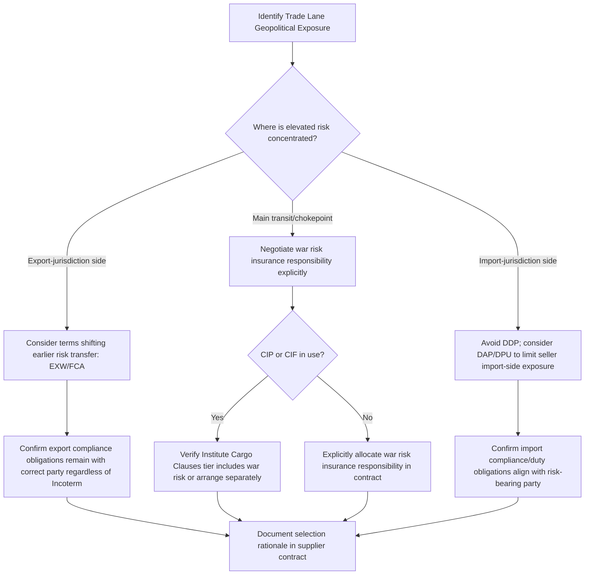

## Incoterms and International Shipping Liability

### Overview

Incoterms (International Commercial Terms) are a standardized set of trade terms published by the International Chamber of Commerce (ICC) that define the allocation of cost, risk, and responsibility between buyer and seller in international (and increasingly domestic) sales transactions. While primarily a commercial/logistics instrument, Incoterms selection carries direct geopolitical risk relevance: the point at which risk and liability transfer determines which party bears the consequences of shipment disruption caused by sanctions, export restrictions, conflict-zone transit, or chokepoint closure — making Incoterms negotiation a meaningful lever in a firm's geopolitical risk mitigation toolkit rather than a purely operational/logistics decision.

### Current Standard: Incoterms 2020

The ICC periodically revises the Incoterms rules; **Incoterms 2020** is the current edition (superseding Incoterms 2010). The eleven terms are organized into two categories based on transport mode.

**Rules for Any Mode of Transport**:

- **EXW (Ex Works)** — seller's obligation is minimal, making goods available at their own premises; buyer bears virtually all risk, cost, and export/import responsibility from that point forward
- **FCA (Free Carrier)** — seller delivers goods to a carrier or other party nominated by the buyer at a named place; risk transfers at that point
- **CPT (Carriage Paid To)** — seller pays for carriage to a named destination, but risk transfers to the buyer once goods are handed to the first carrier (a frequently misunderstood distinction — cost and risk transfer at *different* points under this term)
- **CIP (Carriage and Insurance Paid To)** — as CPT, but seller must also procure insurance; Incoterms 2020 raised the required minimum insurance coverage level for CIP to Institute Cargo Clauses (A), a broader "all risks" standard, compared to the lower-tier coverage still permitted under CIF
- **DAP (Delivered at Place)** — seller bears risk/cost until goods arrive at the named destination, not yet unloaded
- **DPU (Delivered at Place Unloaded)** — as DAP, but seller also bears responsibility for unloading; DPU replaced the Incoterms 2010 term DAT (Delivered at Terminal) in the 2020 revision, broadening applicability beyond terminal-only delivery points
- **DDP (Delivered Duty Paid)** — maximum seller obligation; seller bears risk, cost, and import duty/tax responsibility all the way to the named destination

**Rules for Sea and Inland Waterway Transport**:

- **FAS (Free Alongside Ship)** — seller delivers goods alongside the vessel at the named port; risk transfers at that point
- **FOB (Free on Board)** — risk transfers once goods are loaded onto the vessel; historically the most commonly used maritime term
- **CFR (Cost and Freight)** — seller pays freight to named destination port, but risk transfers at vessel loading (cost/risk split, analogous to CPT)
- **CIF (Cost, Insurance, and Freight)** — as CFR, but seller must procure insurance at the lower Institute Cargo Clauses (C) minimum coverage level (a narrower "named perils" standard than CIP's Clauses (A) requirement)

**Key Points**

- The critical distinction across all eleven terms is *when and where risk transfers* from seller to buyer — this is separate from, and often not aligned with, the point where the seller's *cost* obligation ends (as with CPT/CIP/CFR/CIF, where seller pays freight beyond the point where risk has already transferred)
- Incoterms govern risk and cost allocation between buyer and seller; they do **not** address transfer of *title/ownership*, which is governed separately by the underlying sales contract and applicable law — a common source of confusion

### Geopolitical Risk Relevance of Incoterms Selection

**Risk transfer point and chokepoint/conflict-zone transit**:

- Under FOB/CFR/FCA/CPT-family terms, the buyer bears risk for the ocean/main transit leg — meaning disruption at a maritime chokepoint (closure, war risk zone transit, piracy) during that leg is the buyer's risk exposure, not the seller's
- Under EXW, the buyer bears risk essentially from the seller's factory gate, absorbing risk across the *entire* export process including any export-jurisdiction-side disruption
- Under DDP, the seller bears risk through the *entire* journey including import-side customs and duty processes, exposing the seller to import-jurisdiction sanctions or regulatory risk

**Sanctions and export control interaction**:

- DDP places export *and import* compliance responsibility on the seller, which can be problematic where the seller lacks visibility into import-jurisdiction sanctions exposure or where the goods' destination raises sanctions-circumvention risk
- EXW/FCA shift export declaration responsibility toward the buyer in many circumstances, which can be preferable for a seller seeking to limit its own direct involvement in export compliance determinations for higher-risk destinations — though sellers typically retain underlying export control classification and licensing obligations under their home jurisdiction's law regardless of Incoterm, since Incoterms allocate *commercial* risk/cost, not *regulatory* compliance obligation [Inference — this distinction between commercial risk allocation and non-delegable regulatory obligation is a frequently emphasized point in trade compliance practice, though specific obligations depend on the applicable export control regime]

**War risk and insurance interaction**:

- The insurance-inclusive terms (CIP, CIF) determine which party's insurance program bears war risk/political violence exposure during the insured transit leg — but standard marine cargo insurance frequently excludes war/strikes perils by default (per Institute Cargo Clauses exclusions), requiring separate war risk insurance placement regardless of which party holds the CIP/CIF insurance obligation
- A firm relying on a counterparty's CIF insurance coverage during transit through an elevated-risk corridor should independently verify whether the required minimum coverage (Institute Cargo Clauses (C) under CIF) actually includes adequate war risk extension, rather than assuming coverage adequacy

### Incoterms Selection Framework for Geopolitically Exposed Trade Lanes

### Example: Selecting Incoterms for a High-Risk Corridor Shipment

**Scenario**: A firm imports components via a route transiting a maritime corridor subject to intermittent war risk premium listing.

**Analysis**:

- Under **FOB**, the buyer assumes risk from vessel loading onward, meaning the buyer bears the consequences (and must separately insure) for the high-risk corridor transit
- Under **CIF**, the seller must insure to Institute Cargo Clauses (C), which by default excludes war risk — the buyer would need to confirm a war risk extension is included or arrange it independently, since the base CIF insurance obligation does not automatically cover this peril
- A buyer with strong bargaining leverage might instead negotiate **CIP** (requiring the broader Clauses (A) coverage) or explicitly contract for the seller to arrange and name the buyer as beneficiary on a separate war risk policy for the corridor transit leg, rather than relying on the Incoterm's default insurance minimum

**Conclusion**: The Incoterm chosen determines the *default* risk and insurance allocation, but for corridors with known elevated geopolitical/war risk, best practice is to explicitly negotiate insurance adequacy in the underlying contract rather than relying solely on the Incoterm's baseline requirement — particularly given that even CIF's insurance obligation was, prior to 2020 and still today, set at a minimum coverage tier not automatically inclusive of war risk.

### Common Pitfalls

- **Conflating risk transfer with cost allocation** — assuming that because a seller pays freight to a destination (as under CFR/CIF/CPT/CIP), the seller also bears risk for that entire leg, when in fact risk transferred earlier at origin-port loading or carrier handover
- **Assuming Incoterms address regulatory/compliance obligations** — Incoterms allocate *commercial* risk and cost; export licensing, sanctions compliance, and customs classification obligations are governed by separate applicable law and do not automatically shift with the Incoterm
- **Relying on insurance minimums without verification** — assuming CIF/CIP coverage is "insurance," full stop, without checking whether the specific Institute Cargo Clauses tier in use actually covers the relevant peril (particularly war risk) for a geopolitically exposed route
- **Using DDP into a high sanctions-risk jurisdiction** — placing full import-side compliance and duty responsibility on a seller who may lack adequate visibility into import-jurisdiction sanctions or regulatory exposure

**Related Topics**

- Insurance, hedging, and financial instruments for geopolitical risk
- Maritime chokepoints and shipping route risk
- Sanctions compliance architecture and denied-party screening systems
- Export credit agencies and trade finance structures
- Enterprise risk management frameworks for geopolitical risk