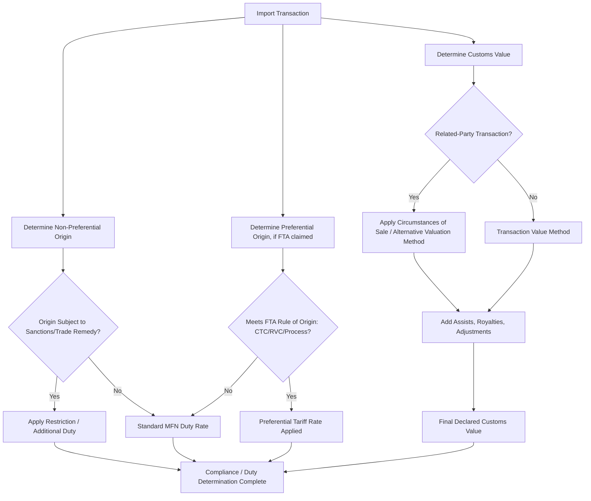

## Rules of Origin and Customs Valuation

### Overview

Rules of origin and customs valuation are the two foundational determinations customs authorities make for every cross-border shipment: **where** a good is deemed to originate, and **what** its value is for duty assessment purposes. Both determinations directly govern applicable tariff rates, preferential trade agreement eligibility, and — critically for supply chain geopolitics — exposure to sanctions, export controls, and trade remedy measures (anti-dumping/countervailing duties) that are frequently origin-specific. As firms increasingly restructure supply chains for geopolitical diversification ("China+1," friend-shoring), origin determination has become a first-order strategic and compliance concern rather than a back-office customs function.

### Rules of Origin: Core Concepts

**Non-preferential origin** vs. **preferential origin**:

- **Non-preferential origin** determines a good's "nationality" for purposes such as trade remedy measures (anti-dumping duties), sanctions/embargo applicability, quota administration, and country-of-origin labeling requirements — generally the default WTO-consistent origin determination absent a specific trade agreement
- **Preferential origin** determines eligibility for reduced or zero tariff treatment under a specific free trade agreement (FTA) or preference program; each FTA typically defines its own origin rules, meaning the same good could have different origin determinations depending on which regime is being applied

**Key Points**

- A good can be "non-originating" for preferential tariff purposes (failing to meet an FTA's specific rule of origin) while still being correctly labeled with a particular country of origin for non-preferential purposes — these are distinct legal tests, not interchangeable
- Origin is not simply "where the good was shipped from" — a good transiting through or being repackaged in a third country without sufficient transformation does not acquire that third country's origin, a principle central to detecting transshipment-based circumvention schemes

### Substantial Transformation Standards

Where a good is manufactured using inputs from multiple countries, origin determination requires applying a substantial transformation test:

**Change in Tariff Classification (CTC / "tariff shift") method**:

- The most common method in modern FTAs; origin is conferred if the finished good's Harmonized System (HS) tariff classification differs from that of its non-originating inputs by a specified level (chapter, heading, or subheading change)
- Codified as detailed product-specific rules (PSRs) in FTA annexes, varying significantly by product category

**Value-added / Regional Value Content (RVC) method**:

- Origin conferred if a specified minimum percentage of the good's value derives from originating materials/processing within the FTA region (calculated via build-up or build-down formulas that vary by agreement)
- Common in automotive and complex manufactured goods where tariff-shift alone may not adequately capture the substance of regional production

**Specific process/technical requirement method**:

- Origin conferred based on a defined manufacturing or processing operation occurring within the country/region (e.g., specific chemical reaction requirements for certain chemical products, particular textile-forward or yarn-forward processing stages), regardless of tariff shift or value content

**Combination rules**: Many modern FTA product-specific rules combine methods (e.g., requiring both a tariff shift AND a minimum regional value content), particularly for goods considered strategically sensitive or historically prone to circumvention.

### Geopolitical Relevance of Rules of Origin

**Transshipment and circumvention risk**:

- Rules of origin are the primary legal mechanism for detecting and penalizing **transshipment** — routing goods through a third country with minimal processing solely to disguise true origin and evade tariffs, anti-dumping duties, or sanctions
- Elevated scrutiny corridors (e.g., goods substantially manufactured in one jurisdiction subject to high tariffs, lightly processed in a third country, then exported as if originating there) are an active customs enforcement priority in several major markets [Inference — reflects a widely reported enforcement trend, though specific current enforcement statistics and targeted corridors should be verified against current customs authority guidance]

**Supply chain diversification and origin engineering**:

- Firms restructuring supply chains to reduce geopolitical concentration risk must ensure the *new* configuration actually achieves qualifying origin status under relevant rules — merely relocating final assembly without sufficient substantial transformation of underlying components can fail to shift origin, undermining both tariff and sanctions-exposure diversification goals
- "Rules of origin engineering" — deliberately structuring production stages and input sourcing to achieve a target origin determination — is a legitimate compliance/planning exercise when done transparently, but shades into circumvention risk if processing added is genuinely minimal (assembly-only operations are frequently insufficient under CTC/RVC tests to confer new origin)

**Sanctions and export control intersection**:

- Non-preferential origin determination is often directly dispositive for sanctions applicability (e.g., goods "of Russian Federation origin" subject to specific import bans) — meaning origin misdetermination carries sanctions-violation risk, not merely tariff underpayment risk
- Export control classification can also depend on the *origin of underlying content/technology* embedded in a product (relevant to U.S. de minimis rules for re-export of goods incorporating controlled U.S.-origin content), a related but analytically distinct determination from customs rules of origin

### Customs Valuation: Core Methodology

Most jurisdictions apply the WTO Customs Valuation Agreement framework, establishing a hierarchy of valuation methods applied sequentially:

1. **Transaction value** — the price actually paid or payable for the goods, adjusted for specified additions (e.g., assists, royalties, packing costs) and subtractions; the primary and most commonly used method
2. **Transaction value of identical goods** — used when transaction value cannot be applied (e.g., related-party transactions without an arm's-length price), based on identical goods sold for export to the same country
3. **Transaction value of similar goods** — as above, using similar (not identical) goods where identical goods comparables are unavailable
4. **Deductive value** — working backward from the resale price in the importing country, deducting profit, expenses, and costs incurred after importation
5. **Computed value** — building up value from cost of materials, fabrication, profit, and general expenses in the country of production
6. **Fallback method** — flexible application of the above methods where none applies cleanly, subject to WTO Agreement constraints against arbitrary valuation

**Key Points**

- The transaction value method dominates in practice, but **related-party transactions** (common in multinational intercompany supply chains) receive heightened customs scrutiny, since the "price actually paid" between related entities may not reflect arm's-length market value
- Firms must be prepared to demonstrate that related-party transfer prices meet the "circumstances of sale" test or align with a computed/deductive value test if challenged — creating direct interaction between customs valuation compliance and corporate transfer pricing policy (a frequently under-coordinated area between tax and trade compliance functions within multinational firms) [Inference]

### Valuation Additions and Adjustments

Common additions to transaction value under most customs regimes:

- **Assists** — value of materials, tools, or engineering/design work provided by the buyer to the seller free of charge or at reduced cost, used in producing the imported goods
- **Royalties and license fees** — where payment is a condition of sale and related to the imported goods
- **Packing costs, commissions (except buying commissions), and proceeds of resale** accruing to the seller

### Process Architecture

### Example: Origin Determination for a Diversified Supply Chain

**Scenario**: A firm relocates final assembly of an electronics product from Country A (subject to elevated tariffs in the destination market) to Country B, while continuing to source key sub-components from Country A.

**Analysis required**:

1. **Tariff shift test**: Does assembly in Country B result in a change in HS classification from the Country-A-origin sub-components to the finished good's classification? Simple assembly of components that remain individually classifiable often fails to achieve the required tariff shift.
2. **Regional value content test** (if applicable under the relevant rule): What percentage of value is added by Country B assembly and any Country-B-sourced components, versus the value embedded in Country-A-origin inputs?
3. **Risk assessment**: If the assembly operation in Country B is minimal (final screw assembly and packaging only) relative to the value and classification-defining characteristics established by Country-A components, customs authorities in the destination market may determine the good remains Country-A-origin for non-preferential purposes — meaning the diversification strategy fails to achieve its intended tariff/sanctions risk mitigation despite the physical relocation of final assembly

**Conclusion**: Physical relocation of production steps does not automatically equal origin change; firms pursuing supply chain diversification for geopolitical risk mitigation should conduct formal rules-of-origin analysis (ideally with customs counsel or a binding ruling request from the relevant customs authority) before assuming a restructured supply chain achieves its intended origin and risk-exposure outcome.

### Common Pitfalls

- **Assuming physical relocation equals origin change** — as illustrated above, insufficient substantial transformation can leave origin unchanged despite significant supply chain restructuring effort and cost
- **Treating preferential and non-preferential origin as interchangeable** — a good qualifying for FTA preferential tariff treatment is not automatically "of that country's origin" for sanctions or trade remedy purposes, and vice versa
- **Under-scrutinizing related-party transaction values** — assuming intercompany transfer prices automatically satisfy customs valuation requirements without documented arm's-length justification
- **Overlooking assists and royalty additions** — underdeclaring customs value by omitting required additions for buyer-furnished materials or royalty payments tied to the imported goods

**Related Topics**

- Sanctions compliance architecture and denied-party screening systems
- Incoterms and international shipping liability
- Export credit agencies and trade finance structures
- Friend-shoring and China+1 diversification strategies
- Supply chain mapping and Tier-N supplier visibility