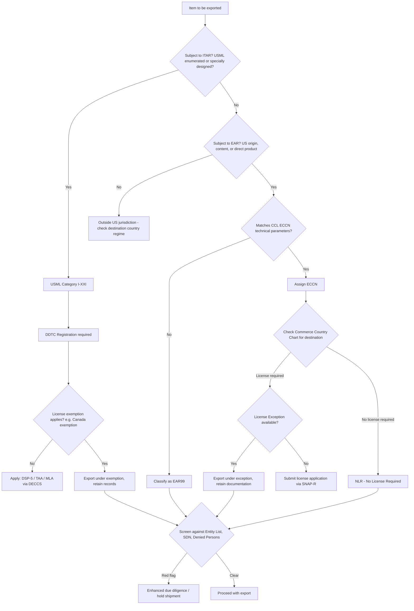

## Export Control Classification and Licensing Procedures

### Overview

Export control classification and licensing is the regulatory process by which states determine whether goods, software, technology, or services crossing a border are subject to restriction, and if so, what authorization is required before the transaction may proceed. For supply chain practitioners, this is not a peripheral legal formality — misclassification can halt shipments, trigger criminal liability, and unwind years of supplier relationships. The frameworks below are dominated in practice by the U.S. system (EAR/ITAR), because of its extraterritorial reach, but the same logical structure — classify, screen, determine license requirement, apply if needed — recurs in the EU, UK, China, and other major regimes.

### Core Regulatory Architecture (U.S.)

The United States splits jurisdiction over export-controlled items between two systems:

- **EAR (Export Administration Regulations)** — administered by the Bureau of Industry and Security (BIS), Department of Commerce. Covers "dual-use" items (commercial items with potential military application) and purely commercial items with national security or foreign policy sensitivity.
- **ITAR (International Traffic in Arms Regulations)** — administered by the Directorate of Defense Trade Controls (DDTC), Department of State. Covers defense articles, defense services, and technical data enumerated on the **U.S. Munitions List (USML)**.

A third, narrower regime — **OFAC sanctions** (Treasury) — overlays both, restricting transactions with sanctioned countries, entities, and individuals regardless of item classification.

**Key Point**: Jurisdiction is determined first (is it USML or not?), and only *then* does classification within that jurisdiction proceed. Getting this wrong — e.g., treating an ITAR-controlled item as EAR-classified — is itself a compliance failure independent of the classification outcome.

### Classification Under EAR: The ECCN

Every item subject to the EAR either:

1. Falls under a specific **Export Control Classification Number (ECCN)** on the **Commerce Control List (CCL)**, or
2. Defaults to **EAR99** (subject to the EAR but not listed — the catch-all for most ordinary commercial goods).

**ECCN structure** (5-character alphanumeric, e.g., `3A001`):

| Position | Meaning | Example |
| --- | --- | --- |
| Digit 1 | CCL Category (0–9) | `3` = Electronics |
| Letter | Product Group (A–E) | `A` = Equipment/Assemblies/Components |
| Digits 2–4 | Reason(s) for Control + sequence | `001` |

CCL Categories:

- 0 — Nuclear materials, facilities, equipment
- 1 — Materials, chemicals, microorganisms, toxins
- 2 — Materials processing
- 3 — Electronics
- 4 — Computers
- 5 — Telecommunications and information security (Pt.1) / Information security (Pt.2)
- 6 — Sensors and lasers
- 7 — Navigation and avionics
- 8 — Marine
- 9 — Aerospace and propulsion

Product Groups within each category:

- A — Systems, equipment, components
- B — Test, inspection, production equipment
- C — Materials
- D — Software
- E — Technology

**Reasons for Control** determine which countries trigger a license requirement. Common ones: NS (National Security), MT (Missile Technology), NP (Nuclear Nonproliferation), CB (Chemical & Biological Weapons), AT (Anti-Terrorism), RS (Regional Stability), CC (Crime Control), SI (Significant Items). Each ECCN entry lists its Reasons for Control, cross-referenced against the **Commerce Country Chart** to determine which destination countries require a license.

**Self-classification procedure**:

1. Determine whether the item is "subject to the EAR" (most items made/located in the U.S., or containing controlled U.S. content, are).
2. Review the CCL against the item's technical parameters (the "Technical Parameters" field of each ECCN entry is often objective — e.g., a specific bit-length threshold for encryption, a specific frequency range for a sensor).
3. If no ECCN reasonably matches, classify as EAR99.
4. Optionally request a **Commodity Classification (CCATS)** ruling from BIS for legal certainty — advisable for ambiguous or high-risk items.

**[Inference]** In practice, many companies under-invest in self-classification rigor for EAR99 defaults, which becomes a liability if a product later incorporates a component that shifts its ECCN (e.g., adding stronger encryption).

### Classification Under ITAR: The USML

Items on the USML (22 CFR § 121.1) are organized into 21 Categories (I–XXI), e.g., Category I (Firearms), Category IV (Launch Vehicles, Guided Missiles), Category XI (Military Electronics), Category XIII (Materials and Miscellaneous Articles). Unlike the EAR's country-chart matrix, **ITAR licensing is required for virtually all destinations** unless a specific exemption applies — the default posture is restrictive.

A critical ITAR concept is the **"specially designed" test**: an item not explicitly enumerated may still be controlled if it was specially designed for a defense article, using a catch-and-release test structure (catch criteria, then release criteria that exempt items with predominant civil application).

**Commerce Control List and USML harmonization**: Since the 2010s **Export Control Reform (ECR)** initiative, many previously ITAR-controlled items (especially less sensitive military electronics and parts) were transferred to the EAR's "600 series" ECCNs (e.g., `9A610`, `3A611`), which retain military-specific control logic but fall under Commerce jurisdiction. This shifted a large volume of items to relatively more flexible EAR licensing while keeping the most sensitive USML items under State Department control.

### Licensing Procedures — EAR

Once an ECCN and destination are known, the Commerce Country Chart determines whether a license is required, and if so, which License Exception (if any) can be used instead.

**Common License Exceptions**:

- **TMP** — Temporary exports (e.g., trade show demos)
- **RPL** — Repair and replacement of parts
- **GOV** — U.S. Government and certain intergovernmental transactions
- **ENC** — Encryption commodities/software meeting specified criteria
- **APR** — Additional permissive reexports
- **STA** — Strategic Trade Authorization, for specified allied destinations

If no exception applies, the exporter submits a license application through **SNAP-R** (Simplified Network Application Process – Redesign), BIS's electronic system. Applications require:

- ECCN and technical specifications
- End-user and end-use statement
- Ultimate consignee information
- Often a **Statement/Letter of Assurance** from the foreign party

BIS review typical turnaround: often cited around 30–45 days for standard cases, though timing varies by case complexity, referral to other agencies (State, Defense, Energy for interagency review), and country of destination. **[Unverified]** — exact current processing statistics should be checked against BIS's published data at time of filing, as these change with policy priorities and staffing.

### Licensing Procedures — ITAR

ITAR licensing runs through DDTC's **DECCS (Defense Export Control and Compliance System)**. Key license/agreement types:

- **DSP-5** — Permanent export of unclassified defense articles/technical data
- **DSP-73** — Temporary export
- **DSP-61** — Temporary import
- **TAA (Technical Assistance Agreement)** — for providing defense services or technical data to foreign persons, including foreign employees of the exporter ("deemed export")
- **MLA (Manufacturing License Agreement)** — for authorizing foreign production under license

ITAR registration (DS-2032) with DDTC is a prerequisite for any manufacturer, exporter, or broker of USML items — separate from and prior to any specific license application, and required even if no export currently occurs.

### The "Deemed Export" Concept

Both EAR and ITAR treat the release of controlled technology or source code to a **foreign national within the exporting country** as an export to that person's home country. This is highly relevant to supply chains with multinational engineering teams: granting a foreign national employee access to controlled technical data in a domestic facility can itself require a license.

**Example**: A U.S. semiconductor company employs an engineer who is a national of a country subject to EAR restrictions for that ECCN. Giving that engineer read access to ECCN-controlled design schematics in the company's Texas office is a "deemed export" to that engineer's country of nationality, requiring the same license analysis as a physical shipment there.

### End-User and End-Use Screening

Classification and licensing sit alongside — not instead of — screening obligations:

- **Denied Persons List, Entity List, Unverified List, Military End-User List** (BIS-maintained)
- **Specially Designated Nationals (SDN) List** (OFAC)
- **Debarred Parties List** (DDTC, for ITAR)

Red flags requiring "Know Your Customer" (KYC) diligence include: reluctance to provide end-use information, unusual payment terms, freight forwarder listed as ultimate consignee, and orders inconsistent with the buyer's normal business.

### Comparative Frameworks

| Jurisdiction | Regime | Administering Body | List Structure |
| --- | --- | --- | --- |
| United States | EAR | BIS (Commerce) | CCL / ECCN |
| United States | ITAR | DDTC (State) | USML |
| European Union | Dual-Use Regulation (2021/821) | Member state authorities, coordinated via EU | Annex I Control List (aligned to multilateral regimes) |
| United Kingdom | Export Control Order 2008 | ECJU (Dept. for Business and Trade) | UK Strategic Export Control Lists |
| China | Export Control Law (2020) | MOFCOM / MIIT | Control lists by category, plus Unreliable Entity List |

**[Inference]** The EU's system is more decentralized in enforcement (each member state issues its own licenses under harmonized rules) compared to the U.S.'s single-agency-per-regime model, which creates more room for interpretive divergence across EU member states in practice.

### Multilateral Control Regimes Underpinning National Lists

National control lists are substantially derived from four multilateral, non-treaty arrangements:

- **Wassenaar Arrangement** — conventional arms and dual-use goods/technologies
- **Nuclear Suppliers Group (NSG)** — nuclear and nuclear-related dual-use items
- **Missile Technology Control Regime (MTCR)** — missile and UAV-related technology
- **Australia Group** — chemical and biological weapons precursors and equipment

These regimes lack binding enforcement power; each member state transposes agreed control parameters into domestic law (this is why ECCN "Reason for Control" codes map closely to these regime names).

### Illustrative Classification Decision Flow

### Supply Chain Compliance Program Elements

A functioning classification/licensing program typically embeds:

1. **Item master classification database** — every SKU/part number mapped to ECCN or USML category, versioned as designs change
2. **Automated screening** at order entry against denied-party lists
3. **Deemed export controls** — access provisioning tied to nationality/visa status for engineering staff
4. **Recordkeeping** — EAR requires 5-year retention of export transaction records; ITAR similarly requires retention of licenses, shipping documents, and technical data transfer logs
5. **Voluntary Self-Disclosure (VSD)** protocols — both BIS and DDTC offer mitigated penalties for self-reported violations, which shapes internal escalation procedures when a misclassification is discovered

**Conclusion**

Export control classification is a jurisdictional and technical determination that precedes and governs licensing; licensing is the procedural mechanism for authorizing an otherwise-restricted transaction. For supply chain design, the practical implication is that classification cannot be a one-time exercise — it must be re-triggered whenever a bill of materials changes, a new destination or counterparty is added, or a product's technical specifications shift across an ECCN or USML threshold. The compliance burden this creates is a direct input into sourcing and localization decisions, particularly for firms managing cross-border engineering teams or multi-country manufacturing footprints.

**Related Topics**

- Entity List and denied-party screening automation
- Deemed export compliance for multinational R&D teams
- U.S.-China semiconductor export controls (advanced computing/AI chips)
- Foreign Direct Product Rule (FDPR) and extraterritorial EAR reach
- EU Dual-Use Regulation catch-all controls
- Voluntary Self-Disclosure procedures and penalty mitigation
- Reexport and transshipment control obligations
- Encryption export controls (5A002/5D002) and mass-market carve-outs