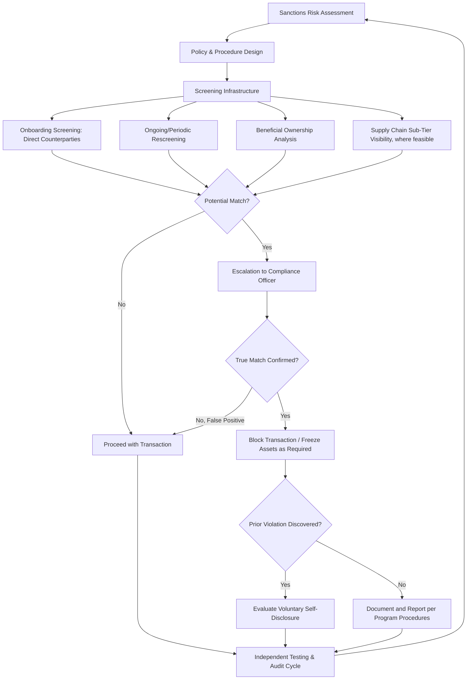

## Sanctions Compliance Programs and OFAC Requirements

### Overview

Sanctions compliance programs (SCPs) are the institutional infrastructure firms build to ensure adherence to economic sanctions regimes — sets of trade, financial, and transactional restrictions imposed by governments and multilateral bodies against designated countries, entities, and individuals. The U.S. Treasury's Office of Foreign Assets Control (OFAC) is the most prominent and extraterritorially significant sanctions authority for multinational supply chains given the centrality of the U.S. dollar financial system, but effective programs must account for overlapping and sometimes divergent sanctions regimes across multiple jurisdictions simultaneously.

### The Sanctions Regulatory Landscape

**Major sanctions-issuing authorities**:

- **OFAC (U.S. Treasury)** — administers and enforces U.S. economic sanctions programs; maintains the Specially Designated Nationals and Blocked Persons (SDN) List along with several other sanctions lists (Sectoral Sanctions Identifications List, Foreign Sanctions Evaders List, among others)
- **EU sanctions regime** — administered through EU Council regulations, implemented at member-state level, with its own consolidated list of designated persons/entities
- **UK OFSI (Office of Financial Sanctions Implementation)** — post-Brexit UK sanctions authority maintaining its own consolidated list, generally though not always aligned with EU/U.S. positions
- **UN Security Council sanctions** — multilaterally adopted sanctions that UN member states are obligated to implement domestically, though implementation mechanisms and enforcement rigor vary by member state

**Key Points**

- Sanctions regimes are **not uniform** across jurisdictions — a transaction permissible under one regime may be prohibited under another, requiring firms with multi-jurisdictional operations to screen against multiple overlapping lists rather than assuming alignment
- OFAC sanctions carry significant **extraterritorial reach** through "U.S. person" jurisdiction (including U.S. citizens, permanent residents, entities organized under U.S. law, and anyone physically in the U.S.) and, for certain programs, secondary sanctions exposure for non-U.S. persons engaging in significant transactions with sanctioned parties — a distinct and broader jurisdictional basis than most other sanctions authorities apply

### Types of Sanctions Programs

- **Comprehensive/country-based sanctions** — broad restrictions covering most transactions with an entire country or region (historically applied to jurisdictions such as North Korea, Cuba, and at various points Iran and Syria, among others; current program status should be verified against OFAC's current program list given how frequently these evolve)
- **List-based (targeted) sanctions** — restrictions tied to specific designated individuals or entities (SDN List and equivalents) regardless of their location, requiring counterparty screening rather than geographic screening alone
- **Sectoral sanctions** — restrictions targeting specific economic sectors or types of transactions (e.g., debt/equity financing restrictions) with entities that are not fully blocked but are restricted from specific transaction types
- **Secondary sanctions** — sanctions targeting non-U.S. persons for engaging in significant transactions with primary sanctions targets, extending practical compliance pressure well beyond formal "U.S. person" jurisdiction

[Unverified] Specific country program designations and their current scope change frequently in response to evolving geopolitical developments; current program status should always be verified against OFAC's published sanctions program list rather than assumed from general knowledge, given the material compliance consequences of relying on outdated program status.

### Core Components of a Sanctions Compliance Program

OFAC's published **"Framework for OFAC Compliance Commitments"** identifies five essential components widely adopted as the industry-standard SCP architecture:

**1. Management Commitment**

- Senior leadership endorsement, adequate resourcing, and a designated compliance officer with sufficient authority and independence
- Board/senior management awareness of sanctions risk exposure and program effectiveness

**2. Risk Assessment**

- Systematic identification of the firm's sanctions risk exposure across customers, products, services, supply chain, and geographic footprint
- Should be periodically updated and account for the firm's specific risk profile rather than applying a generic template — a firm with extensive third-country intermediary relationships faces materially different exposure than one with direct, transparent counterparty relationships

**3. Internal Controls**

- Written policies and procedures translating sanctions requirements into day-to-day operational practice
- Screening processes (see below), escalation protocols for potential matches, and recordkeeping requirements

**4. Testing and Auditing**

- Independent (internal or external) testing of the compliance program's actual effectiveness, distinct from merely having policies on paper
- Should test both screening system accuracy and staff adherence to escalation/reporting procedures

**5. Training**

- Role-appropriate training for employees whose functions carry sanctions exposure (sales, trade compliance, finance, logistics), updated to reflect current program status and typologies

### Screening Infrastructure

**Denied-party/watchlist screening**:

- Automated screening of counterparties (customers, suppliers, intermediaries, and — depending on program — their beneficial owners) against relevant sanctions lists at onboarding and on an ongoing basis (given lists are updated frequently, a one-time onboarding screen is insufficient)
- Commercial screening platforms (Dow Jones Risk & Compliance, Refinitiv World-Check, LexisNexis) are commonly integrated into procurement/CRM systems rather than relying on manual list-checking

**Key screening challenges**:

- **Fuzzy matching and false positives** — name-matching algorithms must balance catching intentional obfuscation (name variations, transliteration differences) against generating excessive false-positive alert volume that overwhelms review capacity
- **Beneficial ownership opacity** — OFAC's "50 Percent Rule" treats entities owned 50% or more (in aggregate) by one or more blocked persons as themselves blocked, even if the entity itself does not appear by name on the SDN List — requiring beneficial ownership analysis beyond simple name screening, which is significantly harder to automate given inconsistent corporate transparency across jurisdictions
- **Supply chain depth** — direct Tier-1 counterparty screening is standard practice, but sanctions risk can be embedded deeper in the supply chain (Tier-2/Tier-3 suppliers, or intermediaries facilitating transactions with sanctioned parties), an area of increasing regulatory expectation but significant practical difficulty given limited visibility into sub-tier relationships (directly connecting to the supply chain mapping and OSINT monitoring practices discussed elsewhere in this curriculum)

### Enforcement, Penalties, and Voluntary Self-Disclosure

- **Strict liability standard**: OFAC generally applies a strict liability standard for sanctions violations — meaning a violation can occur, and penalties can apply, even absent actual knowledge or intent, though OFAC's penalty framework explicitly considers whether a violation was willful, reckless, or the result of a reasonably designed compliance program failure when determining penalty severity
- **Voluntary Self-Disclosure (VSD)** — OFAC's published enforcement guidelines provide for substantial penalty mitigation (commonly cited around a 50% base penalty reduction, though the precise formula depends on OFAC's civil penalty framework specifics) for firms that voluntarily self-disclose violations, creating a strong incentive structure favoring proactive disclosure over concealment once a violation is discovered internally
- **General Factors** — OFAC's penalty determinations consider factors including whether the conduct was willful/reckless, whether the firm had actual knowledge, the existence and quality of a compliance program, remedial response, and cooperation with OFAC's investigation

[Inference] The existence of a documented, tested SCP meeting the five-pillar framework is widely understood in compliance practice to meaningfully affect both the likelihood of enforcement escalation and the severity of any resulting penalty, even though it does not provide immunity from strict liability for an underlying violation — this reflects consistent messaging in OFAC's own published enforcement guidance and settlement patterns.

### Program Architecture

### Example: Applying the Framework to a Supply Chain Screening Scenario

**Scenario**: A firm's automated screening flags a potential match between a new Tier-2 supplier's parent company and an entity appearing on the EU consolidated list, but not the OFAC SDN List.

**Applied process**:

1. **Escalation**: Automated fuzzy-match alert routed to compliance officer for manual review, given the name similarity exceeds the system's confidence threshold
2. **Confirmation**: Compliance officer investigates beneficial ownership structure, confirming whether the flagged entity is genuinely the same party or a false positive (common name collision)
3. **Multi-jurisdictional analysis**: Given the match is against the EU list specifically, the firm must assess its own jurisdictional exposure — a U.S.-only firm may have no direct OFAC obligation here, but if the firm has EU operations, EU entities, or EU-nexus transactions in the relevant supply chain, EU sanctions obligations apply independently of OFAC status
4. **Risk-based decision**: Even absent a strict legal prohibition (if, for example, only the EU program applies and the firm has no EU nexus), many firms apply a risk-based policy of avoiding transactions with any entity appearing on *any* major sanctions list, given reputational risk and the possibility of future designation alignment across regimes

### Common Pitfalls

- **Screening only direct counterparties by name, without beneficial ownership analysis** — missing 50% Rule exposure where the sanctioned party's ownership stake, not direct listing, creates the prohibition
- **One-time onboarding screening without ongoing rescreening** — sanctions lists update frequently (sometimes with immediate effect), and a counterparty clean at onboarding can be designated subsequently
- **Assuming regime alignment** — treating clearance against one jurisdiction's list (e.g., OFAC) as sufficient when the firm has exposure under other regimes (EU, UK, UN) with different designee lists
- **Treating the compliance program as a paper exercise** — maintaining written policies without genuine testing, training, and escalation practice, which undermines both actual risk mitigation and the penalty-mitigation value OFAC assigns to a "reasonably designed and implemented" program

**Related Topics**

- Rules of origin and customs valuation
- Open source intelligence methods for supply chain monitoring
- Insurance, hedging, and financial instruments for geopolitical risk
- Building a geopolitical risk function within a corporation
- Supply chain mapping and Tier-N supplier visibility