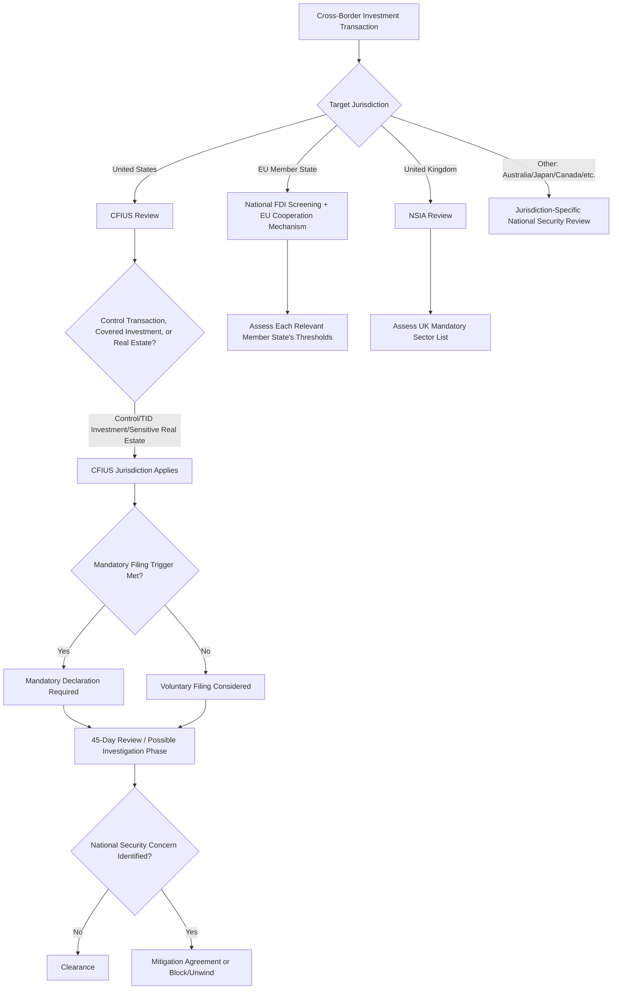

## Investment Screening Regimes: CFIUS and Its International Equivalents

### Overview

Foreign investment screening regimes are government mechanisms for reviewing, conditioning, or blocking cross-border investment transactions on national security grounds. Where export controls regulate the movement of goods and technology, and sanctions regulate transactions with designated parties, investment screening regimes regulate *ownership and control* — addressing the risk that foreign acquisition of, or significant investment in, a domestic company could confer access to sensitive technology, critical infrastructure, or strategically important data. These regimes have proliferated and expanded significantly in scope over the past decade, becoming a central consideration in cross-border M&A, joint ventures, and even some minority investment and real estate transactions relevant to supply chain infrastructure.

### CFIUS (Committee on Foreign Investment in the United States)

**Institutional structure**:

- An interagency committee chaired by the U.S. Treasury Secretary, with member agencies including Defense, State, Commerce, Homeland Security, Justice, and others, each contributing sector-specific expertise to review determinations
- Reviews are triggered by voluntary notice from transaction parties or, increasingly, by CFIUS's own authority to self-initiate review of non-notified transactions

**Jurisdictional scope (post-FIRRMA)**:

- The **Foreign Investment Risk Review Modernization Act (FIRRMA)**, enacted 2018, significantly expanded CFIUS jurisdiction beyond its historical focus on transactions resulting in foreign "control" of a U.S. business
- **Covered control transactions** — any transaction resulting in foreign control of a U.S. business, the traditional core of CFIUS jurisdiction
- **Covered investments** — FIRRMA extended jurisdiction to certain non-controlling investments in U.S. businesses involved in critical technology, critical infrastructure, or sensitive personal data ("TID U.S. businesses"), even absent formal control, where the investment confers specified access rights (board observation rights, access to material non-public technical information, or involvement in substantive decision-making)
- **Real estate transactions** — jurisdiction extended to certain purchases, leases, or concessions of real estate near sensitive government facilities (military installations, airports, maritime ports) even without an operating business acquisition

**Mandatory vs. voluntary filing**:

- Most CFIUS filings remain voluntary, but FIRRMA introduced **mandatory declaration requirements** for specified transaction categories — notably certain transactions involving foreign government-controlled investors acquiring a substantial interest in a TID U.S. business, and transactions involving businesses dealing in items controlled for export to the acquirer's country under specific export control criteria
- [Inference] The mandatory filing triggers are technical and fact-specific enough that transaction parties in ambiguous cases commonly seek specialized CFIUS counsel to determine applicability, given the significant penalty exposure for failing to make a required mandatory filing

**Review process and outcomes**:

- Initial 45-day review period, extendable to a 45-day "investigation" phase if national security concerns are not resolved in the initial review, with a further Presidential decision period in escalated cases
- Outcomes range from clearance with no conditions, clearance subject to a **mitigation agreement** (binding commitments addressing identified risks, such as data security protocols, restrictions on foreign personnel access, or governance structure requirements), to a Presidential order blocking or unwinding the transaction (a rare but not unprecedented outcome)

**Key Points**

- CFIUS review is a **national security** review, not a competition/antitrust review — a transaction can clear antitrust scrutiny entirely while still facing CFIUS-driven conditions or blocking, and these review tracks operate independently
- CFIUS has authority to review **and unwind already-completed transactions** that were not voluntarily notified, creating meaningful risk exposure for parties who assume a closed, non-notified deal is no longer subject to review

### International Equivalent Regimes

**European Union — EU Foreign Direct Investment Screening Regulation**:

- Establishes a cooperation and information-sharing mechanism among EU member states and the European Commission, but does *not* create a single centralized EU-level screening authority — actual screening decisions remain with individual member states operating their own national regimes
- Member states are not obligated to adopt a screening mechanism, though a substantial majority have done so, with considerable variation in scope, thresholds, and sector coverage across jurisdictions [Inference — the general trend toward broader EU member state adoption is well documented, though the precise current count and specific national regime details change over time and should be verified against current EU Commission reporting]

**United Kingdom — National Security and Investment Act (NSIA)**:

- Post-Brexit UK regime (distinct from the prior, narrower public-interest intervention powers), establishing mandatory notification requirements for transactions in specified sensitive sectors (covering areas such as defense, critical infrastructure, advanced technology, and others defined in the Act's sector-specific regulations)
- Broader scope than many peer regimes in that it can apply to relatively small transactions and even certain asset acquisitions, not solely large corporate M&A

**Germany — Foreign Trade and Payments Act (Außenwirtschaftsgesetz) screening**:

- One of the more actively used European national regimes, with specific lower ownership thresholds and mandatory notification requirements for investments by non-EU/EFTA acquirers in critical infrastructure and defense-related sectors

**Australia — Foreign Investment Review Board (FIRB)**:

- Reviews foreign investment proposals against a "national interest" test, with mandatory notification thresholds varying by investor type (with different, generally lower, thresholds applied to foreign government investors) and sector sensitivity

**Japan, Canada, and other jurisdictions**:

- Japan's Foreign Exchange and Foreign Trade Act includes sector-specific prior notification requirements, particularly for investments in industries deemed relevant to national security
- Canada's Investment Canada Act includes a national security review mechanism operating alongside its broader "net benefit to Canada" economic review

**China — Foreign Investment Security Review mechanism**:

- China maintains its own foreign investment security review process, generally understood to be less transparent in published procedure and precedent than the CFIUS/EU/UK regimes, relevant to firms structuring investment flows in both directions given the increasingly common practice of screening-regime comparison across jurisdictions when planning cross-border transactions [Unverified — specific current procedural detail should be confirmed with jurisdiction-specific counsel given limited public transparency into case-level practice]

### Comparative Framework

### Geopolitical and Supply Chain Relevance

- **Critical technology and supply chain sovereignty**: Investment screening regimes have expanded significantly in scope specifically to address supply chain and technology sovereignty concerns — semiconductor, critical minerals processing, biotechnology, and AI-relevant investments have all seen increased screening intensity across major regimes, reflecting explicit policy linkage between investment screening and broader economic/supply chain security strategy
- **Deal structuring implications**: Firms pursuing cross-border supply chain investments (e.g., acquiring or taking a stake in a foreign supplier of critical inputs) must factor multi-jurisdictional investment screening timelines and conditionality risk into deal planning, similar to how antitrust clearance is factored into M&A timelines — but with less predictable outcomes given the discretionary, national-security-based (rather than economic-analysis-based) nature of the review standard
- **Interaction with export controls and sanctions**: Investment screening, export control, and sanctions regimes increasingly operate as a coordinated policy toolkit rather than independent silos — a transaction structured to avoid export control licensing triggers may still face investment screening scrutiny, and vice versa, requiring integrated rather than siloed compliance analysis

### Example: Multi-Jurisdictional Screening Consideration

**Scenario**: A firm is evaluating a minority investment (with board observation rights) in a semiconductor equipment supplier headquartered in an EU member state, where the investing firm itself has non-EU foreign government-linked ownership.

**Applied analysis**:

1. **Target jurisdiction screening**: The relevant EU member state's national FDI screening regime must be assessed for mandatory notification thresholds — board observation rights in a sensitive-sector target commonly trigger review even for minority, non-controlling stakes under many current EU member state regimes
2. **Investor-side considerations**: If the investing firm's own ownership structure includes foreign government links, this typically increases scrutiny intensity across most regimes, which commonly apply heightened review standards to state-linked investors
3. **Downstream CFIUS relevance**: If the target semiconductor equipment supplier has any relevant U.S. business operations, subsidiary, or specified U.S. nexus, CFIUS jurisdiction could independently apply even though the primary transaction is EU-domiciled — a frequently underappreciated extraterritorial reach point requiring careful nexus analysis rather than assuming jurisdiction is confined to the target's headquarters location

### Common Pitfalls

- **Assuming minority/non-controlling investments fall outside screening jurisdiction** — FIRRMA's "covered investment" category and equivalent expansions in other regimes have specifically closed this historical gap for sensitive-sector targets
- **Treating antitrust clearance as sufficient national security clearance** — the two review tracks are independent, and antitrust clearance provides no assurance regarding investment screening outcome
- **Overlooking non-notified transaction risk in the U.S.** — assuming that if a deal isn't voluntarily filed and simply closes, it is no longer subject to CFIUS review, when CFIUS retains authority to review and potentially unwind non-notified transactions
- **Analyzing only the target jurisdiction's regime** — missing extraterritorial nexus triggers (such as a target's U.S. subsidiary triggering CFIUS jurisdiction despite a non-U.S. primary transaction) that require multi-jurisdictional rather than single-jurisdiction screening analysis

**Related Topics**

- Export control classification and licensing procedures
- Sanctions compliance programs and OFAC requirements
- Rules of origin and customs valuation
- Friend-shoring and China+1 diversification strategies
- Enterprise risk management frameworks for geopolitical risk