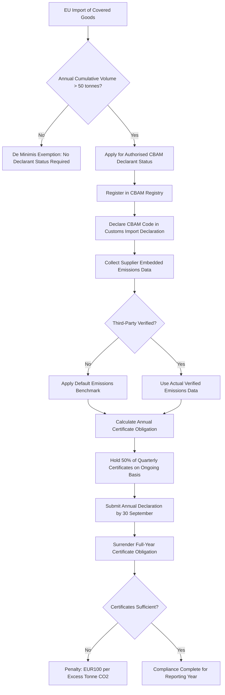

## The EU Carbon Border Adjustment Mechanism

### Overview

The EU Carbon Border Adjustment Mechanism (CBAM) is an environmental trade policy instrument, established by Regulation (EU) 2023/956, designed to combat carbon leakage by putting a fair price on carbon emitted during the production of carbon-intensive goods imported into the EU. Functionally, CBAM operates as a border-adjusted extension of the EU Emissions Trading System (ETS), requiring importers to pay a carbon price on embedded emissions in covered goods equivalent to what EU domestic producers already pay under the ETS — closing a competitiveness gap that would otherwise incentivize relocating carbon-intensive production outside the EU (the "carbon leakage" problem) rather than reducing actual emissions. [European Commission](https://trade.ec.europa.eu/access-to-markets/en/news/start-definitive-period-cbam-eu)

### Regulatory Timeline

**Transitional phase**: began on October 1, 2023, requiring quarterly emissions reporting but no financial payments. [Reed Smith](https://www.reedsmith.com/our-insights/blogs/viewpoints/102lr9t/what-you-need-to-know-as-cbam-simplification-comes-into-effect/)

**Definitive phase**: Began on January 1, 2026. From this point, importers entered the compliance phase where certificate obligations will apply: CBAM certificate sales start on February 1, 2027, via the common central platform. Reporting shifts to an annual basis, with the first report due by September 30, 2027. Third-party verification of emissions data is also now mandatory. [One Click LCA](https://oneclicklca.com/en-us/resources/articles/cbam-a-guide-to-carbon-border-adjustment-mechanism)[Coolset](https://www.coolset.com/academy/cbam-timeline-deadlines-phases-what-to-expect-2026)

**Simplification package**: The regulation has been actively revised. In November 2024, Commission President Ursula von der Leyen announced a "simplification revolution" to reduce administrative burdens across the Green Deal. The first Omnibus Simplification Package, published on February 26, 2025, included a CBAM streamlining proposal, with political agreement between the Parliament and Council following on June 18, 2025, final adoption on September 29, 2025, and publication in the Official Journal on October 17, 2025. [Reed Smith](https://www.reedsmith.com/our-insights/blogs/viewpoints/102lr9t/what-you-need-to-know-as-cbam-simplification-comes-into-effect/)[Reed Smith](https://www.reedsmith.com/our-insights/blogs/viewpoints/102lr9t/what-you-need-to-know-as-cbam-simplification-comes-into-effect/)

**Key Points**

- A key outcome of the simplification package is a new **de minimis threshold**: a single mass-based threshold of 50 tonnes per calendar year has been introduced (Article 2(3a), Regulation (EU) 2025/2083). The new de minimis rule applies to imports of all CBAM goods except hydrogen and electricity [Environmental Protection Agency](https://www.epa.ie/our-services/licensing/climate-change/eu-carbon-border-adjustment-mechanism/)
- This threshold materially narrows CBAM's practical compliance population — small-volume importers below 50 tonnes/year are relieved of authorized-declarant obligations, shifting compliance burden concentration toward larger industrial importers

### Sectoral Scope

CBAM currently applies to goods in six sectors: cement, iron and steel, aluminium, fertilizers, electricity, and hydrogen. These sectors were selected due to their high greenhouse gas emissions and risk of carbon leakage. The EU has proposed to expand the scope to include additional product categories and steel and aluminium-intensive downstream goods from 2028, and sectors like chemicals and polymers are being considered for inclusion as early as 2027–2028. [CBAM: A guide to Carbon Border Adjustment Mechanism +2](https://oneclicklca.com/en-us/resources/articles/cbam-a-guide-to-carbon-border-adjustment-mechanism)

[Inference] Given this stated trajectory toward downstream and additional-sector expansion, firms in adjacent manufacturing sectors (automotive, construction, machinery) that consume CBAM-covered inputs but are not yet directly in scope should reasonably anticipate future exposure and begin supply chain emissions data collection proactively rather than waiting for formal scope expansion.

### Compliance Mechanics for Authorized Declarants

**Authorization requirement**: Importers of more than 50 tonnes of CBAM goods must apply for the status of authorised CBAM declarant to continue importing. Importers must submit CBAM authorisation applications before 31 March 2026 and will be allowed to continue importing CBAM goods pending the authorisation decision. [Environmental Protection Agency](https://www.epa.ie/our-services/licensing/climate-change/eu-carbon-border-adjustment-mechanism/)

**Customs declaration integration**: From 1 January 2026, it is necessary to declare certain codes relating to CBAM in EU import declarations. Only the code corresponding to the transaction carried out must be declared; otherwise, the customs declaration will be rejected by customs authorities of the importing Member State. [European Commission](https://trade.ec.europa.eu/access-to-markets/en/news/start-definitive-period-cbam-eu)

**Emissions data and verification**: Supplier-specific emissions data must be verified by an accredited third party to be used. If a supplier does not undertake — or fails — verification, actual emissions data cannot be used and default data/benchmarks will apply instead. For complex goods producers, such as steel or aluminium product manufacturers, upstream data will need to be verified in order to be included in CBAM declarations. [Carbonchain](https://www.carbonchain.com/cbam)

**Certificate procurement cycle**: Importers must procure CBAM certificates from 2027, where they will have an obligation to hold at least 50% of the required certificates for that quarter's imports, and then must surrender the full amount for the year's imports by the following 30th September. Certificate prices are linked to weekly EU ETS allowance prices. [Carbonchain](https://www.carbonchain.com/cbam)[ASUENE](https://asuene.com/us/blog/cbam-enters-its-definitive-phase-on-january-1-2026-what-companies-must-be-ready-for)

**Penalties**: Failure to surrender the required number of certificates will result in a penalty of €100 per excess tonne of CO2. [Coolset](https://www.coolset.com/academy/cbam-timeline-deadlines-phases-what-to-expect-2026)

### CBAM Compliance Process Architecture

### Geopolitical and Supply Chain Relevance

**Trade friction and WTO considerations**: CBAM has been a subject of international trade tension since its design phase, with non-EU trading partners raising concerns about compatibility with WTO non-discrimination principles and characterizing it as a potential disguised trade barrier. [Inference — this remains a live and disputed area of international trade law commentary rather than a settled legal question, and the EU's own position is that CBAM is designed to be WTO-compatible by mirroring the carbon cost EU domestic producers already bear]

**Supply chain data burden shifts geopolitically**: Legally, CBAM obligations fall on EU importers. They are responsible for submitting reports, purchasing certificates, and surrendering them to cover embedded emissions. In practice, however, non-EU producers are deeply involved, since CBAM applies to EU importers, but it directly impacts non-EU manufacturers, since they need to supply product-specific carbon data to support compliance. This creates an indirect but powerful mechanism by which EU climate policy exports compliance burden onto non-EU supply chain partners — a dynamic with direct parallels to how sanctions and export control regimes extend influence extraterritorially through counterparty obligations rather than direct jurisdiction. [ASUENE](https://asuene.com/us/blog/cbam-enters-its-definitive-phase-on-january-1-2026-what-companies-must-be-ready-for)[One Click LCA](https://oneclicklca.com/en-us/resources/articles/cbam-a-guide-to-carbon-border-adjustment-mechanism)

**Strategic sourcing implications**: Because certificate costs scale with a supplier's embedded carbon intensity, CBAM creates a financial incentive for EU importers to favor lower-carbon-intensity suppliers in sourcing decisions — effectively adding a carbon-cost dimension to the same kind of supplier diversification and re-sourcing calculus already driven by geopolitical concentration risk (friend-shoring, China+1), meaning firms restructuring supply chains for geopolitical resilience should factor CBAM exposure into the same analysis rather than treating carbon and geopolitical risk as separate workstreams.

### Example: Applying CBAM to a Steel Import Scenario

**Scenario**: An EU manufacturer imports semi-finished steel products from a non-EU supplier, with cumulative annual volume of 200 tonnes.

**Applied process**:

1. **Threshold check**: 200 tonnes exceeds the 50-tonne de minimis threshold, triggering authorized declarant obligations
2. **Authorization**: Importer must have applied for Authorised CBAM Declarant status before the 31 March 2026 deadline (or before exceeding the threshold, if later) to continue importing without disruption
3. **Data collection**: Importer requests supplier-specific embedded emissions data; if the non-EU steel producer has not obtained third-party verification, default EU benchmark emissions values apply instead — typically less favorable than accurate low-emissions actual data, creating a direct financial incentive for the supplier to invest in verification
4. **Certificate obligation**: Beginning 2027, the importer procures CBAM certificates priced against the weekly EU ETS allowance price, holding at least 50% of the quarterly requirement on an ongoing basis and surrendering the full annual obligation by 30 September of the following year
5. **Strategic response**: Given the direct cost linkage to supplier emissions intensity, the importer may factor CBAM certificate cost differentials into future sourcing decisions alongside existing geopolitical and tariff considerations

### Common Pitfalls

- **Treating the pre-2026 transitional-phase reporting-only obligation as the full compliance picture** — the transitional phase's absence of financial obligation does not extend into the definitive phase, where certificate costs and penalties are real and material
- **Assuming default emissions benchmarks are a viable long-term strategy** — default values are typically set conservatively (favoring the higher end of a sector's emissions range), making verified actual supplier data financially advantageous wherever achievable
- **Overlooking the 31 March 2026 authorization deadline** — importers who fail to apply in time for authorized declarant status face import continuity risk once the transitional accommodation period lapses
- **Ignoring downstream expansion signals** — firms in sectors adjacent to the current six covered categories risk being caught unprepared if they do not track the EU's stated intent to expand scope to additional products and sectors in coming years

**Related Topics**

- Rules of origin and customs valuation
- Sanctions compliance programs and OFAC requirements
- Investment screening regimes: CFIUS and its international equivalents
- Friend-shoring and China+1 diversification strategies
- Supply chain mapping and Tier-N supplier visibility