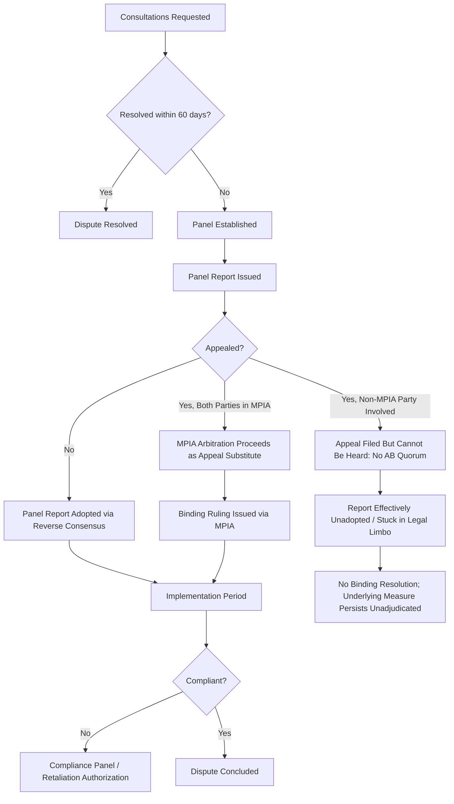

## WTO Dispute Settlement Mechanics and Its Current Paralysis

### Overview

The WTO Dispute Settlement Understanding (DSU) established what is often described as the most legalized and effective dispute resolution mechanism in international law — a binding, two-tier adjudicative system for resolving trade disputes between member states. Its practical paralysis, centered on the non-functioning Appellate Body, is directly relevant to supply chain geopolitics: without a fully functioning enforcement backstop, trade remedy measures, unilateral tariff actions, and non-compliance with WTO rulings carry materially different risk and predictability implications for firms navigating cross-border trade exposure.

### Core Dispute Settlement Process (as designed)

**Stage 1 — Consultations**:

- A complaining member requests formal consultations with the respondent member, a mandatory first step intended to allow bilateral resolution before adjudication
- If consultations fail to resolve the matter within 60 days, the complainant may request establishment of a panel

**Stage 2 — Panel Proceedings**:

- The Dispute Settlement Body (DSB) — comprising all WTO members — establishes a panel of typically three trade law experts to examine the dispute
- Panels issue findings on whether the measure in question is consistent with WTO agreements, typically within around 6-9 months of composition, though actual timelines frequently extend beyond this target
- Panel reports are adopted by the DSB unless there is a consensus *against* adoption (the "reverse consensus" or "negative consensus" rule) — since the winning party would never join a consensus to block its own favorable ruling, this rule makes panel report adoption effectively automatic, a deliberate design feature distinguishing the WTO system from its GATT predecessor, where a losing party could unilaterally block adoption

**Stage 3 — Appellate Review**:

- Either party may appeal a panel report to the **Appellate Body**, a standing seven-member body (with appeals normally heard by three members on rotation) reviewing legal (not factual) findings
- Appellate Body reports are similarly subject to reverse-consensus adoption, making appellate rulings effectively final and binding absent member consensus to reject them

**Stage 4 — Implementation and Compliance**:

- A losing member must bring its measure into compliance within a "reasonable period of time," determined by negotiation or binding arbitration
- If compliance is disputed, a **compliance panel** (Article 21.5 proceeding) may be established to determine whether implementation measures actually achieve compliance

**Stage 5 — Retaliation/Countermeasures**:

- If a member fails to comply within the reasonable period, the complaining member may request DSB authorization to suspend concessions (impose retaliatory tariffs) at a level commensurate with the nullification/impairment caused by the original violation
- The level of authorized retaliation is itself subject to arbitration if disputed (Article 22.6 proceeding)

### The Appellate Body Paralysis

**Key Points**

- The Appellate Body has been non-functional since December 2019, when it lost its quorum (minimum three sitting members required to hear appeals) due to the United States blocking consensus on new member appointments — a blocking position the U.S. maintained across the Obama, Trump, and Biden administrations, reflecting longstanding and bipartisan U.S. criticism of the Appellate Body's practice
- U.S. objections have centered on claims that the Appellate Body engaged in "judicial overreach" — issuing advisory opinions beyond what was necessary to resolve disputes, exceeding mandated deadlines, and treating its own prior rulings as binding precedent in a manner U.S. officials argued was not supported by the DSU text
- [Unverified] The precise current status of Appellate Body reform negotiations and appointment blocking is subject to ongoing diplomatic developments; the described paralysis reflects the well-documented multi-year institutional state as of recent years, but current negotiating posture should be verified against current WTO and USTR sources given the fluid and politically sensitive nature of this issue

**Practical consequence — "appeals into the void"**:

- Because any party can appeal a panel report, and appeals cannot be heard without a functioning Appellate Body, a losing party can now effectively block adoption of an unfavorable panel ruling simply by filing an appeal that will never be resolved — a tactic informally termed "appealing into the void"
- This converts what was designed as an automatic, binding adjudication system back toward something closer to the pre-WTO GATT system, where a losing party could functionally block enforcement, undermining the core reverse-consensus design feature that was meant to prevent exactly this outcome

### Workaround Mechanisms

**Multi-Party Interim Appeal Arbitration Arrangement (MPIA)**:

- A voluction, WTO-consistent alternative appeal mechanism established under DSU Article 25 (arbitration), created by a subset of WTO members (initially led by the EU) as a voluntary substitute appellate process among participating members
- Members who are both party to a dispute and have joined the MPIA can use it to obtain a binding appellate-equivalent ruling, preserving dispute settlement functionality *between MPIA participants* even without the WTO's own Appellate Body
- **Limitation**: only functions between two disputing parties who have both opted into the MPIA; disputes involving a non-participating member (including the United States, which has not joined) cannot use this workaround, meaning the core paralysis persists for a substantial share of WTO's overall dispute caseload

**Bilateral/plurilateral appeal waivers**:

- In some disputes, parties have agreed ad hoc not to appeal a panel report (effectively waiving the appeal right for that specific case), allowing the panel report to be adopted and the dispute to conclude despite the systemic Appellate Body absence — but this depends entirely on case-specific voluntary agreement rather than being a structural fix

### Process Flow Showing Both Designed and Paralysis-State Paths

### Geopolitical and Supply Chain Risk Implications

**Reduced predictability of trade remedy exposure**:

- Firms facing anti-dumping, countervailing duty, or safeguard measures historically had a credible path to binding multilateral review if they believed a measure was WTO-inconsistent; the current paralysis means a panel-level "win" can be indefinitely neutralized via unresolved appeal, reducing the practical deterrent effect the system was designed to provide against WTO-inconsistent trade measures
- This shifts practical risk mitigation weight toward diplomatic/political channels and bilateral negotiation rather than confident reliance on binding multilateral adjudication — relevant context for firms evaluating whether to challenge a trade measure at all, given the diminished certainty of ultimate binding resolution

**Increased space for unilateral action**:

- The weakened multilateral enforcement backstop has coincided with — though causation is genuinely debated rather than established — an observed increase in unilateral tariff and trade restriction actions by major economies, since the traditional multilateral check on WTO-inconsistent unilateral measures is functionally degraded [Speculation — the causal relationship between AB paralysis and increased unilateralism is a matter of ongoing debate among trade policy analysts rather than an empirically settled finding, since unilateralism trends have multiple contributing drivers including broader geopolitical realignment]

**MPIA as a partial risk-mitigation signal**:

- Firms whose primary trade relationships run through MPIA-participating jurisdictions retain meaningfully more binding dispute resolution certainty than those whose exposure runs through non-participating jurisdictions (notably U.S.-related disputes), a factor worth incorporating into geographic risk-differentiated compliance and trade remedy strategy

### Example: Practical Implications for a Firm Facing a Trade Remedy Measure

**Scenario**: A firm's exports face a new countervailing duty measure imposed by an importing country that the firm's trade counsel believes is WTO-inconsistent.

**Analysis under current conditions**:

1. The firm's home government could pursue a WTO panel challenge, and would likely prevail at the panel stage if the measure is genuinely WTO-inconsistent, given panel proceedings remain functional
2. However, if the losing party (the country maintaining the duty) appeals and is not an MPIA participant alongside the complaining country, the panel ruling cannot be enforced through the normal binding adoption process — the duty could persist in practice despite an unfavorable panel finding
3. **Practical implication for the firm**: legal victory at the panel stage does not guarantee actual removal of the duty on any predictable timeline, meaning the firm's commercial risk mitigation strategy (alternate market diversification, cost absorption planning, or political/diplomatic engagement) cannot rely on WTO adjudication alone as a reliable resolution path under current systemic conditions

### Common Pitfalls in Analysis

- **Assuming a panel ruling in a firm's favor equals resolution** — under current paralysis conditions, panel-stage success can be neutralized by an unresolved appeal, a distinction essential to accurate risk assessment
- **Treating the paralysis as uniformly affecting all disputes** — MPIA-participant disputes retain meaningfully more enforcement certainty, making the practical impact jurisdiction-dependent rather than uniform
- **Conflating WTO dispute settlement paralysis with WTO irrelevance generally** — panels, consultations, and the broader rules-based framework continue to function; it is specifically the appellate/binding-finality stage that is impaired, a distinction relevant to accurately scoping risk analysis

**Related Topics**

- Rules of origin and customs valuation
- The EU Carbon Border Adjustment Mechanism
- Sanctions compliance programs and OFAC requirements
- Investment screening regimes: CFIUS and its international equivalents
- Enterprise risk management frameworks for geopolitical risk