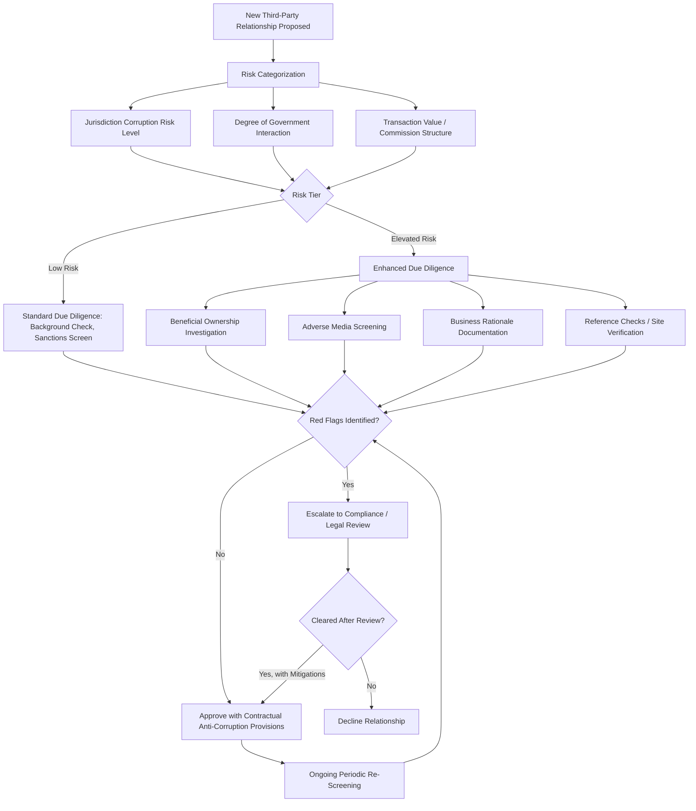

## Anti-Corruption Law and Supply Chain Due Diligence Obligations

### Overview

Anti-corruption law extends supply chain compliance obligations beyond sanctions and export controls into the conduct of business relationships themselves — prohibiting bribery of foreign officials and, increasingly, imposing affirmative due diligence obligations on firms regarding the conduct of their supply chain counterparties. Unlike sanctions (transactional prohibition with a designated party) or export controls (regulation of goods/technology movement), anti-corruption regimes regulate *how* business is conducted, making supply chain due diligence a preventive compliance discipline rather than a transactional screening exercise alone.

### Major Anti-Corruption Legal Frameworks

**U.S. Foreign Corrupt Practices Act (FCPA)**:

- Enacted 1977; prohibits U.S. persons and issuers (and, under certain provisions, foreign persons/entities with a U.S. nexus) from bribing foreign government officials to obtain or retain business
- **Anti-bribery provisions**: prohibit corrupt payments, offers, or promises of anything of value to foreign officials, political parties, or candidates for the purpose of influencing official action to obtain or retain business or secure an improper advantage
- **Accounting provisions**: separately require issuers to maintain accurate books and records and adequate internal accounting controls — a provision frequently used to pursue enforcement even where an underlying bribery payment itself is difficult to prove, since inaccurate recordkeeping around a suspicious payment can independently violate the Act
- Enforced jointly by the U.S. Department of Justice (criminal enforcement) and the SEC (civil enforcement against issuers)

**UK Bribery Act 2010**:

- Broader in scope than the FCPA in several respects: prohibits bribery of any person (not limited to foreign government officials), criminalizes both giving and receiving bribes, and includes a distinct offense of bribing a foreign public official
- **Section 7 "failure to prevent bribery" offense**: creates strict corporate liability for a commercial organization when a person associated with it (including, notably, third-party agents and intermediaries) bribes another person intending to obtain or retain business for the organization — with an affirmative defense available only if the organization can demonstrate it had "adequate procedures" in place to prevent bribery
- This "failure to prevent" strict liability model, combined with the adequate-procedures defense, has been highly influential in shaping subsequent corporate compliance program expectations globally, including in supply chain due diligence design

**OECD Anti-Bribery Convention**:

- Multilateral framework obligating signatory states to criminalize bribery of foreign public officials in international business transactions, providing the common baseline underlying many national anti-corruption laws (including the FCPA and UK Bribery Act, both broadly consistent with Convention obligations)

**Other significant national regimes**:

- France's **Loi Sapin II** (2016) introduced its own failure-to-prevent-style obligations and mandatory compliance program requirements for larger French companies, with dedicated regulatory oversight via the Agence Française Anticorruption
- Brazil's Clean Companies Act, and various national anti-corruption laws across major trading jurisdictions, reflect similar convergence toward corporate liability models incorporating due diligence expectations

### Third-Party and Supply Chain Risk Under Anti-Corruption Law

**Key Points**

- The majority of significant anti-corruption enforcement actions in recent history have involved **third-party intermediaries** — agents, distributors, consultants, joint venture partners, or suppliers — rather than direct payments by the firm itself, reflecting a well-established enforcement pattern where corrupt payments are frequently routed through intermediary relationships to create distance from the principal
- This pattern is precisely why regulators (particularly under the UK Bribery Act's Section 7 framework) have shifted expectations toward requiring firms to conduct genuine due diligence on third parties acting on their behalf, rather than treating third-party conduct as outside the firm's compliance responsibility

**Common high-risk third-party categories in supply chain contexts**:

- Customs brokers and freight forwarders, given frequent interaction with government officials at ports and border crossings
- Local agents/consultants facilitating market entry, licensing, or permit acquisition in jurisdictions with elevated corruption risk indices
- Joint venture partners, particularly state-linked or politically connected local partners common in certain regulated or resource-extraction sectors
- Distributors and resellers with government-entity end customers, where sales-incentive structures can create indirect bribery exposure

### Elements of a Supply Chain Anti-Corruption Due Diligence Program

**Risk-based third-party due diligence**:

- Tiered due diligence intensity based on risk factors: jurisdiction corruption risk level (commonly referenced against indices such as Transparency International's Corruption Perceptions Index), transaction value, degree of government interaction inherent in the third party's role, and red flags arising from the relationship's structure (e.g., unusually high commission rates, requests for payment to unrelated third-party accounts, or lack of demonstrable business rationale for the intermediary's role)
- Standard due diligence steps typically include background/beneficial ownership investigation, adverse media and litigation screening, verification of the third party's actual business legitimacy and capability, and documented business rationale for the engagement

**Contractual anti-corruption provisions**:

- Standard contract clauses requiring third-party compliance with applicable anti-corruption laws, representations and warranties regarding no prior violations, audit rights, and termination rights for breach — providing both a compliance control and, in the event of a violation, a contractual basis for the firm's own defense that it took reasonable preventive steps

**Ongoing monitoring rather than one-time clearance**:

- Given that relationships and risk profiles evolve, mature programs incorporate periodic re-screening and monitoring (analogous to the sanctions screening principle that ongoing rescreening is necessary, not just onboarding due diligence) rather than treating initial clearance as a permanent status

**Training and internal reporting channels**:

- Role-appropriate training for employees managing third-party relationships in supply-chain-adjacent functions (procurement, business development, government affairs)
- Accessible internal reporting/whistleblower channels, given that internal reporting is frequently how corruption issues are first identified within an organization

### Due Diligence Program Architecture

### Intersection with Other Trade Compliance Regimes

- **Overlap with sanctions/export control screening**: Many third-party due diligence platforms integrate anti-corruption risk screening alongside sanctions and denied-party screening, given overlapping data needs (beneficial ownership, adverse media) even though the underlying legal obligations are analytically distinct
- **Overlap with investment screening**: Foreign investment transactions subject to CFIUS or equivalent regimes increasingly incorporate anti-corruption and integrity due diligence as part of broader national security and reputational risk assessment of the counterparties involved
- **Relevance to supply chain diversification decisions**: As firms pursue friend-shoring or supplier diversification for geopolitical risk mitigation, new supplier jurisdictions and intermediary relationships introduced by diversification efforts require the same anti-corruption due diligence rigor as legacy relationships — diversification for one risk category should not implicitly introduce elevated exposure in another

### Example: Due Diligence on a Customs Broker in a High-Risk Jurisdiction

**Scenario**: A firm is engaging a local customs broker to facilitate import clearance in a jurisdiction with an elevated corruption risk profile.

**Applied process**:

1. **Risk categorization**: Customs brokerage is inherently classified as elevated risk given direct, frequent interaction with government officials at the point of import clearance
2. **Enhanced due diligence**: Beneficial ownership check confirms the broker is not owned or controlled by a government official with decision-making authority over the firm's shipments (a specific, well-recognized red flag pattern); adverse media screening checks for prior corruption-related findings or investigations
3. **Business rationale and fee structure review**: Commission/fee structure is compared against market-typical rates for customs brokerage services in the jurisdiction; unusually high fees or fee structures tied to expedited/preferential treatment (rather than standard service scope) are flagged for further inquiry, as these are common patterns associated with facilitation of improper payments
4. **Contractual provisions**: Engagement contract includes anti-corruption representations, audit rights, and termination provisions, alongside training for the firm's own logistics staff managing the relationship on recognizing and escalating red flags
5. **Ongoing monitoring**: Given the relationship's high-risk classification, the firm applies more frequent re-screening intervals than would apply to a low-risk vendor relationship

### Common Pitfalls

- **Treating due diligence as a one-time onboarding gate** — failing to re-screen and monitor third-party relationships over time, missing risk profile changes (ownership changes, new adverse findings, changed political connections)
- **Underestimating indirect exposure through intermediaries** — assuming liability risk is limited to direct payments by firm employees, when the dominant enforcement pattern involves third-party intermediary conduct
- **Applying uniform due diligence intensity regardless of risk profile** — inefficient over-scrutiny of genuinely low-risk relationships alongside under-scrutiny of high-risk ones, rather than risk-based tiering
- **Documenting policies without genuine implementation** — maintaining an anti-corruption policy on paper without demonstrable evidence of actual due diligence execution, training, and escalation practice, which undermines the "adequate procedures" defense available under frameworks like the UK Bribery Act's Section 7

**Related Topics**

- Sanctions compliance programs and OFAC requirements
- Investment screening regimes: CFIUS and its international equivalents
- Supply chain mapping and Tier-N supplier visibility
- Building a geopolitical risk function within a corporation
- Rules of origin and customs valuation