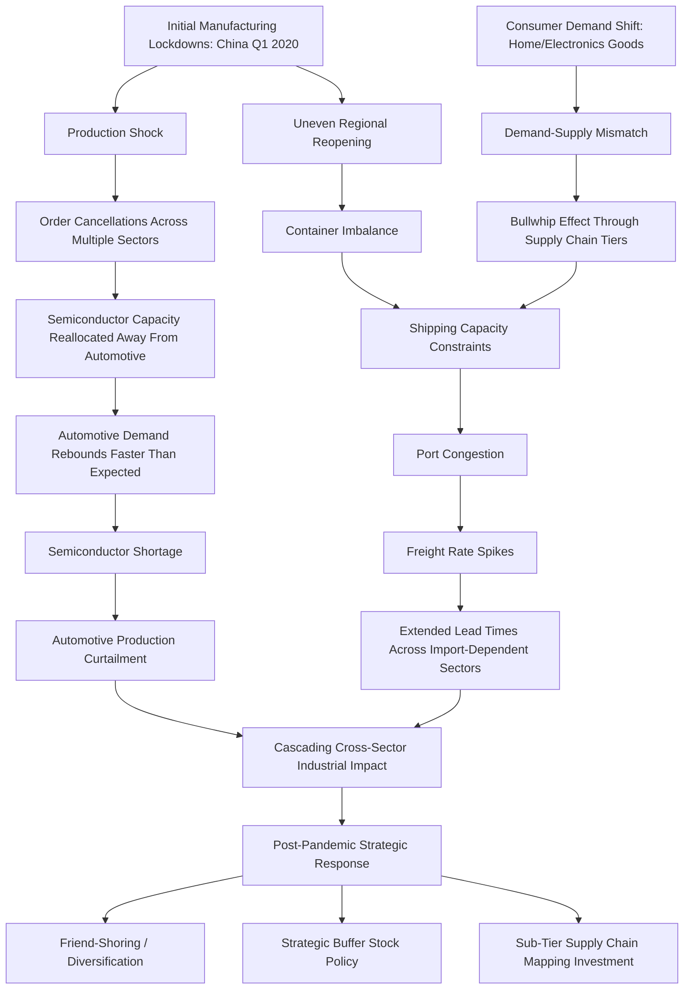

## The COVID-19 Pandemic and the Global Supply Chain Collapse

### Overview

The COVID-19 pandemic (2020-2022) represents the most consequential global supply chain disruption case study of the modern era — not because it originated as a geopolitical event, but because it exposed structural vulnerabilities in globally optimized supply chains that subsequent geopolitical strategy (friend-shoring, diversification mandates, strategic stockpiling) has been substantially designed to address. Its case-study value lies in demonstrating how a genuinely exogenous shock cascaded through interconnected systems in ways that closely mirror how geopolitical shocks propagate, making it a foundational reference point for supply chain resilience planning even outside pandemic-specific contexts.

### Timeline and Disruption Phases

**Phase 1 — Initial production shock (Q1 2020)**:

- Manufacturing shutdowns concentrated initially in China, the world's dominant manufacturing hub, as lockdown measures halted or severely curtailed factory operations
- This exposed the depth of single-region manufacturing concentration across numerous product categories, from electronics components to pharmaceutical active ingredients, where alternate capacity did not exist at comparable scale

**Phase 2 — Demand shock and the bullwhip effect (mid-2020)**:

- Initial demand collapse in many sectors (automotive, industrial) led firms to cancel orders and reduce production, including semiconductor orders — a decision that would prove consequential
- Simultaneously, consumer demand shifted sharply toward goods purchased for pandemic-altered lifestyles (home office equipment, consumer electronics, home goods), creating a severe demand-supply mismatch across different product categories at the same time
- This produced a textbook **bullwhip effect** — small changes in end-consumer demand amplifying into large swings in upstream orders as each tier of the supply chain over- or under-corrected based on incomplete information about actual downstream demand

**Phase 3 — Logistics and shipping capacity collapse (2020-2021)**:

- Container shipping capacity became severely constrained as the demand shock and uneven regional recovery created container imbalances — containers accumulated in some regions while being scarce in others, disrupting normal shipping rotation patterns
- Port congestion, particularly at major gateway ports, created extended vessel wait times and cascading schedule reliability collapse across global shipping networks
- Freight rates on major trade lanes rose to levels many multiples above pre-pandemic norms, fundamentally altering the cost structure of global trade for an extended period

**Phase 4 — Semiconductor shortage and cascading industrial impact (2021-2022)**:

- The earlier 2020 order cancellations meant semiconductor foundries had reallocated capacity away from automotive-grade chips toward consumer electronics; when automotive demand rebounded faster than anticipated, foundries could not rapidly re-prioritize capacity back given the long lead times and specialized nature of semiconductor manufacturing
- This produced a shortage that rippled through automotive and numerous electronics-dependent industries for an extended period, illustrating how a shock in one narrow input category can cascade across seemingly unrelated downstream industries given deep, often invisible dependency chains

**Phase 5 — Regional lockdown recurrence and localized shocks (2021-2022)**:

- Recurring regional lockdowns, notably China's sustained zero-COVID policy extending well beyond most other major economies' reopening, continued to generate episodic manufacturing and port disruptions even as global conditions broadly normalized elsewhere — illustrating how divergent national policy responses to a shared shock can prolong and geographically concentrate disruption

### Structural Vulnerabilities Exposed

**Key Points**

- **Just-in-time (JIT) inventory philosophy**, which had dominated supply chain management doctrine for decades on efficiency grounds, proved to leave minimal buffer against sustained disruption — firms operating with lean, low-inventory models had far less resilience than those maintaining strategic buffer stock, directly informing the post-pandemic shift toward "just-in-case" thinking in strategic sectors
- **Single-source and single-region concentration** — many firms discovered they had limited or no visibility into how concentrated their sub-tier (Tier-2, Tier-3) supplier base was in specific regions, since Tier-1 supplier relationships often obscured deeper concentration risk
- **Interdependency across unrelated sectors** — the semiconductor shortage's automotive impact demonstrated that supply chain risk assessment confined to a firm's own direct sector is insufficient; cross-sector capacity competition for shared upstream inputs is a systemic risk factor
- **Demand forecasting fragility under regime change** — standard demand forecasting models, calibrated on historical patterns, performed poorly when consumer behavior shifted abruptly and durably rather than through gradual trend evolution

### Disruption Cascade Architecture

### Example: The Automotive Semiconductor Shortage as a Cascading Failure

**Sequence of events**:

1. In early 2020, automotive manufacturers, anticipating a severe pandemic-driven demand collapse, cancelled semiconductor orders with their suppliers
2. Semiconductor foundries, operating capacity-constrained facilities with long reconfiguration lead times, reallocated the freed capacity toward consumer electronics manufacturers, whose demand was proving resilient or even increasing
3. Automotive demand recovered considerably faster and more strongly than the initial cancellation decisions had anticipated
4. Automotive manufacturers attempted to place renewed semiconductor orders, but found themselves at the back of an allocation queue behind consumer electronics customers who had maintained continuous orders throughout, and behind the inherent lead-time constraints of semiconductor fabrication itself
5. The resulting shortage forced extended production curtailments and plant idling across the global automotive industry for a period extending well beyond initial expectations

**Lesson for supply chain risk management**: The shortage did not originate from a geopolitical action, sanction, or conflict — it originated from a *demand forecasting error compounding through a capacity-constrained, long-lead-time upstream industry*. This is directly relevant to geopolitical risk practice because it demonstrates that supply chain fragility is not solely a function of geopolitical exposure; concentration risk, buffer capacity, and cross-sector interdependency are structural vulnerabilities that amplify *any* shock, geopolitical or otherwise, and should be assessed as a baseline resilience factor independent of the specific triggering event.

### Relevance to Geopolitical Risk Practice

**Direct influence on subsequent geopolitical supply chain strategy**:

- The pandemic experience substantially accelerated and legitimized strategic conversations (friend-shoring, China+1, critical mineral stockpiling) that had previously existed mainly in specialist geopolitical risk circles, bringing supply chain resilience into mainstream corporate strategy and board-level attention in a way that purely geopolitical scenario analysis had not achieved to the same degree
- [Inference] Many of the ERM framework enhancements, buffer stock policies, and sub-tier supply chain mapping investments described elsewhere in this curriculum trace their organizational funding and executive priority directly to lessons drawn from the pandemic experience, even where the specific risk being mitigated is geopolitical rather than pandemic-related — reflecting how a non-geopolitical shock can still catalyze geopolitical risk management maturity

**Distinguishing pandemic-specific lessons from generalizable ones**:

- Some pandemic-specific dynamics (biological transmission risk, public health lockdown policy) are not directly analogous to geopolitical disruption
- However, the *structural* lessons — JIT fragility, sub-tier visibility gaps, cross-sector interdependency, bullwhip amplification, and the value of pre-positioned buffer capacity — apply directly to geopolitical disruption scenarios (conflict-driven chokepoint closure, sanctions-driven sudden supplier loss, export restriction-driven input scarcity), making the pandemic a generalizable stress-test case study rather than a narrowly pandemic-specific one

### Common Pitfalls in Drawing Lessons from This Case Study

- **Treating the pandemic as a purely exogenous, non-repeatable event** — while the specific biological trigger was unique, the structural amplification mechanisms (bullwhip effect, JIT fragility, cross-sector cascading) are general properties of tightly optimized global supply chains and will recur under different triggering events, including geopolitical ones
- **Over-indexing on the specific shortage (semiconductors) rather than the underlying mechanism** — the specific product category was semiconductors in this instance, but the underlying lesson (capacity reallocation lag under demand volatility in concentrated, long-lead-time industries) generalizes to any similarly structured critical input, including many currently subject to geopolitical export control or resource nationalism risk
- **Assuming post-pandemic resilience investments fully addressed the exposed vulnerabilities** — buffer stock and diversification investments made in direct response to pandemic lessons should be periodically re-assessed against current risk exposure rather than assumed to remain adequate indefinitely, particularly as cost pressures can erode initially well-funded resilience investments over time

**Related Topics**

- Enterprise risk management frameworks for geopolitical risk
- Building a geopolitical risk function within a corporation
- Wargaming and red teaming for supply chain scenarios
- Friend-shoring and China+1 diversification strategies
- Supply chain mapping and Tier-N supplier visibility