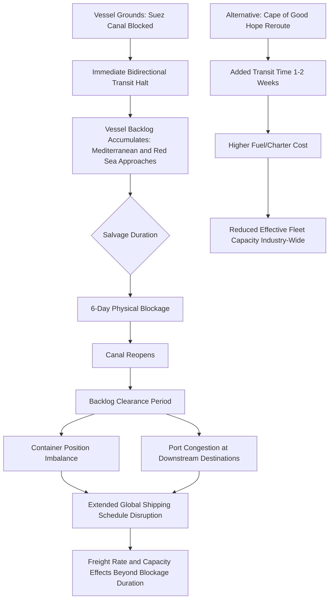

## The Ever Given Grounding and the Suez Canal Blockage

### Overview

The grounding of the container ship *Ever Given* in the Suez Canal in March 2021 is a landmark case study in maritime chokepoint risk — demonstrating how a single vessel incident, entirely unrelated to geopolitical conflict or state action, could halt approximately 12% of global trade volume for six days and create cascading effects across global shipping schedules for months afterward. Its enduring relevance to supply chain geopolitics lies in the structural lesson it shares with geopolitically-driven chokepoint disruptions (Strait of Hormuz tension, Red Sea attacks): global trade's dependence on a small number of geographically fixed maritime chokepoints creates systemic fragility regardless of whether the triggering event is accidental, technical, or deliberate.

### Incident Timeline

**The grounding**: On March 23, 2021, the *Ever Given*, a large container vessel, ran aground diagonally across the Suez Canal, reportedly due to a combination of high winds and a sandstorm reducing visibility, compounded by the vessel's size relative to the canal's dimensions in the affected section. The vessel became wedged across the canal's width, fully blocking transit in both directions.

**The blockage**: The canal remained blocked for approximately six days, from March 23 to March 29, 2021, during which no vessels could transit in either direction, creating an immediate and growing backlog of waiting ships on both the Mediterranean and Red Sea approaches.

**Salvage operation**: Refloating the vessel required a combined effort involving dredging around the hull, tugboat operations, and eventually assistance from high tide conditions, illustrating the technical complexity of resolving even a single-vessel obstruction in a narrow chokepoint.

**Aftermath backlog clearance**: Even after the canal reopened, the accumulated backlog of several hundred vessels took a significant additional period to clear, and the schedule disruption rippled through global shipping networks for months as vessels, containers, and port schedules struggled to normalize — illustrating that chokepoint disruption impact duration substantially exceeds the duration of the chokepoint closure itself.

### Why the Suez Canal Is a Systemically Critical Chokepoint

**Key Points**

- The Suez Canal provides the shortest maritime route between Europe/the Mediterranean and Asia/the Indian Ocean, avoiding the substantially longer alternative route around the Cape of Good Hope (Southern Africa) — a detour adding roughly one to two weeks of additional transit time depending on the specific origin-destination pair
- A significant share of global containerized trade transits the canal, alongside substantial volumes of energy shipments (crude oil and LNG), making it critical to both manufactured goods supply chains and energy security simultaneously
- **No practical substitute exists** for the canal's specific geographic function — the Cape of Good Hope alternative exists but at substantially higher cost (fuel, time, vessel-day charter cost) and reduced schedule reliability, meaning it functions as a costly fallback rather than a genuine substitute under normal conditions

### Structural Parallels to Geopolitical Chokepoint Risk

This incident is instructive precisely because it was **not** geopolitically caused, yet produced effects structurally identical to what a deliberate state-action closure would produce:

- **Comparison to the Strait of Hormuz**: a chokepoint through which a substantial share of global oil trade transits, subject to recurring geopolitical tension risk given littoral state relations; a Hormuz closure scenario (whether through military action, mining, or state-imposed restriction) would produce the same fundamental dynamic — binary chokepoint unavailability with limited-capacity, higher-cost alternative routing
- **Comparison to the Red Sea/Bab-el-Mandeb corridor**: subsequent disruptions to Red Sea shipping (driven by security threats to vessels rather than a physical blockage) demonstrated a related but distinct chokepoint risk mechanism — rather than the canal itself being physically impassable, elevated war-risk/security threat led many carriers to voluntarily reroute around the Cape of Good Hope, producing similar network-wide schedule and cost effects to a physical blockage despite the underlying mechanism (voluntary rerouting due to risk versus involuntary physical obstruction) being different
- [Inference] The Ever Given incident is frequently cited in supply chain risk literature specifically because it provided a real-world, unambiguous demonstration of chokepoint impact magnitude without the confounding variables of an actual geopolitical conflict, making it a valuable "clean" reference case for quantifying chokepoint disruption cost and cascading timeline even when reasoning about geopolitically-triggered chokepoint scenarios

### Disruption Cascade Architecture

### Example: Applying the Chokepoint Lesson to Geopolitical Contingency Planning

**Scenario**: A firm is assessing contingency planning for potential disruption to a different critical maritime chokepoint relevant to its supply chain, informed by the Ever Given case study.

**Applied analysis**:

1. **Duration mismatch planning**: Contingency plans should explicitly account for the demonstrated pattern that total disruption impact duration (including backlog clearance and schedule normalization) substantially exceeds the chokepoint closure duration itself — a plan sized only to the closure period itself, rather than the full cascading recovery period, will underestimate required buffer stock or alternate routing duration
2. **Alternative route cost-benefit pre-analysis**: Given that alternate routing (analogous to the Cape of Good Hope option) exists but at materially higher cost and longer transit time, firms benefit from having pre-analyzed alternate routing cost and lead-time impact *before* a disruption occurs, rather than scrambling to model this under acute crisis time pressure
3. **Container/vessel position risk**: The case demonstrated that chokepoint disruption effects extend beyond the immediately affected vessels to broader container and vessel positioning imbalances across the network — contingency planning should consider network-wide logistics partner capacity constraints, not just the specific shipment route directly affected

### Broader Supply Chain and Risk Management Lessons

**Quantifying chokepoint risk for enterprise risk registers**:

- The incident provided real-world empirical grounding for the "High-Impact/Low-Probability" structured analytic technique discussed elsewhere in this curriculum — a six-day closure of a single chokepoint, from a cause with no obvious historical precedent at that specific scale, produced measurable global trade value impact, offering a calibration reference point for scenario-planning exercises modeling chokepoint disruption of varying duration and cause

**Insurance and risk transfer relevance**:

- The incident generated substantial legal and insurance complexity regarding liability allocation (vessel owner, canal authority, cargo interests) and business interruption claims, illustrating the practical difficulty of using traditional indemnity-based insurance to address chokepoint disruption — reinforcing the case, discussed elsewhere in this curriculum, for parametric risk transfer instruments tied to objective chokepoint-status triggers rather than requiring proof of loss and liability determination in a complex multi-party incident

**Governance and monitoring implications**:

- The event underscored the practical value of AIS-based maritime tracking (discussed under OSINT methods) as an early-warning and situational awareness tool — firms and logistics partners with real-time visibility into vessel positioning and canal transit status were better positioned to make rapid rerouting decisions than those relying on delayed or indirect information sources

### Common Pitfalls in Drawing Lessons from This Case Study

- **Treating the incident as purely a "black swan" with no recurrence relevance** — while the specific triggering mechanism (weather-related grounding) is not directly predictable, the underlying structural chokepoint fragility it revealed is a persistent, ongoing risk factor applicable to any future disruption of the same or comparable chokepoints, regardless of cause
- **Underestimating recovery-phase duration in contingency planning** — a common analytical error is planning contingency measures (buffer stock duration, alternate sourcing activation) calibrated only to the acute closure period rather than the full, longer cascading recovery period demonstrated by this case
- **Assuming alternate routing is a costless substitute** — the Cape of Good Hope alternative exists but is not free; contingency plans that assume seamless rerouting without accounting for added cost, transit time, and industry-wide capacity effects will understate the true cost of chokepoint disruption

**Related Topics**

- Maritime chokepoints and shipping route risk (Strait of Hormuz, Bab-el-Mandeb, Taiwan Strait)
- The COVID-19 pandemic and the global supply chain collapse
- Insurance, hedging, and financial instruments for geopolitical risk
- Open source intelligence methods for supply chain monitoring
- Wargaming and red teaming for supply chain scenarios