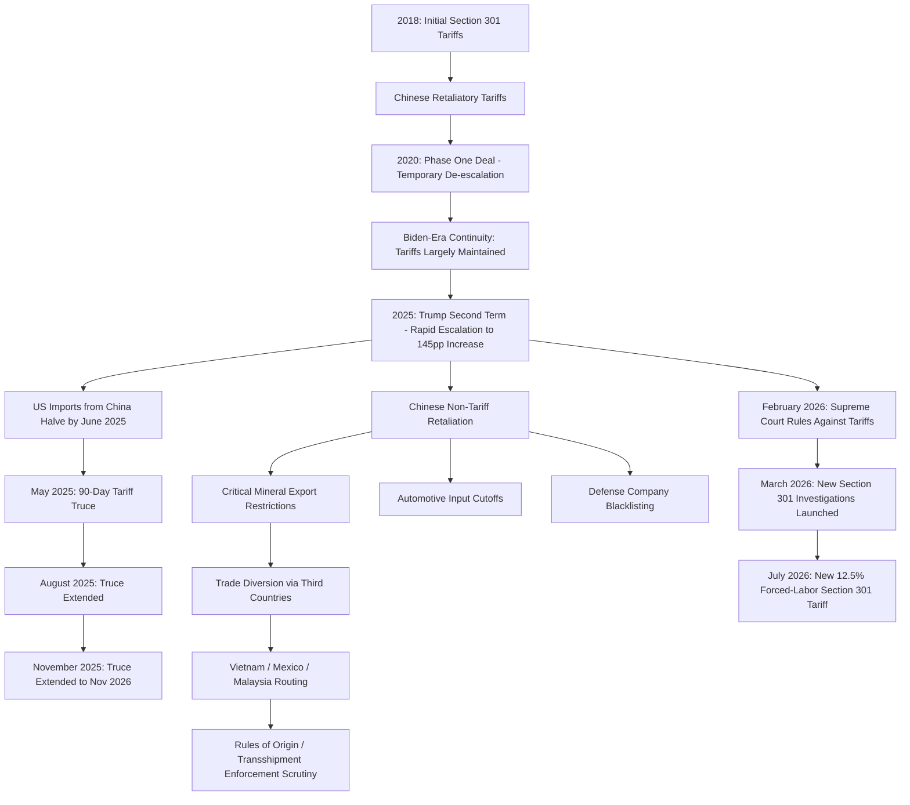

## The US-China Trade War and Tariff Escalation

### Overview

The US-China trade war, initiated in 2018 and continuing through an extended and highly volatile escalation-de-escalation cycle into 2026, represents the defining great-power economic conflict of the current era and a foundational case study for supply chain geopolitics. It demonstrates how tariff policy, export controls, and retaliatory non-tariff measures interact dynamically between two economically interdependent great powers, producing effects — trade diversion, supply chain restructuring, cross-sector leverage escalation — that extend far beyond the two directly involved economies.

### Timeline: First Phase (2018-2020)

- **January 22, 2018**: First series of major United States tariffs on China took effect, marking the formal start of the conflict.
- **April 2, 2018**: First series of major Chinese retaliatory tariffs on the U.S. began.
- Tariffs were imposed in four tranches under **Section 301** of the Trade Act of 1974, eventually covering $370 billion in Chinese goods (Lists 1-4), with China retaliating on $110 billion in US goods.
- **Phase One deal**: signed in early 2020, with China committing to $200 billion in additional US purchases, providing a temporary de-escalation before broader tensions resumed.
- Tariffs largely remained in place and additional levies on Chinese goods were introduced under the Biden administration, indicating substantial bipartisan continuity in the underlying trade policy stance despite the change in administration.

### Timeline: Second Escalation Phase (2025-2026)

**Key Points**

- The fiercest competition between Presidents Trump and Xi in 2025 involved rapid, large-scale mutual trade restriction: Trump launched his second trade war soon after taking office in January 2025 and raised tariffs on China by 145 percentage points by April 2025. By June 2025, US imports from China were roughly half their levels of a year earlier, falling to depths not seen since the 2009 financial crisis
- China responded not primarily through matching tariffs (having largely exhausted proportionate tariff room given the trade imbalance) but through **non-tariff retaliation**: since 2025, most PRC retaliation to U.S. tariffs has involved nontariff actions, as the PRC ran out of items to effectively tariff given the trade imbalance. China canceled orders, imposed market restrictions, and enacted export controls on production inputs, expanding export controls to cover more trade and requiring disclosure about the end use of PRC inputs
- Twice in 2025, Xi nearly brought the US automobile industry to a screeching halt by cutting off companies' access to essential Chinese inputs — with nearly 6.5% of US manufacturing workers employed in just-in-time automotive supply chains, this leverage point carried substantial economic disruption potential, directly echoing the critical-input dependency dynamics discussed in the COVID-19 semiconductor shortage case study

**Tariff truce cycle**:

- On May 12, 2025, the United States and China announced a 90-day reduction in bilateral tariffs after a months-long, tit-for-tat escalation — under the agreement, tariffs imposed in April 2025 were reduced from 125% to 10% on each other's goods (other US-China tariffs remained in place)
- In August 2025, the two parties extended the tariff reduction for another 90 days
- In November 2025, the two parties reached an agreement to extend the tariff reduction for one year, through November 10, 2026 — alongside this, the 10% reduction of the 20% IEEPA Fentanyl tariff on China went into effect November 10, 2025, remaining in effect until November 10, 2026, with certain Section 301 tariff exclusions extended to the same date and USTR 301 China Ships fees suspended for one year

**Legal disruption — the Supreme Court ruling**:

- The US Supreme Court's February 2026 ruling against many of Trump's 2025 tariffs forced a recalibration of the administration's entire trade strategy, illustrating that domestic legal/constitutional constraints on executive tariff authority are themselves a material source of policy volatility and unpredictability in this case study
- In March 2026, the Trump administration announced new investigations into allegedly unfair trading practices by China and numerous other economies (Vietnam, Taiwan, Mexico, Japan, the EU, and dozens more) under Section 301, seeking an alternative legal basis for continued tariff action following the Supreme Court setback

**Most recent developments**:

- USTR proposed new Section 301 tariffs of 12.5% citing forced labor issues, with hearings held in July 2026; the USTR subsequently announced this 12.5% Section 301 tariff on Chinese goods effective July 24, 2026, specifically citing China's "failure to impose and effectively enforce a prohibition on the importation of goods produced with forced labor"
- [Unverified] Given the pace and volatility of developments through mid-to-late 2026, the precise tariff rate structure and truce status should be verified against current sources at the time of use rather than treated as static, given this topic's demonstrated pattern of rapid change even within single-year windows

### China's Retaliatory Toolkit: Beyond Tariffs

**Key Points**

- China has imposed tariffs of 10-125% on US agricultural products (soybeans, sorghum, pork, beef, dairy) at various points, but has increasingly relied on non-tariff leverage: restricting exports of rare earth minerals and critical materials, blacklisting US defense companies, and imposing export controls on gallium, germanium, and other tech-critical minerals
- China's State Council released new regulations on supply chain security, expanding government powers to investigate and impose countermeasures on foreign entities deemed to threaten the country's industrial supply chains — a direct institutional parallel to CFIUS-style investment screening and export control mechanisms in Western jurisdictions, illustrating convergent great-power supply-chain-security institution-building
- This shift toward critical mineral and rare earth export leverage is particularly significant for supply chain geopolitics given China's concentrated global market position in several of these categories, discussed further under resource nationalism and critical minerals topics elsewhere in this curriculum

### Trade Diversion Rather Than Trade Elimination

**Key Points**

- The bilateral trade deficit fell from $420 billion in 2018 to an estimated $194 billion in 2025 — a 54% decline — but economists note that much of this "reduction" reflects **trade diversion**: Chinese goods now enter the US through third countries like Vietnam, Mexico, and Malaysia, meaning the real underlying deficit reduction is smaller than the bilateral figures suggest
- Despite over $370 billion in Chinese goods facing tariffs since 2018, China remained America's third-largest trading partner in 2025 — the trade deficit with China fell substantially, but the overall US trade deficit barely changed, since imports shifted to Vietnam, Mexico, India, and other countries, often for goods that still contain significant Chinese-origin components or value-add
- This dynamic is directly relevant to the rules-of-origin and transshipment discussion elsewhere in this curriculum: trade diversion through minimal-transformation third-country routing raises exactly the substantial-transformation and circumvention-risk questions covered under customs rules of origin, and reflects growing enforcement attention — reporting indicates the DOJ is expected to significantly increase enforcement against tariff evasion in 2026

### Escalation Architecture

### Supply Chain and Geopolitical Risk Implications

**Cross-sector leverage escalation**: The automotive semiconductor/input cutoff episodes in 2025 demonstrate how great-power trade conflicts can rapidly escalate from tariff-based friction into direct supply chain weaponization — a firm's risk exposure in this conflict is not confined to tariff cost pass-through but extends to acute, potentially sudden input-access denial in critical sectors.

**Policy volatility as a standalone risk factor**: The truce-extension cycle (repeated 90-day and then one-year extensions) combined with the Supreme Court's disruption of the administration's tariff legal basis illustrates that firms operating in this environment face not only the direct cost of tariffs themselves but substantial planning uncertainty from the underlying policy's demonstrated volatility — informing the case for scenario planning and indicator-based monitoring (as discussed under structured analytic techniques and early warning indicators) rather than static single-scenario planning assumptions.

**Reinforcement of diversification strategy, with a caveat**: The trade diversion data reinforces the strategic logic behind friend-shoring and China+1 diversification strategies discussed elsewhere in this curriculum, while simultaneously illustrating the rules-of-origin risk inherent in diversification that does not achieve genuine substantial transformation — a firm diversifying sourcing through third countries must ensure the diversification is substantive rather than merely a transshipment pass-through vulnerable to future enforcement action.

### Common Pitfalls in Analyzing This Case Study

- **Treating the trade war as tariff-focused only** — the 2025-2026 phase has been substantially defined by non-tariff Chinese retaliation (critical mineral controls, input cutoffs) that in some episodes carried greater immediate supply chain disruption potential than the tariff measures themselves
- **Treating headline bilateral deficit reduction as evidence of reduced China exposure** — the trade diversion data demonstrates that apparent bilateral trade reduction can mask continued underlying dependency routed through third countries, requiring deeper supply chain mapping analysis rather than reliance on bilateral trade statistics alone
- **Assuming policy stability once a truce or deal is announced** — the demonstrated pattern of repeated renegotiation, extension, and judicial disruption (the Supreme Court ruling) shows that even announced agreements carry meaningful revision risk within relatively short timeframes
- **Treating this as a static, resolved historical episode** — given documented developments continuing into mid-to-late 2026, this remains an active, evolving case study rather than a closed historical one, and current status should be verified rather than assumed static at any given point in time

**Related Topics**

- Friend-shoring and China+1 diversification strategies
- Rules of origin and customs valuation
- Resource nationalism and critical minerals
- Enterprise risk management frameworks for geopolitical risk
- The COVID-19 pandemic and the global supply chain collapse