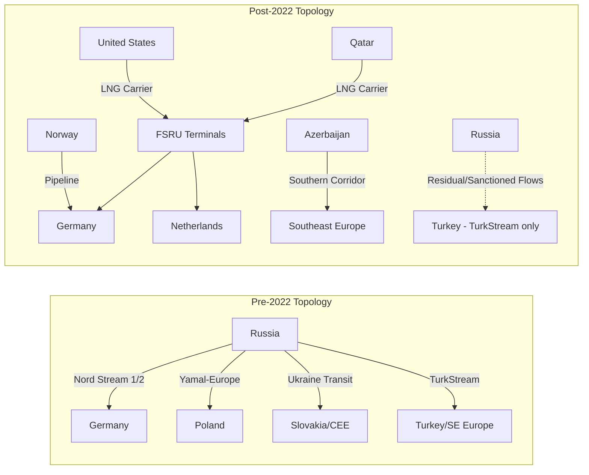

## Russia's Invasion of Ukraine and the Reordering of European Energy

### Overview

The February 2022 invasion of Ukraine triggered the most consequential disruption to European energy supply chains since the 1970s oil shocks. Europe's decades-long dependency on Russian pipeline gas, crude oil, and refined products was severed within roughly 18 months, forcing a continent-wide reordering of sourcing, infrastructure, pricing mechanisms, and strategic reserves policy.

### Pre-War Baseline Dependency Structure

**Key Points**

- In 2021, the EU imported approximately 40% of its natural gas, 27% of its crude oil imports, and 46% of its coal imports from Russia
- Germany was the single most exposed major economy, with Russian gas covering roughly 55% of its consumption
- Pipeline infrastructure (Nord Stream 1/2, Yamal-Europe, the Ukraine transit system, TurkStream) represented sunk capital investment optimized for a single-supplier model
- Central and Eastern European states (Hungary, Slovakia, Bulgaria, the Baltics) had near-total dependency due to Soviet-era pipeline architecture with no westward interconnection

$$\text{Dependency Ratio} = \frac{\text{Russian Volume Imported}}{\text{Total National Consumption}}$$

### Timeline of Supply Chain Shocks

#### Phase 1: Initial Invasion and Sanctions Response (Feb–Jun 2022)

- EU and allies imposed successive sanctions packages targeting Russian financial institutions, but initially carved out energy to avoid immediate self-harm
- Germany suspended Nord Stream 2 certification days before the invasion
- Companies (Shell, BP, ExxonMobil) began voluntary divestment from Russian joint ventures (Sakhalin-1, Sakhalin-2, Rosneft stakes)

#### Phase 2: Weaponization of Gas Supply (Jun–Sep 2022)

- Gazprom progressively throttled Nord Stream 1 flows citing turbine maintenance disputes (the "Siemens turbine" pretext)
- Poland, Bulgaria, Finland, Netherlands, and Denmark had direct supply cut for refusing the ruble-payment scheme
- September 2022: Nord Stream 1 and 2 pipelines sabotaged (subsea explosions), permanently removing ~110 bcm/year of theoretical capacity from the system

#### Phase 3: Embargo and Price Cap Implementation (Dec 2022–Feb 2023)

- EU seaborne crude oil embargo took effect December 5, 2022
- G7+EU crude price cap mechanism ($60/barrel) implemented same date, enforced via insurance/shipping services jurisdiction
- Refined products embargo and $45/$100 price caps (for discount/premium products) followed February 5, 2023

### Substitution Mechanisms

#### LNG Import Surge

- Europe's LNG import capacity became the primary substitution lever, since new pipeline infrastructure cannot be built at the speed sanctions required
- Floating Storage and Regasification Units (FSRUs) were fast-tracked, cutting deployment time from years to months (Germany commissioned multiple FSRU terminals — Wilhelmshaven, Lubmin — within a single year)
- US LNG exports became the largest marginal supplier, with volumes to Europe roughly doubling year-on-year through 2022

**Example**

A representative FSRU deployment sequence:

1. Charter or purchase converted LNG carrier with regasification capability
2. Install offshore/nearshore jetty and subsea pipeline tie-in to national grid
3. Regulatory fast-track (Germany's LNG Acceleration Act suspended standard environmental review timelines)
4. Commissioning and first send-out, typically 8–12 months from contract signing under emergency procedures versus 3–5 years for conventional onshore terminals

#### Pipeline Diversification

- Southern Gas Corridor (TAP/TANAP from Azerbaijan) capacity utilization increased
- Norwegian pipeline exports (via Langeled, Europipe) became the EU's largest single pipeline source, overtaking Russia
- Reverse-flow capability activated on interconnectors (e.g., Germany-to-Poland, previously configured for one-directional Russian transit)

#### Demand-Side Adjustment

- EU voluntary gas demand reduction target: 15% below five-year average (Council Regulation (EU) 2022/1369)
- Industrial demand destruction in gas-intensive sectors (fertilizer, ammonia, glass, ceramics) as a market-clearing mechanism when supply could not be replaced
- Accelerated renewable and heat-pump deployment under REPowerEU

### Price and Market Structure Effects

- TTF (Title Transfer Facility) benchmark gas prices spiked to historic highs, exceeding €300/MWh in August 2022 versus a pre-crisis norm of roughly €20/MWh
- Contango-driven divergence between pipeline and LNG cargo pricing incentivized spot-market arbitrage and reshaped long-term contracting behavior toward shorter-tenor, more flexible LNG offtake agreements
- Electricity price formation (merit-order effect) transmitted gas price shocks directly into power prices across interconnected European markets, since gas-fired plants remained frequent marginal price-setters

$$P_{\text{electricity}} = \max(\text{MC}_{\text{renewables}}, \text{MC}_{\text{gas}}, \text{MC}_{\text{coal}}, \ldots)$$

where marginal cost (MC) of the last dispatched unit — frequently gas — set the clearing price under the pay-as-cleared mechanism, explaining why gas shocks disproportionately inflated retail electricity bills.

### Structural Diagram: Pre- and Post-War Supply Topology

### Strategic Reserve and Storage Policy

- EU Regulation 2022/1032 mandated minimum storage fill targets (80% by November 1, 2022, rising to 90% in subsequent years), converting storage from a commercial buffer into a binding security instrument
- Storage-based security substituted for supply diversity in the short run, but only smooths seasonal risk — it does not address the underlying annual replacement volume that pipeline gas previously provided

### Downstream and Second-Order Effects

- **Fertilizer supply chains**: European ammonia production (gas is a feedstock, not just fuel) contracted sharply, increasing reliance on imported fertilizer and affecting global food price transmission
- **Industrial competitiveness**: Energy-intensive manufacturers (chemicals, steel, aluminum) faced structural cost disadvantages versus US and Gulf competitors with cheaper domestic gas, accelerating some production relocation decisions [Inference — firm-level relocation decisions are multi-causal and not solely attributable to energy costs]
- **Shipping and insurance markets**: The price cap enforcement mechanism relied on Western-dominated tanker insurance (P&I clubs), prompting Russia to build a "shadow fleet" of uninsured or opaquely-insured tankers to circumvent the cap — a supply chain adaptation with its own safety and enforcement externalities
- **Refining realignment**: Diesel-deficit Europe, which historically relied on Russian refined product imports, shifted sourcing toward India, the Middle East, and the US Gulf Coast, lengthening average shipping distances and tanker-days per unit delivered

### Behavioral and Forecasting Caveats

Claims regarding long-term price convergence, the permanence of demand destruction, and the pace of further Russian volume displacement remain [Inference], as they depend on weather-driven demand variance, the trajectory of Asian LNG demand (competing for the same marginal cargoes), and unresolved questions about a postwar settlement's effect on sanctions architecture. Behavior of price-cap enforcement and shadow-fleet circumvention may vary as monitoring capacity and diplomatic priorities evolve.

### Related Topics

- REPowerEU Plan: legislative and financing architecture
- LNG shadow fleet and sanctions circumvention economics
- Merit-order effect and EU electricity market redesign proposals
- Southern Gas Corridor and Caspian energy diversification
- US LNG export capacity buildout (Gulf Coast terminals) as a geopolitical supply lever
- Fertilizer and food security transmission channels from European gas shocks