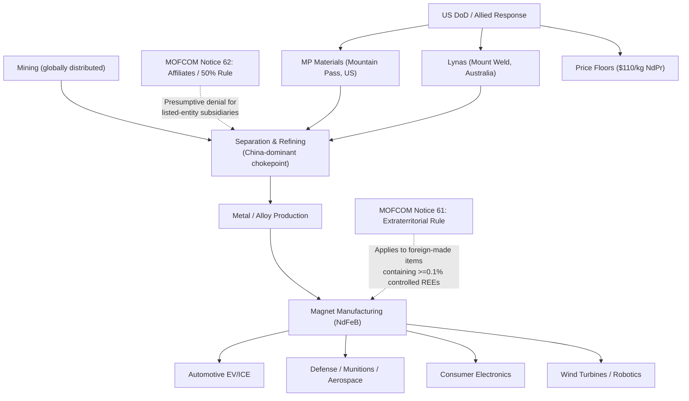

## The 2025 Rare Earth Export Controls and Their Global Ripple Effects

### Overview

Between April and October 2025, China deployed its dominant position in rare earth element (REE) mining, refining, and magnet manufacturing as a coercive trade instrument in response to escalating US tariff actions. The episode marked the first large-scale demonstration of extraterritorial, technology-based export control jurisdiction applied to critical minerals, and it accelerated — though did not resolve — a multi-year Western effort to build parallel supply chains outside Chinese control.

### Structural Basis of Chinese Leverage

**Key Points**

- China accounts for the substantial majority of global rare earth mining output and an even larger share of separation/refining capacity and permanent magnet manufacturing — the mining stage is geographically distributed, but midstream separation is the true chokepoint
- Rare earth elements are not truly "rare" geologically; the bottleneck is the capital- and environmentally-intensive separation/refining process, where China built decades of accumulated process expertise and cost advantage
- China's dominant position in rare earth supply chains has been described as quasi-monopolistic by European Parliament members [Epthinktank](https://epthinktank.eu/2025/11/24/chinas-rare-earth-export-restrictions/)
- Seventeen elements comprise the REE group; heavy rare earths (dysprosium, terbium) are the most supply-constrained, since as of late 2025 Lynas was the only producer of separated heavy rare earths outside China [Jubak Picks](https://www.jubakpicks.com/the-road-to-rare-earth-independence-runs-through-lynas-and-mp-materials/)

### Timeline of the 2025 Escalation

#### Round One: April 2025

- China announced its first round of export restrictions on heavy rare earth elements and permanent magnets on April 4, 2025, triggered by new US tariffs, sending global supply chains into disarray [Center for Strategic and International Studies](https://www.csis.org/analysis/rare-earth-export-restrictions-one-year-later)
- China introduced export controls on seven heavy rare earth elements with licensing requirements, covering related compounds, metals, and magnets [Epthinktank](https://epthinktank.eu/2025/11/24/chinas-rare-earth-export-restrictions/)
- Within weeks, automakers in the US, Europe, and Japan reported disruptions severe enough to threaten halting domestic production [Center for Strategic and International Studies](https://www.csis.org/analysis/rare-earth-export-restrictions-one-year-later)
- The Trump administration negotiated a 90-day truce to restore export flows [Center for Strategic and International Studies](https://www.csis.org/analysis/rare-earth-export-restrictions-one-year-later)

#### Round Two: October 2025 — Escalation to Extraterritorial Jurisdiction

- On October 9, 2025, China's Ministry of Commerce (MOFCOM) announced a new round of controls targeting rare earth, battery, and superhard materials via six notices (Nos. 55–58, 61–62) [CMS](https://cms.law/en/chn/legal-updates/china-tightens-export-controls-on-rare-earths-takeaways-for-global-businesses)
- Notice No. 61 marked a landmark shift by asserting extraterritorial jurisdiction, harmonizing with principles used by other major jurisdictions (echoing the US Foreign Direct Product Rule model) [CMS](https://cms.law/en/chn/legal-updates/china-tightens-export-controls-on-rare-earths-takeaways-for-global-businesses)
- The rule applied to foreign-produced rare earth permanent magnets containing as little as 0.1% by value of 13 specified Chinese-controlled rare earth elements, regardless of where the item was manufactured [White & Case LLP](https://www.whitecase.com/insight-alert/china-imposes-extraterritorial-jurisdiction-and-50-rule-export-controls-rare-earth)
- A companion "Affiliates Rule" (50% Rule) imposed presumptive denial of export license applications for entities on China's control/watch lists and any subsidiary in which such an entity held 50% or greater ownership [White & Case LLP](https://www.whitecase.com/insight-alert/china-imposes-extraterritorial-jurisdiction-and-50-rule-export-controls-rare-earth)
- Export applications for foreign military end users, and for importers/users on control or concern lists, were in principle denied outright [CSET](https://cset.georgetown.edu/publication/mofcom-notice-2025-61/)
- The reimposition came days before the scheduled Trump-Xi summit in South Korea, functioning as explicit pre-negotiation leverage [Center for Strategic and International Studies](https://www.csis.org/analysis/rare-earth-export-restrictions-one-year-later)

#### De-escalation: November 2025

- China officially suspended the October 9 controls on November 7, 2025, for one year, through November 10, 2026 [China Briefing](https://www.china-briefing.com/news/chinas-rare-earth-export-controls-impacts-on-businesses/)
- The suspension covered Announcements Nos. 55, 56, 57, 58, 61, and 62, per MOFCOM's statement [globalsecurity](https://www.globalsecurity.org/wmd/library/news/china/2025/11/china-251107-globaltimes04.htm)
- The suspension was reached as part of a broader US-China agreement following the Xi-Trump meeting, rolling back various tariffs, in exchange for a one-year suspension of the US 50 percent ownership rule [China Briefing](https://www.china-briefing.com/news/chinas-rare-earth-export-controls-impacts-on-businesses/)
- The White House stated China had also agreed to issue general-purpose licenses for items on the original April 2025 control list, though China had not confirmed this and those controls remained in place at the time of reporting [China Briefing](https://www.china-briefing.com/news/chinas-rare-earth-export-controls-impacts-on-businesses/)

### Paradox: Export Volumes Rose Despite Restrictions

**Key Points**

- China's 2025 rare earth exports reached their highest level since at least 2014, totaling 62,585 metric tons across the 17-element group — a 12.9% annual increase [Yahoo Finance](https://finance.yahoo.com/news/chinas-2025-rare-earth-exports-042255750.html)
- Magnet shipments fell sharply in April and May following the initial control announcement, but recovered from June onward as agreements were reached between China, the US, and Europe [Yahoo Finance](https://finance.yahoo.com/news/chinas-2025-rare-earth-exports-042255750.html)
- This illustrates a key mechanism distinction: export controls function primarily as a *licensing chokepoint and political signaling tool*, not a blanket embargo — the controls create friction, delay, and selective denial rather than a hard volume ceiling, which explains why aggregate export statistics can rise even as individual downstream sectors (automotive, defense) experience acute shortages

$$\text{Effective Supply Disruption} \neq \text{Aggregate Export Volume Change}$$

The disruption is concentrated at the *license-approval bottleneck and end-user category level* (military, defense-adjacent, sanctioned-entity-affiliated buyers), not evenly distributed across all commercial buyers.

### Sectoral Ripple Effects

- **Automotive**: NdFeB (neodymium-iron-boron) permanent magnets are essential for EV traction motors and internal combustion power steering/sensor systems; the April 2025 restrictions caused supply disruptions across US, European, and Japanese auto manufacturing within weeks, with reported production-halt risk at several major OEMs [Inference — specific plant-level halts vary by source and were partially mitigated by inventory buffers] [Center for Strategic and International Studies](https://www.csis.org/analysis/rare-earth-export-restrictions-one-year-later)
- **Defense**: Rare earth magnets are embedded in guided munitions, radar systems, and fighter jet components; rare earths are used in essentially all precision military hardware, making the Pentagon a direct strategic actor in supply chain reconstruction rather than a passive observer [Tectonic Defense](https://www.tectonicdefense.com/australian-rare-earths-miner-lynas-inks-96m-pentagon-deal/)
- **Semiconductors and electronics**: Superhard materials and battery-material controls issued alongside the rare earth notices extended restrictions from finished products to underlying technologies, creating substantial compliance burdens for manufacturers with any Chinese-technology exposure in their supply chain [CMS](https://cms.law/en/chn/legal-updates/china-tightens-export-controls-on-rare-earths-takeaways-for-global-businesses)
- **EU industrial base**: The European Parliament noted REEs are indispensable to the EU's digital, green, and defense industries, and that REEs are difficult or often impossible to substitute given their unique magnetic and electrochemical properties; Parliament adopted a resolution in July 2025 urging accelerated implementation of the EU Critical Raw Materials Act, characterizing China's action as coercive given its quasi-monopolistic position [Epthinktank](https://epthinktank.eu/2025/11/24/chinas-rare-earth-export-restrictions/)[Epthinktank](https://epthinktank.eu/2025/11/24/chinas-rare-earth-export-restrictions/)

### Western Diversification Response

#### Government-Backed Reshoring (United States)

- The US Department of Defense has invested several hundred million dollars in MP Materials: a $35 million IBAS contract in 2022 for a heavy rare earth separation facility at Mountain Pass, California, a $150 million direct loan in 2025 via the Office of Strategic Capital, and approximately $400 million to acquire an equity stake as part of a wider public-private partnership [Jubak Picks](https://www.jubakpicks.com/the-road-to-rare-earth-independence-runs-through-lynas-and-mp-materials/)
- MP Materials operates the world's second-largest rare earth mine at Mountain Pass and is commissioning "Independence," a downstream magnetics facility in Texas [sec](https://www.sec.gov/Archives/edgar/data/1801368/000119312525157310/d43796dex991.htm)
- A $550 million DoD partnership aims to build refining capacity outside China for materials such as terbium and dysprosium, complemented by the US-Japan Framework for Securing the Supply of Critical Minerals signed in October 2025 [EnkiAI](https://enkiai.com/critical-minerals/mp-materials-rare-earth-processing/)
- MP Materials achieved a validation milestone in Q1 2026, producing 917 metric tons of separated neodymium-praseodymium (NdPr) — demonstrating the difficult concentrate-to-metal separation step at growing scale [EnkiAI](https://enkiai.com/critical-minerals/mp-materials-rare-earth-processing/)
- Pentagon-backed deals extended beyond MP Materials to a $1.4 billion agreement with magnet-maker Vulcan Elements and Korea Zinc's $7.4 billion refinery investment in Tennessee [Tectonic Defense](https://www.tectonicdefense.com/australian-rare-earths-miner-lynas-inks-96m-pentagon-deal/)

#### Allied Diversification (Australia and Beyond)

- Lynas Rare Earths owns the high-grade Mount Weld deposit in Western Australia plus processing facilities in Kalgoorlie and Malaysia, with an estimated mine life exceeding 20 years and status as the world's lowest-cost separated NdPr producer [Jubak Picks](https://www.jubakpicks.com/the-road-to-rare-earth-independence-runs-through-lynas-and-mp-materials/)
- In early 2026, Lynas signed a $96 million, four-year deal with the Pentagon to supply light and heavy rare earth oxides, establishing a $110/kg floor price for NdPr — mirroring the floor price structure set in the MP Materials deal [Tectonic Defense](https://www.tectonicdefense.com/australian-rare-earths-miner-lynas-inks-96m-pentagon-deal/)
- The Trump administration pursued rare earth cooperation discussions across Australia, Brazil, Greenland, Japan, Kazakhstan, Malaysia, Saudi Arabia, Thailand, Ukraine, and Pakistan, though not all of these are near-term viable suppliers — Greenland faces ice-cover and infrastructure constraints, while Ukraine's deposits sit within the active conflict zone [Center for Strategic and International Studies](https://www.csis.org/analysis/rare-earth-export-restrictions-one-year-later)[Center for Strategic and International Studies](https://www.csis.org/analysis/rare-earth-export-restrictions-one-year-later)

#### Structural Assessment of Diversification Progress

- Lynas and MP Materials together anchor roughly 25–33% of non-Chinese rare earth supply as of 2026, but a 10,000-tonne NdPr deficit leaves the broader system structurally brittle [Materials Dispatch](https://www.materialsdispatch.com/en/blog/review-lynas-mp-materials-and-other-key-rare)
- Non-Chinese supply through 2026–2030 is better characterized as a concentrated set of critical nodes rather than a broad, redundant network, with each node carrying its own operational, regulatory, and geopolitical risk exposure [Materials Dispatch](https://www.materialsdispatch.com/en/blog/review-lynas-mp-materials-and-other-key-rare)
- Emerging diversification projects (Arafura Nolans, the Ma'aden-MP joint venture, Browns Range, Eneabba, and others) remain exposed to schedule slippage, permitting friction, and infrastructure bottlenecks — with shipping routes, water availability, and radioactive waste-handling rules functioning as central rather than peripheral constraints on uptime [Materials Dispatch](https://www.materialsdispatch.com/en/blog/review-lynas-mp-materials-and-other-key-rare)

### Mechanism Diagram: Chinese Export Control Chokepoint Structure

### Policy and Contractual Innovations Emerging from the Crisis

- **Price floor mechanisms**: the Pentagon established a $110/kg NdPr floor price in its agreements with both MP Materials and Lynas, an unusual government intervention designed to guarantee producer economics against Chinese price undercutting — a classic predatory-pricing counter-strategy in critical minerals markets [Tectonic Defense](https://www.tectonicdefense.com/australian-rare-earths-miner-lynas-inks-96m-pentagon-deal/)
- **Reciprocal leverage trading**: the November 2025 truce exchanged a Chinese one-year suspension of rare earth extraterritorial rules for a US one-year suspension of its own 50% ownership rule — illustrating export controls increasingly functioning as *paired bargaining chips* in a broader technology-and-trade negotiation rather than standalone national security measures [Inference — the durability of this reciprocal linkage beyond November 2026 is not yet established]
- **Recycling and closed-loop sourcing**: MP Materials has incorporated magnet scrap recycling capability to process feedstock from post-industrial and end-of-life magnets, reducing dependency on newly mined material [sec](https://www.sec.gov/Archives/edgar/data/0001801368/000180136826000022/annualreporttoshareholders.pdf)

### Behavioral and Forecasting Caveats

The suspension through November 10, 2026 is a negotiated pause, not a structural resolution — the underlying Chinese midstream refining dominance remains intact, and the legal architecture (extraterritorial jurisdiction, the 0.1% de minimis threshold, the Affiliates Rule) remains codified and available for reactivation. Claims about the pace of Western refining capacity reaching parity with Chinese output, the durability of the price-floor mechanism under market stress, and the long-term reliability of newer allied sourcing (Ukraine, Greenland, Kazakhstan) are [Inference], contingent on capital deployment speed, permitting outcomes, and the broader US-China trade relationship trajectory.

### Related Topics

- EU Critical Raw Materials Act implementation and stockpiling targets
- Extraterritorial export control doctrine: comparing China's Notice 61/62 to the US Foreign Direct Product Rule
- Heavy vs. light rare earth element supply asymmetry (dysprosium/terbium bottlenecks)
- Magnet recycling and urban mining as a structural hedge against upstream chokepoints
- Price-floor and offtake-agreement mechanisms as critical minerals policy tools
- Ukraine's rare earth deposits and the minerals dimension of postwar reconstruction agreements