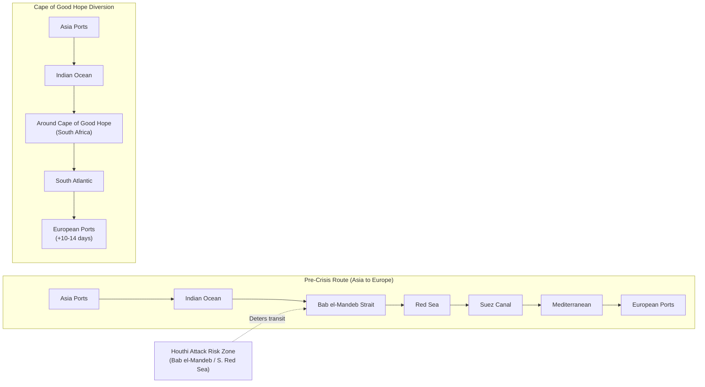

## The Red Sea Shipping Crisis and Its Impact on Global Trade Routes

### Overview

The Red Sea crisis began on 19 November 2023 when Houthi forces in Yemen started attacking commercial vessels transiting the Bab el-Mandeb strait, initially framed as retaliation tied to the Gaza war. It evolved through 2024–2026 into a semi-permanent restructuring of Asia-Europe and Asia-US East Coast trade routes, with attacks pausing and resuming multiple times in step with the broader Gaza and Iran-Israel conflict cycles. As of mid-2026 the corridor remains in a state of conditional deterrence rather than resolved security.

### Geographic and Structural Chokepoint

**Key Points**

- The Red Sea connects the Mediterranean to the Indian Ocean via the Suez Canal (north) and the Bab el-Mandeb strait (south) — the strait, bordered by Yemen, is the chokepoint the Houthis have targeted
- Approximately 12–15% of world trade transits this corridor, including roughly 30% of Asia-Europe container traffic
- It is the shortest route from Asia to Europe and to the US East Coast (via Suez and the Atlantic); Asia-to-US West Coast (transpacific) routing is structurally unaffected

### Timeline of Escalation and De-escalation

#### Phase 1: Onset and Peak Disruption (Nov 2023–2024)

- Houthi forces began attacking Israel-affiliated shipping on 19 November 2023; by February 2024, 40 vessels had been attacked
- Global carriers shifted en masse to Cape of Good Hope routing around Southern Africa
- The US led Operation Prosperity Guardian (December 2023–May 2025), a multinational naval coalition (US, UK, Australia, Bahrain, Canada, Denmark, Finland, Greece, Netherlands, New Zealand, Norway, Singapore, Sri Lanka, with Seychelles support) conducting escort and interdiction operations, alongside US-led Operation Poseidon Archer and Operation Rough Rider strike campaigns against Houthi-controlled territory

#### Phase 2: UN Response

- UN Security Council Resolution 2722 (co-authored by Japan and the US) demanded an immediate end to Houthi attacks on merchant and commercial vessels and affirmed states' right to defend their vessels under international law; adopted 11-0 with four abstentions (Algeria, China, Mozambique, Russia)
- The resolution mandated monthly Secretary-General reports on further attacks and has been renewed four times at six-month intervals, with the most recent renewals (2025–2026) co-authored by Greece and the US
- Secretary-General António Guterres condemned the resumption of attacks in July 2025, citing violations of freedom of navigation and serious environmental, economic, and humanitarian risk, and stressed compliance obligations under Resolution 2768

#### Phase 3: 2025 Continued Violence and Ceasefire Pause

- On July 6–8, 2025, Houthis attacked and sank two commercial vessels in the southern Red Sea, killing four seafarers
- On August 31, 2025, Houthis struck an Israeli-associated vessel off Yanbu, Saudi Arabia — the furthest north an attack had occurred since the crisis began
- On September 29, 2025, a Dutch-flagged cargo ship was struck by missile in the Gulf of Aden, killing one mariner
- From November 2023 to October 2025, more than 100 separate Houthi attacks on commercial vessels affected more than 60 nations
- Following the October 2025 Gaza ceasefire, Houthi attacks on commercial shipping paused

#### Phase 4: 2026 Renewed Conflict Linkage

- On 28 March 2026, the Houthis resumed attacks against Israel directly (ballistic missiles), joining the broader 2026 Iran war, coordinating with Iran and Hezbollah
- In June 2026, as Israel-Iran fighting reignited, the Houthis declared a renewed ban on Israeli-linked shipping
- Maritime traffic began partially resuming in early 2026 even as threats persisted — analysts characterize the absence of active strikes as **conditional deterrence** rather than degraded Houthi capability, given continued trench-network and coastal missile positioning reports around Hodeidah
- As of July 2026, no new attacks had been reported for several months, but daily Bab el-Mandeb traffic remained far below pre-crisis levels as many shippers continued avoiding the route
- The US Maritime Administration's active advisory (superseding the 2025-012 advisory) still designates Israeli-, US-, or UK-associated vessels, and any vessel in a fleet with Israel port-call history, as high-risk for UAV, USV, UUV, missile, small-arms, and boarding/seizure threats

### Rerouting Mechanics and Cost Structure

$$T_{\text{Cape}} = T_{\text{Suez}} + \Delta t_{\text{diversion}}, \quad \Delta t_{\text{diversion}} \approx 10\text{–}14 \text{ days}$$

**Key Points**

- Cape of Good Hope diversions add approximately 10–14 days of transit time versus the Suez routing
- Asia-Europe freight rates have run 25–40% above pre-crisis baseline levels; Asia-to-US East Coast runs 15–25% higher with 8–12 additional transit days
- Asia-to-US West Coast (transpacific) routing sees little to no change, since it never used the Suez corridor
- An estimated 5–7% of global container shipping capacity is absorbed by the longer Cape routing — roughly 1.3–1.8 million TEU removed from effective market availability, which tightens freight capacity even on lanes with no direct Red Sea exposure
- Reported per-container cost premiums run $800–$1,500 for a 40ft container on China-to-US East Coast lanes, plus an additional $300–$500 in war-risk insurance and security surcharges

**Example**

A representative capacity-tightening mechanism:

1. Carrier reroutes an Asia-Europe vessel via the Cape of Good Hope, adding ~12 days round-trip
2. The same vessel, tied up longer per voyage, completes fewer annual round trips, reducing effective fleet throughput
3. Reduced throughput on the Asia-Europe trade absorbs idle capacity that would otherwise be redeployed to other lanes (e.g., transpacific), tightening rates globally even where no vessel touches the Red Sea
4. Shippers respond with earlier booking, safety-stock increases, and diversified sourcing to buffer against unpredictable transit windows

### Route Diagram: Pre-Crisis vs. Diversion Routing

### Humanitarian and Regional Spillover

- The crisis is layered on top of Yemen's own civil war and humanitarian emergency, with millions of Yemenis dependent on aid amid recurring cholera and acute malnutrition outbreaks
- Naval buildup and blockade dynamics add further strain on Yemeni ports such as Hodeidah, a critical entry point for food and medical aid, slowing deliveries and raising import costs for an already displaced and shortage-affected population

### Behavioral and Forecasting Caveats

Whether the current lull (as of mid-2026) represents durable de-escalation or a conditional pause tied to the broader Iran-Israel conflict trajectory is [Inference] — regional analysts explicitly characterize it as "institutionalized readiness" rather than resolved conflict, and note the Houthis retain both the stated intent and reported infrastructure to resume attacks on short notice. Freight rate and transit-time figures cited above reflect reporting through mid-2026 and are [Unverified] as precise real-time figures, since they fluctuate with attack frequency, insurance market repricing, and seasonal shipping demand. Behavior of carrier routing decisions may vary by alliance, flag state, and individual vessel ownership structure.

### Related Topics

- UN Security Council Resolution 2722/2768 enforcement mechanisms and renewal politics
- War-risk marine insurance pricing models and the London market's role in chokepoint crises
- Suez Canal Authority revenue impact and Egypt's fiscal exposure
- Comparative chokepoint analysis: Bab el-Mandeb vs. Strait of Hormuz vs. Strait of Malacca
- Just-in-time inventory strategy erosion and the shift toward safety-stock buffering post-2024
- Naval coalition operations (Prosperity Guardian, Poseidon Archer) as supply chain security infrastructure