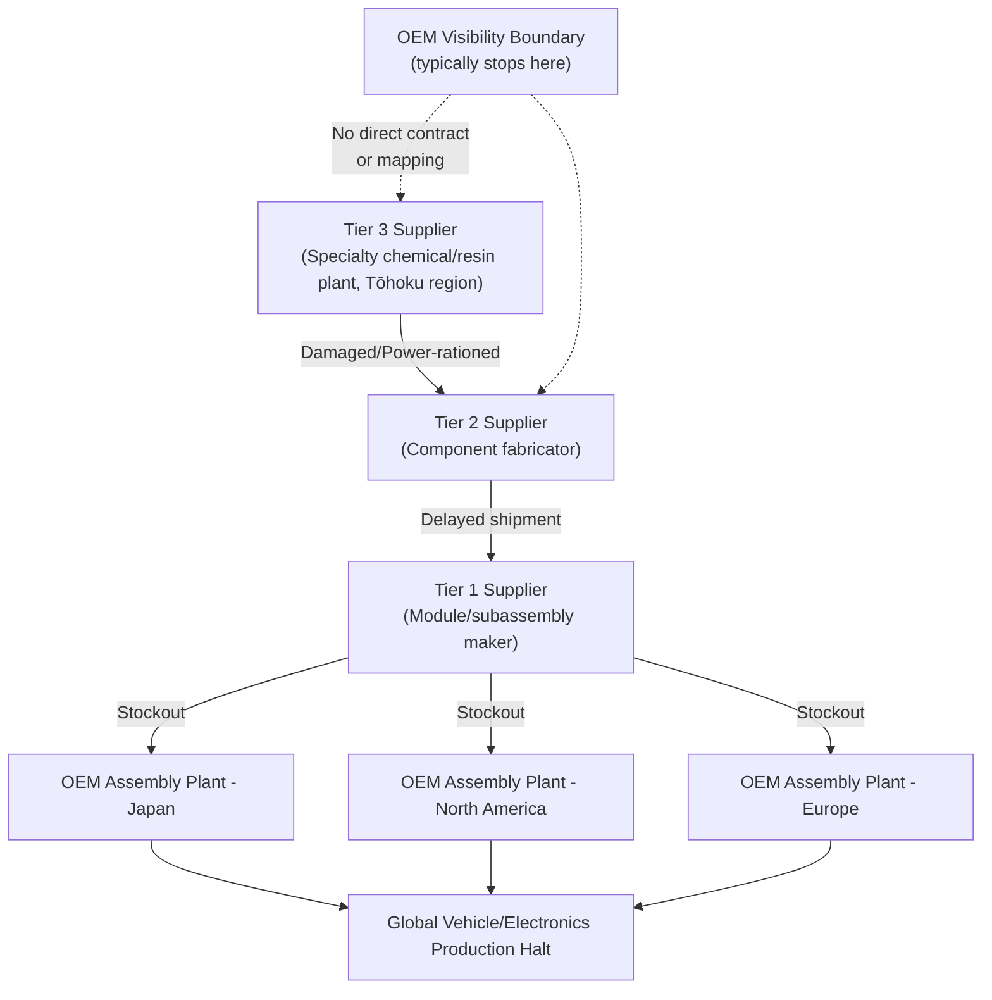

## Japan's 2011 Earthquake and the Fragility of Just-in-Time Manufacturing

### Overview

The Tōhoku earthquake and tsunami of March 11, 2011, followed by the Fukushima Daiichi nuclear crisis, exposed a structural vulnerability in the global manufacturing paradigm that had dominated industrial strategy since the 1980s: just-in-time (JIT) production, optimized for cost and inventory efficiency, carried almost no buffer against a correlated, large-scale supply shock. The event became the canonical case study for supply chain risk management curricula worldwide and catalyzed a multi-decade shift toward resilience-oriented sourcing strategy.

### The Just-in-Time Paradigm: Design Logic

**Key Points**

- JIT (originating from the Toyota Production System) minimizes inventory carrying costs by synchronizing component delivery precisely with production need, ideally reducing buffer stock to near zero
- The model assumes high supplier reliability, redundant logistics pathways, and — critically — that disruption risk across geographically distributed suppliers is largely uncorrelated
- Cost efficiency under JIT is a direct function of inventory turnover; the model's efficiency gains come precisely from eliminating the buffers that provide shock absorption

$$\text{Inventory Turnover} = \frac{\text{Cost of Goods Sold}}{\text{Average Inventory}}$$

Higher turnover indicates leaner inventory — the metric JIT explicitly optimizes — which is structurally in tension with resilience to correlated shocks.

### The Disruption Event

#### Physical and Infrastructure Impact

- The magnitude 9.0–9.1 earthquake and subsequent tsunami struck Japan's northeastern Tōhoku region on March 11, 2011
- Direct destruction of manufacturing facilities, ports, and transportation infrastructure across a wide industrial belt
- The Fukushima Daiichi nuclear disaster triggered rolling blackouts and power rationing across a broader swath of Japan's industrial base than the tsunami zone alone, extending disruption well beyond the directly damaged region
- Compounding effects: damaged rail and road networks disrupted logistics even for facilities that survived structurally intact

#### Sectoral Transmission: Semiconductors and Automotive

- Japan held (and continues to hold) concentrated global market share in specific upstream materials — notably certain specialty semiconductor-grade chemicals and automotive-grade microcontrollers — meaning even facilities representing a small fraction of global production value could create disproportionate downstream bottlenecks
- Automotive supply chains were especially exposed: modern vehicles integrate thousands of discrete components sourced through multi-tier supplier networks, and JIT meant OEMs held only days of buffer stock for many parts
- Single-source or near-single-source components (specialty resins, microcontroller units, certain sensors) created acute chokepoints — a facility producing a small-value, seemingly replaceable part halted assembly lines globally because no qualified alternate supplier existed at scale

### Propagation Mechanism: Why a Local Shock Went Global

**Key Points**

- The disruption did not stay contained to Japan-based final assembly; it propagated through multi-tier supplier networks to automotive and electronics plants in North America, Europe, and elsewhere in Asia within weeks
- This illustrates a core supply chain risk principle: **visibility typically extends only to Tier 1 suppliers**, while critical chokepoints frequently sit at Tier 2, Tier 3, or deeper — tiers most manufacturers had never mapped
- Many OEMs discovered during the crisis that they did not know which of their components ultimately depended on a specific Japanese sub-supplier, because that dependency was several tiers removed from direct contractual visibility

### Duration and Recovery Pattern

- Automotive production disruptions extended for months following the March 2011 event, with staggered recovery as different tiers of the supply chain came back online at different rates
- Recovery was non-linear: facilities with structural damage required rebuilding on a timeline measured in months, while power-rationing effects eased as the electrical grid stabilized, and logistics normalized faster than the most severely damaged production nodes
- The semiconductor and specialty-chemical bottlenecks, concentrated in fewer, harder-to-replace facilities, tended to resolve more slowly than more geographically distributable component production [Inference — recovery timelines varied substantially by specific facility and product category, and precise comparative duration figures are not standardized across sources]

### Strategic and Policy Responses

#### Corporate-Level Adaptations

- **Supply chain mapping**: Manufacturers invested heavily in extending visibility beyond Tier 1 to identify concentrated dependencies at deeper tiers
- **Dual/multi-sourcing**: Shift away from single-source strategic components toward qualifying at least one geographically distinct alternate supplier for critical parts
- **Strategic buffer inventory**: Reintroduction of targeted safety stock for components identified as high-risk single points of failure, a partial retreat from pure JIT for specifically flagged critical items — while retaining JIT efficiency for lower-risk components
- **Geographic diversification**: Encouraging or requiring key suppliers to establish redundant production sites outside the original single-region footprint

#### The Efficiency-Resilience Trade-off

This event crystallized what is now a standard supply chain risk management framework:

$$\text{Total Supply Chain Cost} = \text{Steady-State Operating Cost} + \text{Expected Disruption Cost}$$

Pure JIT minimizes the first term while implicitly treating the second term as negligible. The 2011 event demonstrated that for components with concentrated, correlated geographic risk, the expected disruption cost term can be large enough that a small increase in steady-state cost (via buffer stock or multi-sourcing) produces a lower total expected cost — the foundational logic behind subsequent "just-in-case" hybrid strategies.

### Comparative Legacy: Influence on Later Crises

- The 2011 case became the reference framework analysts applied to subsequent disruptions (the 2020–2022 COVID-19 semiconductor shortage, the 2021 Renesas Naka fire, and later geopolitically-driven disruptions), each re-testing whether the post-2011 resilience reforms had actually taken hold across industries
- A recurring finding in subsequent crises was that resilience investments were often partial and sector-specific — automotive and electronics OEMs that had directly experienced 2011 losses tended to have deeper mapping and buffer strategies than sectors that had not been directly exposed [Inference — the degree of genuine behavioral change versus temporary post-crisis adjustment that later reverted is debated in the supply chain risk literature]

### Behavioral and Forecasting Caveats

Precise quantitative figures for total global production losses, exact recovery timelines by sector, and the durability of post-2011 resilience reforms vary across sources and are not fully standardized; treat specific numeric loss estimates as [Unverified] unless drawn from a specific cited source. The extent to which "just-in-case" reforms persisted into the 2020s versus eroded under renewed cost pressure remains an active area of supply chain management debate.

### Related Topics

- Toyota Production System origins and the historical logic of JIT/Kanban
- The 2021 Renesas Naka semiconductor fire and automotive chip shortage
- COVID-19 semiconductor shortage (2020–2022) as a comparative case study
- Multi-tier supply chain mapping methodologies and software tooling
- Business continuity planning (BCP) frameworks adopted by Japanese manufacturers post-2011
- Bullwhip effect dynamics in multi-tier supplier disruption propagation