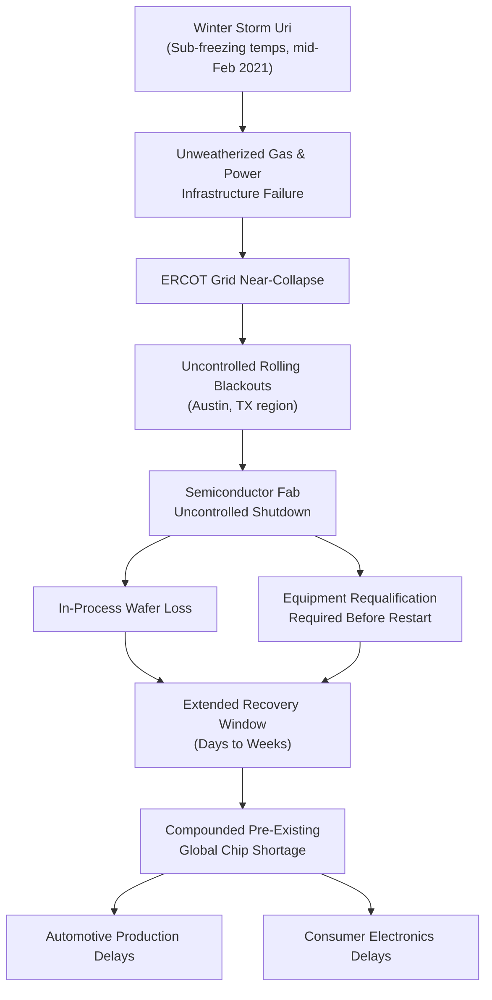

## The 2021 Texas Winter Storm and Semiconductor Production Disruption

### Overview

Winter Storm Uri struck Texas in mid-February 2021, triggering a catastrophic failure of the Texas electrical grid (ERCOT) that forced an unplanned, uncontrolled shutdown of a significant cluster of semiconductor fabrication facilities concentrated around Austin. The event compounded an already-tightening global chip shortage driven by COVID-19 demand shifts, illustrating how single-region infrastructure fragility can amplify a pre-existing supply crisis rather than operate as an isolated shock.

### Precondition: The Pre-Existing 2020–2021 Chip Shortage

**Key Points**

- Global semiconductor demand had already shifted sharply in 2020 as pandemic-driven remote work, home electronics purchases, and later automotive demand recovery outpaced fab capacity planning cycles
- Automotive OEMs, which had cut chip orders early in the pandemic anticipating demand collapse, found themselves at the back of the reorder queue when demand rebounded faster than semiconductor lead times could accommodate
- Fab capacity additions operate on multi-year planning horizons, meaning the industry entered 2021 already supply-constrained before the Texas event occurred

### The Storm and Grid Failure Mechanism

- Winter Storm Uri brought sustained sub-freezing temperatures to Texas beginning February 13–14, 2021, a climate regime the state's energy infrastructure was not weatherized for
- ERCOT (the Electric Reliability Council of Texas), operating as an largely isolated grid with limited interconnection to neighboring US grid regions, could not import sufficient emergency power from outside the state
- Natural gas production, processing, and power generation infrastructure — much of it unweatherized — failed simultaneously as demand for heating spiked, creating a supply-demand collision within the grid itself
- ERCOT was forced into rolling/uncontrolled blackouts across the state to prevent total grid collapse, affecting millions of customers including industrial users

### Semiconductor Facility Impact

**Key Points**

- Austin, Texas hosts a significant concentration of semiconductor fabrication capacity, including major fabs operated by companies such as Samsung, NXP Semiconductors, and Infineon
- Fabs require continuous, tightly controlled power, temperature, and cleanroom conditions; an uncontrolled power loss is far more damaging than a planned shutdown, since wafers in process are ruined and equipment can be damaged by improper shutdown sequences
- Multiple major Austin-area fabs were forced into unplanned shutdowns lasting from days to weeks depending on facility-specific damage and restart complexity
- Restart of a semiconductor fab following an uncontrolled shutdown is a multi-stage process — verifying tool integrity, requalifying process chambers, discarding in-process wafer lots — meaning even a short power outage translates into a disproportionately long production recovery window

$$T_{\text{recovery}} \gg T_{\text{outage}}$$

This asymmetry — recovery time far exceeding outage duration — is a defining characteristic of semiconductor fab disruptions and distinguishes them from less process-sensitive manufacturing.

### Propagation Diagram

### Compounding Effect on the Global Chip Shortage

- The Texas disruption did not create the chip shortage but sharply intensified it at a moment when spare capacity across the industry was already minimal, illustrating how regional infrastructure risk interacts multiplicatively with pre-existing tight-market conditions rather than simply adding a separate, independent delay
- Automotive semiconductor categories were particularly exposed, given multi-tier dependency chains for microcontrollers and power-management chips already discussed in the JIT fragility literature (see Japan 2011 case study for the analogous single-region concentration risk pattern)
- The event reinforced a strategic conclusion already emerging from the 2011 Japan earthquake case: geographic concentration of critical fabrication capacity — whether driven by tsunami risk in Tōhoku or grid fragility in Texas — represents a systemic, recurring category of supply chain risk rather than a one-off anomaly

### Structural Root Cause: Grid Isolation and Deregulation Design

**Key Points**

- ERCOT's limited interconnection with the Eastern and Western US grid interconnections — a design choice historically tied to avoiding federal interstate-commerce regulatory jurisdiction — meant Texas could not draw emergency power from neighboring states at the scale needed
- Absence of mandatory weatherization requirements for power generation and gas infrastructure prior to the storm meant cold-weather failure modes were not systematically hedged against, despite prior, smaller-scale cold-weather grid stress events having occurred in Texas history [Inference — the specific degree to which prior events should have prompted preventive investment is a matter of regulatory and engineering debate covered extensively in post-event assessments]
- This represents an infrastructure-policy-driven supply chain risk distinct from the natural-disaster-driven risk in the Japan 2011 case — the failure mode originated in regulatory and market design choices rather than solely from an unpreventable natural hazard

### Industry and Policy Response

- Semiconductor manufacturers with Austin exposure reassessed regional concentration risk in subsequent capacity expansion planning, a factor cited alongside other considerations (subsidies, talent availability, geopolitical diversification) in later fab siting decisions across multiple US states and internationally
- The event contributed to broader US policy momentum toward domestic semiconductor manufacturing incentives and supply chain resilience legislation in the years following, alongside the concurrent COVID-driven shortage as a combined catalyst [Inference — attributing specific legislative outcomes primarily to the Texas storm versus the broader chip shortage context requires care, as the two drivers are difficult to fully separate]
- ERCOT and Texas state regulators implemented some weatherization mandates for power generation following the event, aimed at reducing recurrence risk for future cold-weather events

### Behavioral and Forecasting Caveats

Precise figures for total wafer/output loss, exact fab-by-fab outage duration, and quantified dollar impact attributable specifically to the Texas event (as separated from the broader concurrent chip shortage) vary across industry sources and are not fully standardized; treat specific numeric estimates as [Unverified] unless drawn from a named source. The durability and completeness of post-storm weatherization reforms, and their sufficiency against future extreme cold events, remains a subject of ongoing engineering and regulatory assessment.

### Related Topics

- ERCOT grid architecture and interstate interconnection policy
- Semiconductor fab restart procedures and process requalification standards
- The 2020–2023 global chip shortage as a multi-causal case study
- US CHIPS Act and domestic fab-siting incentive structures
- Climate risk as an emerging category in supply chain risk frameworks
- Comparative single-region concentration risk: Japan 2011 vs. Texas 2021