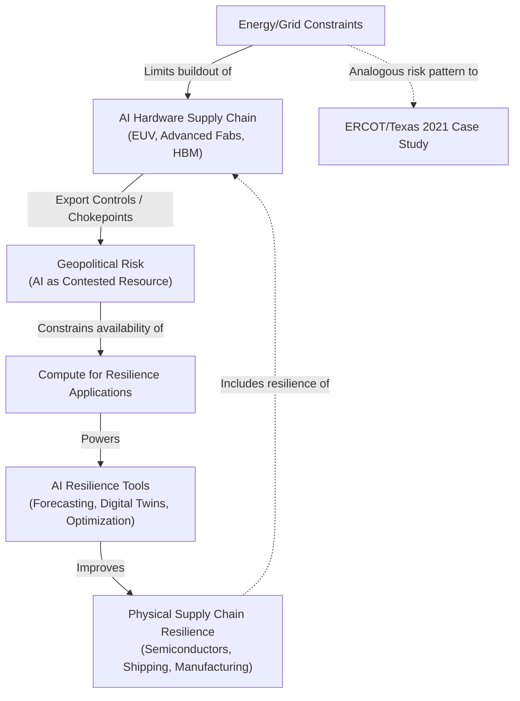

## Artificial Intelligence as Both a Supply Chain Risk and a Resilience Tool

### Overview

Artificial intelligence occupies a dual and structurally linked role in contemporary supply chain geopolitics: it is simultaneously a strategic resource whose own supply chain (advanced semiconductors, specialized talent, energy-intensive compute) has become a primary object of geopolitical contest, and a set of tools increasingly applied to forecast, detect, and mitigate disruption across unrelated physical supply chains. These two roles interact — the compute and hardware required to run resilience-oriented AI systems are themselves subject to the same chokepoint dynamics the AI is meant to help manage.

### AI as a Supply Chain Risk: The Compute Stack as Strategic Asset

#### Structural Chokepoints in the AI Hardware Supply Chain

- Advanced AI accelerator production depends on a narrow set of chokepoints: extreme ultraviolet (EUV) lithography equipment (effectively a single-supplier market), leading-edge foundry capacity (concentrated in a small number of fabs), and high-bandwidth memory production
- This concentration mirrors, and in some respects intensifies, the fab-concentration risk patterns documented in prior case studies (Japan 2011, Texas 2021) — but with the added dimension that AI chips are now explicitly targeted by export control regimes rather than merely exposed to natural or infrastructure risk
- US export controls on advanced semiconductor manufacturing equipment and AI chips to China, and China's rare earth and critical mineral leverage in response (see the 2025 rare earth export controls case study), illustrate how AI hardware has become a two-way instrument of supply chain coercion rather than a passive casualty of disruption

#### Energy and Resource Intensity as an Emerging Constraint

- Large-scale AI training and inference workloads impose substantial electricity demand, increasingly treated by grid operators and policymakers as a distinct category of industrial load requiring dedicated planning
- Data center siting decisions are increasingly influenced by power availability and grid stability considerations, echoing the ERCOT-related vulnerabilities discussed in the Texas 2021 case study, though at the scale of a new class of industrial consumer rather than an existing fab cluster
- Water consumption for cooling, land availability, and grid interconnection queue timelines are emerging as secondary but non-trivial constraints on AI infrastructure buildout pace [Inference — the degree to which these constraints will bind versus be engineered around via efficiency gains and alternative cooling methods is actively contested]

#### Talent and Knowledge as a Supply Chain Node

- Advanced AI development depends on a concentrated pool of specialized research and engineering talent, creating a human-capital chokepoint analogous to physical infrastructure concentration
- Talent mobility restrictions, visa policy, and competitive recruitment across US, Chinese, and other national AI programs function as a supply chain lever in their own right, distinct from but interacting with hardware export controls

### AI as a Resilience Tool: Application Layer

#### Predictive Risk Detection and Early Warning

- Machine learning models trained on shipping data, weather patterns, geopolitical event feeds, and historical disruption records can flag emerging risk signals (port congestion, weather system formation, conflict escalation indicators) earlier than traditional manual monitoring
- Natural language processing applied to news, regulatory filings, and social media can surface early indicators of instability (labor disputes, regulatory shifts, security incidents) at a velocity human analyst teams cannot match at global scale
- These systems function as an extension of, rather than a replacement for, the multi-tier supply chain mapping efforts that emerged as a direct lesson from the Japan 2011 earthquake case — AI-assisted mapping can extend visibility into Tier 2/3/4 suppliers faster than manual auditing

#### Scenario Simulation and Network Optimization

- Digital twin modeling of supply chain networks allows simulation of disruption scenarios (a specific port closure, a specific supplier facility loss) to quantify expected impact and evaluate rerouting or buffer-stock strategies before a real disruption occurs
- Optimization algorithms can recommend dynamic rerouting, safety-stock allocation, and multi-sourcing configurations that balance the efficiency-resilience trade-off quantified in the JIT fragility framework (see Japan 2011 case study), doing so continuously rather than as a one-time post-crisis reassessment

$$\text{Expected Disruption Cost} = \sum_{i} P(\text{disruption}_i) \times \text{Impact}(\text{disruption}_i)$$

AI-driven scenario modeling primarily improves the estimation of $P(\text{disruption}_i)$ and $\text{Impact}(\text{disruption}_i)$ across a much larger set of simultaneously tracked risk factors than manual analysis can sustain.

#### Autonomous and Semi-Autonomous Response

- Some logistics operators deploy AI-assisted systems for dynamic freight rerouting, inventory rebalancing, and automated supplier communication triggered by detected disruption signals
- Behavior of these systems in genuinely novel disruption scenarios (as opposed to scenarios resembling historical training data) carries inherent uncertainty, since model performance depends on the relevance of historical patterns to the current shock — a structural limitation for any predictive system applied to low-frequency, high-impact "black swan" events

### Interaction Diagram: The Dual-Role Feedback Loop

### Governance and Standardization Gaps

**Key Points**

- No settled international governance framework currently exists for AI-specific supply chain risk categories (compute export controls, model weight export restrictions, talent mobility), leaving the field in a comparatively earlier and more fluid state than established trade-law frameworks governing traditional goods
- Divergent national approaches — US export control regimes, EU AI Act provisions with indirect supply chain implications, Chinese domestic substitution policy — create a fragmented compliance landscape for multinational firms operating AI-dependent resilience tools across jurisdictions
- The rare earth and critical mineral inputs required for AI hardware (certain specialty magnets, gallium, germanium) create a secondary linkage back to the mineral-based coercion dynamics documented in the 2025 rare earth export controls case study, meaning AI supply chain risk is not fully separable from broader critical minerals geopolitics

### Behavioral and Forecasting Caveats

The relative balance between AI's role as a risk amplifier versus a resilience enabler is likely to shift as hardware diversification progresses (see MP Materials, Lynas, and allied semiconductor reshoring efforts discussed in related case studies) and as governance frameworks mature; current assessments are necessarily provisional. Claims about the effectiveness of AI-driven predictive tools against genuinely unprecedented disruption types are [Speculation], since these systems have not yet been tested against a shock class fundamentally outside their training distribution at the scale of a 2011-Japan or 2020-COVID-level event. The pace and outcome of AI hardware export control evolution remains contingent on broader US-China and allied trade negotiations whose trajectory cannot be reliably forecast.

### Related Topics

- Export control architecture for advanced semiconductors and AI accelerators
- Digital twin methodology for supply chain network simulation
- Compute-as-critical-infrastructure: grid planning implications of AI data centers
- Rare earth and critical mineral inputs to AI hardware manufacturing
- Comparative AI governance frameworks: US, EU, and Chinese regulatory divergence
- Multi-tier supply chain visibility tooling and AI-assisted supplier mapping