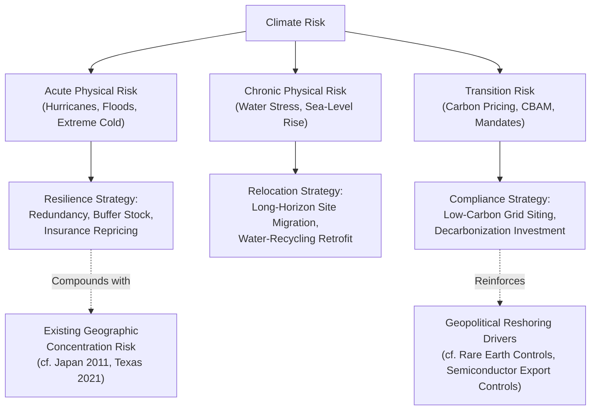

## Climate Change Adaptation and Supply Chain Relocation Pressures

### Overview

Climate change is shifting from a background environmental risk factor to a direct driver of supply chain location strategy. Rising frequency and severity of extreme weather events, chronic climate stress on specific regions, and the compliance burden of decarbonization policy are together reshaping where firms choose to site production, source raw materials, and route logistics — layering a new, partially predictable risk category on top of the geopolitical and infrastructure risks examined elsewhere in this course.

### Climate Risk Taxonomy for Supply Chains

**Key Points**

- **Acute physical risk**: discrete extreme weather events (hurricanes, floods, wildfires, extreme cold events such as the Texas 2021 case study) that cause sudden facility or infrastructure disruption
- **Chronic physical risk**: gradual, sustained shifts (sea-level rise, chronic water scarcity, rising average temperatures, shifting agricultural viability zones) that erode a location's long-term production or logistics suitability
- **Transition risk**: costs and disruptions arising from the policy and market response to climate change itself — carbon pricing, border carbon adjustments, decarbonization mandates, and stranded-asset risk for carbon-intensive facilities — rather than from physical climate effects directly

This taxonomy matters because each category demands a different mitigation strategy: acute risk is addressed through resilience and redundancy (as in the JIT fragility lessons from Japan 2011 and Texas 2021), chronic risk through long-horizon relocation or engineering adaptation, and transition risk through regulatory compliance and decarbonization investment.

### Acute Risk: Recurrence and Compounding with Existing Fragility Patterns

- Extreme weather events increasingly compound with the single-region concentration vulnerabilities already documented in this course: a semiconductor fab cluster or port complex sited in a hurricane-prone or flood-prone region carries a climate risk layer on top of its existing geographic concentration risk
- Insurance markets are beginning to reprice this compounding risk directly, with rising premiums and, in some markets, reduced insurer willingness to underwrite facilities in high-exposure zones — mirroring the war-risk insurance repricing seen in the Red Sea shipping crisis case study, but driven by climate rather than conflict exposure
- Port infrastructure is particularly exposed, since major global ports are disproportionately sited at sea level in coastal, storm-exposed locations by geographic necessity

### Chronic Risk: Long-Horizon Relocation Drivers

#### Water Stress and Manufacturing Siting

- Water-intensive manufacturing processes (semiconductor fabrication, textile dyeing, certain chemical processes) face growing exposure to regions experiencing chronic water stress, creating a slow-moving but structural pressure toward relocation or costly water-recycling retrofits
- This connects directly to the AI/data-center water consumption constraint discussed in the AI resilience case study, illustrating that water stress is an emerging cross-sectoral chokepoint rather than one confined to traditional manufacturing

#### Agricultural and Raw Material Sourcing Shifts

- Shifting precipitation patterns and temperature zones are altering viable growing regions for climate-sensitive agricultural commodities, forcing sourcing reconfiguration for food and agricultural-input supply chains over multi-decade horizons
- Raw material extraction sites (mining, forestry) face similar chronic exposure where operations depend on stable water access or are located in regions experiencing desertification or increased wildfire risk

### Transition Risk: Policy-Driven Relocation Pressure

**Key Points**

- Carbon border adjustment mechanisms (such as the EU's CBAM) impose a cost differential on imports based on embedded carbon intensity, creating a direct financial incentive to relocate carbon-intensive production either toward lower-carbon-grid regions or toward jurisdictions inside the regulatory boundary
- Decarbonization mandates in destination markets can make continued sourcing from high-carbon-intensity production regions economically unviable over time, independent of any physical climate event
- This transition risk interacts with the broader reshoring trend already driven by geopolitical factors (the rare earth export controls case study, semiconductor export controls) — firms increasingly cite both geopolitical resilience and decarbonization compliance as joint, reinforcing drivers of relocation decisions [Inference — the relative weighting of climate versus geopolitical motivation in specific corporate relocation decisions is often not cleanly separable from public disclosures]

### Relocation Decision Framework

$$\text{Relocation NPV} = \sum_{t} \frac{(\text{Cost}_{\text{status quo}, t} - \text{Cost}_{\text{relocated}, t})}{(1+r)^t} - \text{Relocation Capital Expenditure}$$

Where $\text{Cost}_{\text{status quo}, t}$ increasingly incorporates climate-adjusted insurance premiums, expected disruption frequency, and carbon compliance costs — terms that were often treated as negligible or excluded from siting decisions prior to the 2010s but are now routinely modeled explicitly in supply chain network design.

### Diagram: Climate Risk Categories and Relocation Pathways

### Regional Case Patterns

- **Coastal port and logistics infrastructure**: facing the most direct acute risk exposure given unavoidable sea-level and storm-surge proximity, prompting infrastructure hardening investment (elevated facilities, improved drainage, storm barriers) as an alternative to relocation where relocation is geographically infeasible
- **Water-intensive manufacturing hubs**: regions with strong existing manufacturing ecosystems but emerging water stress face a genuine tension between the sunk-cost advantage of established supplier clusters and the rising operating cost of water scarcity — a dynamic without full resolution yet observed in the market [Inference — whether water stress will ultimately drive substantial relocation versus be addressed primarily through recycling/efficiency technology is not yet settled]
- **Agricultural commodity belts**: multi-decade shifts already observable in some crop viability zones are prompting early-stage sourcing diversification by major agricultural commodity buyers, though full supply chain reconfiguration for agricultural products operates on longer timescales than manufacturing relocation due to the multi-year lag in establishing new growing regions at scale

### Behavioral and Forecasting Caveats

The pace and ultimate scale of climate-driven supply chain relocation remain genuinely uncertain and should be treated as [Speculation] beyond the directional trends described above — outcomes depend on the trajectory of climate policy (carbon pricing stringency, border adjustment mechanism adoption breadth), the pace of adaptation technology (water recycling, resilient infrastructure engineering), and the relative future frequency/severity of acute climate events, none of which can be forecast with high confidence over multi-decade planning horizons. Firm-level disclosures often blend climate and non-climate motivations for relocation decisions, making precise attribution to climate factors alone [Unverified] in many individual cases even where the aggregate trend is well documented.

### Related Topics

- EU Carbon Border Adjustment Mechanism (CBAM) mechanics and sectoral scope
- Port infrastructure resilience engineering and storm-surge adaptation investment
- Water stress mapping tools for industrial site selection
- Agricultural commodity sourcing diversification under shifting climate zones
- Climate risk disclosure frameworks (TCFD-derived standards) and supply chain reporting
- Comparative analysis: climate-driven vs. geopolitically-driven reshoring decision criteria