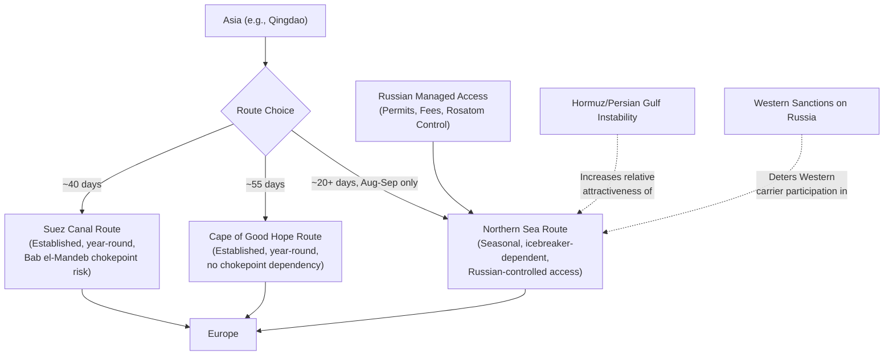

## Arctic Geopolitics and the Opening of New Trade Routes

### Overview

Retreating sea ice is gradually opening Arctic maritime corridors that could shorten Asia-Europe shipping distances by thousands of nautical miles, drawing growing commercial and strategic interest from Russia, China, the United States, and NATO states. As of 2026, the dominant assessment is that Arctic routes represent an emerging, strategically significant but still narrow and seasonally constrained corridor — not yet, and not expected soon, to be a reliable structural rival to the Suez Canal.

### Geographic and Route Structure

**Key Points**

- The **Northern Sea Route (NSR)** runs along Russia's Arctic coastline and is the most developed and commercially active Arctic corridor
- The **Northwest Passage**, through the Canadian Arctic Archipelago, and the potential future **Transpolar Route** across the central Arctic Ocean face similar or greater operational constraints and remain far less developed than the NSR
- Distance advantage: the NSR is roughly 3,000 nautical miles (about 11 days) shorter than the Suez Canal route on comparable Asia-Europe voyages; more recent reporting cites transits of just over 20 days via the NSR versus roughly 40 days via Suez and 55 days around the Cape of Good Hope
- Unlike established corridors constrained by fixed physical chokepoints (Bab el-Mandeb, Suez), NSR constraints are primarily environmental (ice conditions, seasonal access window) and geopolitical (proximity to and control by Russia)

### Seasonal and Operational Constraints

- The NSR's practical navigation season is short — historically concentrated in August and September, with marginal access possible in July and October
- Ice conditions remain unpredictable year to year, generally requiring specialized, ice-reinforced vessels and icebreaker escort for safe transit
- Infrastructure along the route (ports, search-and-rescue capability, refueling, emergency response) remains limited compared to established corridors like Suez or the major transpacific lanes
- Industry experts have characterized the route as still commercially difficult, dangerous, and expensive for reliable regular use, even as interest grows

### Timeline of Commercial Development

- 2009: first commercial voyage along the NSR, completed by Germany's Beluga Shipping
- 2018: Maersk's Venta Maersk completed the route's first container ship transit
- 2025 marked a further milestone in Arctic shipping activity growth, according to Allianz Commercial's Safety and Shipping Review 2026
- 2026: Russia's state nuclear corporation Rosatom, which operates the NSR, issued transit permits for seven Chinese vessels, with Chinese carrier Sea Legend Shipping planning what Rosatom describes as the first fully regular weekly container service via the NSR for the 2026 navigation season — a shift from earlier voyages, which were largely experimental or one-off
- A separate high-profile 2026 voyage, the Chinese cargo ship Dubai Tower, completed a roughly three-week Qingdao-to-Teesport transit, prompting debate among Arctic watchers over whether such voyages reflect genuine commercial logic or primarily geopolitical signaling

### Strategic Actor Positioning

#### Russia: Managed Access Strategy

- Russia is developing the NSR not as an open international corridor but as a **managed access** system, shaped by Russian legal claims, permit requirements, infrastructure control, and military presence along the route
- Rosatom has lobbied for introduction of an investment fee for NSR shipments, reflecting Russian intent to monetize and control corridor access directly rather than treat it as freely navigable international water
- Russian officials have cited deteriorating conditions and uncertainty around the Strait of Hormuz and the Persian Gulf as a factor increasing the relative attractiveness of the NSR — explicitly positioning the Arctic route as a substitute option amid instability in traditional chokepoints (see Red Sea shipping crisis case study for the broader pattern of chokepoint-driven rerouting)
- Russian President Putin has stated there is growing interest from partner countries, including India, in NSR cooperation, while describing Western concern over Arctic militarization as "artificial tensions"

#### China: Strategic Interest Beyond Immediate Commercial Logic

- China has declared itself a "near-Arctic state" despite being geographically distant from the Arctic Circle, and has pursued coast guard cooperation with Russia and various resource/technology projects in Arctic regions, though many of the latter have not materialized
- China is now promoting the first regular commercial cargo service via the NSR, but shipping analysts continue to question whether current Arctic voyages reflect commercial viability or a longer-horizon geopolitical positioning strategy
- Western sanctions on Russia over the Ukraine war (see the Russia-Ukraine energy reordering case study) create wariness among many Western shipping companies about Arctic route engagement, leaving Chinese and Russian-aligned carriers as the primary early movers

#### United States and NATO: Renewed Strategic Attention

- Growing Chinese interest and Russian infrastructure consolidation have drawn renewed US and NATO attention to the Arctic as a security and economic domain, embedding NSR developments within a broader geopolitical and military landscape linking the Arctic to North Atlantic security dynamics
- European states with Arctic and North Atlantic security interests (e.g., the Netherlands, per 2026 Clingendael Institute policy analysis) have recommended prioritizing economic security, navigation rights, and allied freedom of operation over routine commercial NSR use — treating the route primarily as a strategic-monitoring priority rather than a logistics opportunity

### Route Comparison Diagram

### Long-Term Forecast Assessment

**Key Points**

- Strategic policy analysis (Clingendael Institute, 2026) assesses that the NSR will **not** reliably rival Suez shipping volumes in the 2030–2040 horizon, despite greater seasonal ice-free access, due to persistent cost, infrastructure, and variability constraints
- Absent a fundamental Russia-Europe rapprochement, the NSR is expected to remain a **selective corridor** focused chiefly on Russian Arctic resource exports (oil, LNG, minerals) rather than becoming a general-purpose Asia-Europe container highway
- Arctic regional economic activity has grown substantially, with gross regional product nearly tripling between 2003 and 2022 to approximately $666 billion, reflecting broader resource development and investment beyond shipping alone
- Allianz Commercial's risk assessment characterizes the Arctic as remaining one of the highest-risk operating environments for commercial shipping globally, even as interest and voyage frequency increase

### Behavioral and Forecasting Caveats

Whether the 2026 shift toward "regular" scheduled NSR container service (the Sea Legend Shipping program) proves durable or reverts to the historically experimental, one-off voyage pattern is [Inference], since a single announced weekly-service program does not yet constitute an established multi-year operating track record. The degree to which Hormuz/Persian Gulf instability will sustainably redirect volume toward the NSR, versus representing a temporary opportunistic signal, is [Speculation]. Claims about the 2030–2040 trajectory rely on current policy analysis and climate/ice projections that carry inherent long-horizon uncertainty; actual ice retreat pace, Russian infrastructure investment follow-through, and the broader Russia-West relationship trajectory could each materially alter these forecasts.

### Related Topics

- Rosatom's icebreaker fleet and Russian Arctic infrastructure investment
- NSR legal status under UNCLOS and the Svalbard Treaty framework
- Strait of Hormuz risk and its effect on alternative-route incentives
- NATO High North strategy and Arctic military posture
- Comparative chokepoint risk: NSR vs. Suez vs. Bab el-Mandeb vs. Panama Canal
- Arctic resource extraction (oil, LNG, minerals) as a driver independent of transit shipping