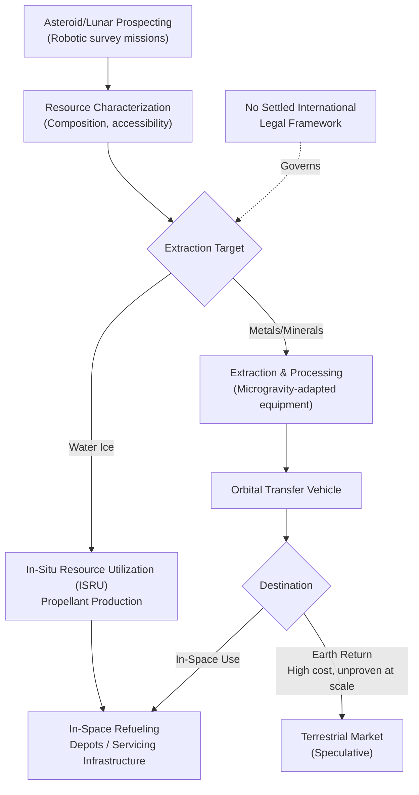

## Space-Based Supply Chains and Asteroid Mining Prospects

### Overview

Space-based supply chains represent an emerging, currently pre-commercial frontier of supply chain geopolitics, spanning near-term orbital logistics (satellite manufacturing, launch services, in-orbit servicing) and longer-horizon, still-speculative resource extraction concepts such as asteroid and lunar mining. Unlike the other case studies in this course, this domain remains largely in the technology-demonstration and early-investment phase rather than exhibiting established, disruption-tested supply chain patterns — the applicable frameworks here are extrapolations from terrestrial supply chain principles rather than documented historical events.

### Current State: Near-Term Orbital Supply Chains

**Key Points**

- The existing space supply chain is Earth-centric: launch vehicles, satellites, and components are manufactured terrestrially and transported to orbit, making it fundamentally a specialized extension of conventional aerospace manufacturing and logistics rather than a distinct extraterrestrial system
- Launch services have shifted from a small number of state-dominated providers toward a more commercially competitive market, though the sector still exhibits significant concentration among a handful of capable providers, creating chokepoint dynamics analogous to other concentrated-supplier industries examined in this course
- Satellite manufacturing supply chains depend on specialized components (radiation-hardened electronics, specific propulsion system parts) that intersect with the same semiconductor and rare earth element chokepoints documented in the AI hardware and rare earth export control case studies — space hardware is not exempt from terrestrial mineral and chip supply chain fragility

### The Asteroid and Off-World Mining Concept

#### Resource Rationale

- Certain asteroid classes (particularly M-type/metallic asteroids) are hypothesized to contain concentrations of platinum-group metals, nickel, iron, and potentially water ice, which could theoretically supply either in-space manufacturing/fuel needs or, in far more speculative scenarios, terrestrial markets
- Water ice extraction is generally considered the nearer-term and more economically plausible target than metal extraction, since water can be processed in-situ into propellant (hydrogen/oxygen) to support in-space refueling — directly reducing the cost of extending missions or servicing infrastructure, rather than requiring return-to-Earth logistics
- Metal extraction for terrestrial import remains economically constrained primarily by the extreme cost of the Earth-return leg of the supply chain, a cost structure fundamentally different from any terrestrial mining logistics problem addressed elsewhere in this course [Inference — precise economic breakeven thresholds are highly sensitive to future launch cost trajectories and are not established with confidence]

#### Structural Supply Chain Differences from Terrestrial Mining

- **Extraction environment**: microgravity and vacuum conditions require fundamentally different extraction technology than terrestrial mining equipment, with no directly transferable equipment base
- **Transport logistics**: no existing equivalent to terrestrial shipping infrastructure (ports, rail, pipelines) exists in cislunar space; any extracted material requires purpose-built orbital transfer vehicles
- **Regulatory environment**: no settled international legal framework equivalent to terrestrial mining law or maritime law currently governs commercial resource extraction rights in space, creating a fundamentally different risk profile than the geopolitically contested but legally structured terrestrial resource disputes covered elsewhere in this course (e.g., rare earth export controls, Arctic resource claims)

### Supply Chain Structure Diagram: Speculative In-Space Value Chain

### Governance and Legal Uncertainty

**Key Points**

- The foundational international legal instrument, the 1967 Outer Space Treaty, establishes that outer space is not subject to national appropriation but does not explicitly resolve the legal status of private commercial resource extraction, leaving significant interpretive ambiguity
- Some individual states have enacted domestic legislation asserting the legality of private entities owning resources they extract from celestial bodies, but this approach creates a fragmented, unilateral legal landscape rather than a settled multilateral framework — structurally similar to the fragmented AI governance landscape described in the AI supply chain case study, but for an even less mature commercial domain
- The absence of an enforceable international extraction rights regime means any future commercial asteroid mining venture would operate under substantially higher legal and political risk than terrestrial mining operations, which — despite their own geopolitical contestation — at minimum function within established sovereign jurisdiction and international trade law

### Relationship to Terrestrial Critical Minerals Geopolitics

- Proponents of asteroid mining frequently frame it as a long-term hedge against terrestrial critical mineral concentration risk (the same concentration dynamics documented in the 2025 rare earth export controls case study), theoretically offering a supply source outside any single nation's territorial control
- This framing should be treated with caution: even under optimistic technological timelines, the capital cost, technical risk, and multi-decade development horizon for any at-scale extraction-and-return operation make near-term relevance to actual terrestrial critical mineral markets low [Inference — this is a widely-held view among space economics analysts, but is not a settled empirical conclusion given the field's lack of any operational precedent]
- A more immediate and better-established space-supply-chain-geopolitics intersection lies in **satellite manufacturing and launch capability** as a strategic asset — nations and firms increasingly treat sovereign launch access and satellite production capacity as strategically significant in ways that echo semiconductor fab concentration concerns, rather than in asteroid mining specifically

### Current Investment and Technology Demonstration Activity

- Several private companies and national space agencies have conducted early-stage asteroid characterization missions (sample-return and remote sensing), providing foundational data on asteroid composition but not yet approaching extraction-scale operations
- In-situ resource utilization (ISRU) technology demonstration, particularly for lunar water ice extraction, represents the most operationally advanced near-term work in this domain, driven substantially by its direct relevance to planned crewed lunar exploration programs rather than by commercial mining economics per se

### Behavioral and Forecasting Caveats

This entire domain should be understood as substantially more speculative than the other case studies in this course: unlike the Japan 2011 earthquake, the Texas 2021 storm, or the Red Sea crisis, there is no documented historical disruption event to analyze, and the "supply chain" under discussion is largely prospective rather than operational at any meaningful scale. Timelines for commercially viable asteroid mining are [Speculation] and have historically been subject to significant optimistic bias in industry projections; multiple previously announced asteroid mining ventures have failed to reach operational extraction. Claims about eventual terrestrial market impact, cost trajectories, and regulatory resolution should not be treated with the same confidence as the historically-grounded case studies elsewhere in this course.

### Related Topics

- 1967 Outer Space Treaty and national space resource legislation
- In-situ resource utilization (ISRU) technology for lunar and Martian missions
- Launch vehicle market concentration and sovereign launch capability as strategic asset
- Satellite manufacturing supply chains and radiation-hardened component sourcing
- Comparative legal regimes: maritime law, mining law, and the space resource governance gap
- Long-horizon critical mineral hedging strategies and their feasibility limits