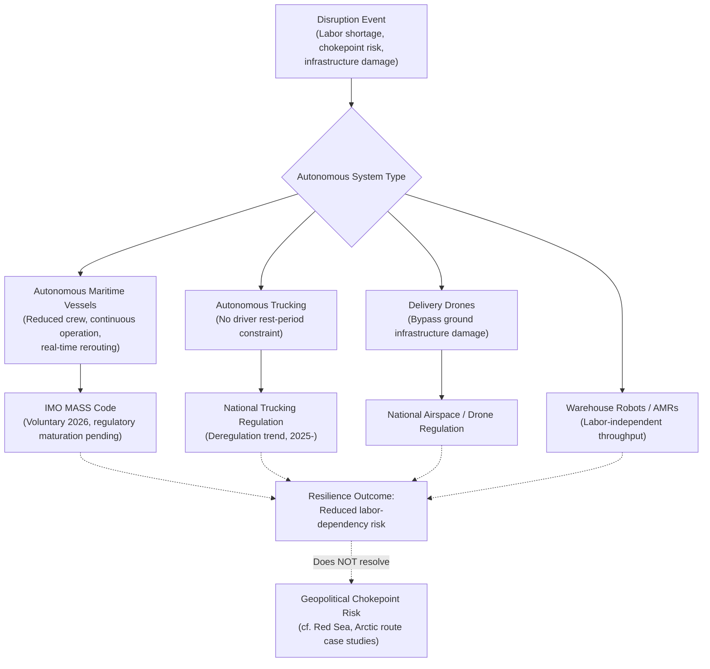

## Autonomous Shipping and Drone Logistics as Emerging Resilience Tools

### Overview

Autonomous maritime vessels, delivery drones, and self-driving trucks are transitioning from pilot programs to limited commercial deployment across 2025–2026, positioned by industry and policymakers as tools to address labor shortages, reduce human-error disruption, and provide redundant capacity during crisis conditions. As with other emerging-technology domains, current deployment remains narrow relative to the scale of global freight movement, and the resilience benefits are more accurately characterized as complementary and partial rather than a wholesale replacement for existing crewed logistics infrastructure.

### Structural Rationale: Why Autonomy Is Framed as a Resilience Tool

**Key Points**

- Supply chains face four structural disruption categories reinforcing each other: geopolitical volatility and trade route instability, component inaccessibility, workforce attrition/labor shortages, and rising regulatory/safety compliance pressure
- Labor shortages are a direct driver: retiring skilled workers have left substantial job vacancies across supply chain and manufacturing roles in the US alone, with younger workers less inclined to enter logistics professions, and high turnover further compounding gaps
- Autonomous systems are framed as addressing this labor constraint directly — a truck, vessel, or drone that does not require rest periods, shift scheduling, or a full crew can theoretically sustain operations through disruption scenarios where human-crew availability becomes the binding constraint
- This connects to the JIT fragility framework from the Japan 2011 case study: autonomy is positioned as a way to reduce one specific category of disruption risk (labor/crew availability) without necessarily requiring the inventory buffer trade-offs that traditional resilience strategies demand

### Autonomous Maritime Shipping

#### Current Capability and Value Proposition

- Autonomous ships integrate advanced navigation systems and AI to operate with reduced or no crew, potentially running continuously without rest-period constraints, reducing human error, and freeing crew-allocated space for additional cargo
- Systems can automatically adjust routes based on real-time data such as weather patterns and port congestion — a capability directly relevant to crisis-responsive rerouting of the kind examined in the Red Sea shipping crisis case study, where manual rerouting decisions currently impose significant coordination lag
- Reduced crew requirements also reduce direct human exposure to the security risks documented in the Red Sea case (attack, boarding, seizure threats), since uncrewed or minimally-crewed vessels carry no seafarer casualty risk in a hostile-transit scenario [Inference — this benefit is theoretical pending actual deployment in genuinely hostile transit corridors, which has not yet occurred at meaningful scale]

#### Regulatory Development

- The International Maritime Organization (IMO) is developing a Marine Autonomous Surface Ship (MASS) Code, expected to be introduced as a voluntary framework in 2026, with potential future transition to mandatory status
- Autonomous ships will require flag-state registration like conventional vessels, with each flag state setting its own requirements, and classification societies extending existing vessel-standard-setting roles to autonomous systems
- The regulatory landscape remains comparatively sparse relative to conventional shipping law, reflecting the early-stage nature of the underlying technology and operational track record

### Autonomous Trucking

- Commercial-scale autonomous trucking deployment is underway: PepsiCo was reported operating 35 autonomous trucks commercially as of mid-2026, while Volvo has targeted full automation by Q1 2027
- Regulatory deregulation trends in trucking (rollback of certain federal emissions, language, and speed-limiter requirements under the Trump administration beginning 2025) are reshaping the operating environment in which autonomous trucking scales, though the interaction between deregulation trends and autonomy-specific rules is a distinct and separately evolving regulatory track
- Autonomous trucking's resilience contribution operates primarily at the labor-availability layer described above, rather than addressing route-level geopolitical chokepoints (which affect maritime and air routes more directly than domestic trucking corridors)

### Drone Logistics

#### Last-Mile and Direct Delivery Applications

- Commercial drone delivery is expanding geographically: Zipline rolled out autonomous drone delivery service to Houston and Phoenix in early 2026, extending an already-operating service model
- Sidewalk delivery robots (e.g., Serve Robotics) and drone systems are increasingly operating in combination — Serve Robotics and Wing debuted a robot-to-drone handoff delivery system in the Dallas-Fort Worth area, illustrating an emerging multi-modal automated last-mile architecture rather than drones operating as a standalone solution
- The autonomous delivery market (encompassing drones and ground robots) has been projected to reach approximately $11.5 billion by 2032, reflecting continued but still-early-stage commercial scaling

#### Resilience-Specific Value

- Drones offer a distinct resilience property relative to ground and maritime logistics: they can bypass certain physical infrastructure disruptions (damaged roads, blocked ports, congested chokepoints) by operating through unobstructed airspace, provided flight range and payload constraints are met
- This makes drones particularly relevant for last-mile continuity during localized infrastructure disruption (comparable in category, though much smaller in scale, to the infrastructure-damage disruption pattern documented in the Japan 2011 and Texas 2021 case studies) rather than for long-haul or high-volume freight movement, where payload and range limitations remain binding constraints

### System Architecture Diagram: Autonomous Resilience Layer

### The Autonomous AI Agent Layer

- A parallel and interacting trend is the shift from AI-assisted logistics workflows toward autonomous ("agentic") AI systems capable of adjusting purchase orders, rerouting shipments, and modifying supplier terms in real time without step-by-step human authorization at each decision point
- Survey data indicates significant organizational hesitancy: a substantial share of logistics leaders reported holding off on agentic AI adoption, making near-term adoption trajectory genuinely uncertain rather than a settled trend
- Autonomous physical logistics (vessels, trucks, drones) and autonomous decision-making AI (the agentic layer discussed in the AI resilience case study) are complementary but distinct developments — physical autonomy addresses execution-layer labor constraints, while agentic AI addresses planning- and decision-layer speed, and the two are increasingly discussed as converging but have separate maturity timelines and risk profiles

### Behavioral and Forecasting Caveats

Current autonomous shipping, trucking, and drone deployment remains a small fraction of total global freight volume, and claims about near-term (multi-year) transformation of overall supply chain resilience should be treated as [Inference] rather than established fact — most cited deployments (35 trucks, drone service in two additional US cities, an emerging IMO voluntary code) represent early commercial and regulatory stages rather than mature, disruption-tested infrastructure. The extent to which autonomous systems will perform reliably under genuinely adverse and adversarial conditions (severe weather, contested waters, cyberattack targeting autonomous navigation systems) remains largely untested at meaningful scale and is [Speculation]. Regulatory frameworks, particularly the IMO MASS Code's transition from voluntary to potentially mandatory status, remain in active development and their final form and timeline are not yet settled.

### Related Topics

- IMO Marine Autonomous Surface Ship (MASS) Code development and classification society standards
- Agentic AI adoption trends and organizational trust barriers in logistics
- Cybersecurity risk in autonomous navigation and fleet management systems
- Warehouse robotics (AMRs) and physical AI convergence with autonomous transport
- Comparative resilience value: autonomy vs. traditional buffer-stock and multi-sourcing strategies
- Labor market dynamics in logistics and the automation-employment transition