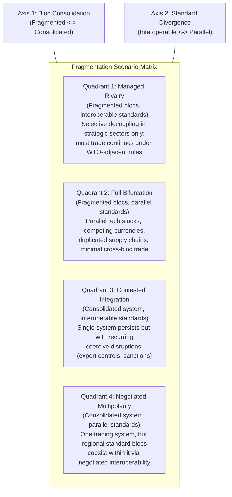

## Scenario Planning for a Fragmented Global Trading System

### Overview

Scenario planning is a structured strategic foresight methodology used to prepare organizations for multiple plausible futures rather than forecasting a single expected outcome. Applied to global trade fragmentation, it addresses a genuinely high-uncertainty environment where the post-Cold War single integrated global trading system is increasingly giving way to competing blocs, parallel technology standards, and selectively decoupled supply chains — a trajectory reinforced by nearly every case study examined in this course, from rare earth export controls to semiconductor export restrictions to Arctic route contestation.

### Why Scenario Planning Fits This Problem

**Key Points**

- Traditional single-point forecasting performs poorly under conditions of deep uncertainty — where not just the magnitude but the fundamental structure of future outcomes is contested — because it forces commitment to one assumed trajectory
- Global trade fragmentation exhibits classic deep-uncertainty characteristics: multiple plausible end states (partial decoupling, full bifurcation, fragmented-but-interdependent blocs), long causal chains connecting geopolitical decisions to supply chain outcomes, and genuine disagreement among informed analysts about probability weightings
- Scenario planning's core value is not predicting which future occurs, but building organizational capacity to recognize early indicators of each scenario and respond with pre-considered strategic options, rather than reacting under crisis time pressure

### Core Methodology

#### Step 1: Identify Critical Uncertainties

- Distinguish between predetermined elements (trends highly likely to continue regardless of scenario — e.g., continued automation adoption, continued climate risk accumulation) and genuine uncertainties (outcomes that could plausibly go multiple ways — e.g., the durability of US-China trade détente, the pace of EU strategic autonomy policy)
- Rank uncertainties by both **impact** (how much the outcome would matter to the organization) and **uncertainty** (how genuinely unpredictable the outcome is) — the highest-value scenario axes come from the intersection of high impact and high uncertainty

#### Step 2: Select Scenario Axes

- Typically two independent, high-impact/high-uncertainty axes are selected to define a 2x2 scenario matrix, though more complex frameworks use additional dimensions
- For global trade fragmentation, plausible axes include: degree of bloc consolidation (fragmented-but-interdependent vs. fully bifurcated) and degree of technology standard divergence (interoperable vs. parallel/incompatible standards)

#### Step 3: Develop Scenario Narratives

- Each quadrant of the matrix is developed into an internally consistent narrative describing how the world would look, what triggered that path, and what supply chain structures would result
- Narratives should be specific and vivid enough to generate genuine strategic insight, not generic enough to apply to any future

#### Step 4: Identify Early Indicators and Strategic Options

- For each scenario, identify observable signposts that would indicate the world is moving toward that path
- Develop strategic options (sourcing diversification, inventory policy, market exit/entry decisions) that are evaluated for robustness across multiple scenarios — options that perform reasonably well across most scenarios are prioritized over options optimized for only one

### Illustrative 2x2 Scenario Matrix: Global Trade Fragmentation

### Scenario Narratives Applied to Course Case Studies

#### Quadrant 1: Managed Rivalry (most consistent with 2025–2026 observed pattern)

- Reflects the pattern observed in the rare earth export controls case study: escalation followed by negotiated suspension, with both sides retaining leverage instruments but choosing selective, reversible application rather than permanent severance
- Supply chains under this scenario require **dual-track strategies**: maintaining efficient integrated sourcing for non-strategic goods while building genuine redundancy only for designated critical/strategic categories (semiconductors, rare earths, defense-adjacent components)

#### Quadrant 2: Full Bifurcation

- Would extend the reshoring and diversification trends already underway (MP Materials, Lynas, allied semiconductor investment) to their logical conclusion — largely separate, duplicated supply chains serving distinct geopolitical blocs
- Historical analogy: Cold War-era separate economic systems, though contemporary technology and financial interdependence make a clean bifurcation structurally harder to achieve than the mid-20th-century case, since starting from a highly integrated baseline requires unwinding decades of embedded interdependency [Inference — the practical feasibility of complete bifurcation given current integration depth is genuinely contested among trade economists]

#### Quadrant 3: Contested Integration

- Resembles the Red Sea shipping crisis pattern extended broadly: the underlying integrated trading system persists, but is punctuated by recurring, geographically or sector-specific coercive disruptions (chokepoint attacks, targeted export controls, sanctions) that never fully sever the system but impose a persistent risk premium
- Under this scenario, insurance and risk-pricing mechanisms (war-risk premiums, price caps, sanctions-compliance infrastructure) become permanent structural features of trade rather than crisis-specific temporary measures

#### Quadrant 4: Negotiated Multipolarity

- Reflects a world where competing regional standards (e.g., divergent AI governance, divergent carbon border adjustment regimes) coexist within a single formally integrated trading system via negotiated mutual recognition or interoperability agreements
- Requires sustained multilateral institutional capacity to negotiate and maintain interoperability — a capacity currently under strain given fragmented AI governance and divergent climate policy trajectories documented elsewhere in this course

### Cross-Case-Study Signpost Framework

$$\text{Scenario Likelihood Update} = f(\text{Observed Signpost}_1, \text{Observed Signpost}_2, \ldots, \text{Observed Signpost}_n)$$

**Key Points**

- Effective scenario planning requires continuously updating scenario likelihood assessments as real-world signposts emerge, rather than fixing probability weights at initial scenario development and never revisiting them
- Relevant signposts drawn from this course's case studies include: the durability of the 2025 rare earth export control suspension beyond November 2026, the pace of Western semiconductor and critical mineral reshoring investment, the frequency of renewed Red Sea attacks and their linkage to the broader Iran-Israel conflict trajectory, and the evolution of AI hardware export control stringency
- No single signpost is decisive; scenario planning practice emphasizes monitoring a portfolio of indicators across multiple domains simultaneously, since fragmentation dynamics in trade, technology, and security tend to be interlinked but not perfectly correlated

### Strategic Option Robustness Testing

**Example**

A representative robustness-testing exercise for a sourcing diversification decision:

1. Define the candidate strategic option (e.g., qualify a second-source supplier in a geopolitically distinct region for a critical component)
2. Evaluate expected outcome and cost under each of the four scenario quadrants independently
3. An option that performs reasonably well (positive expected value, acceptable cost) across three or more quadrants is considered **robust**; an option that only performs well under one specific quadrant is a **contingent bet** requiring explicit acknowledgment of the concentrated scenario risk being taken
4. Prioritize robust options for near-term implementation; reserve contingent bets for scenarios where strong signpost evidence favors that specific quadrant

### Limitations of the Methodology

- Scenario planning does not eliminate uncertainty or guarantee correct strategic decisions; it improves decision quality under uncertainty by broadening the considered outcome space, but organizations can still be wrong about which scenarios are even plausible, missing genuine "unknown unknowns" outside the constructed matrix
- The quality of scenario planning output is highly dependent on the quality and diversity of input perspectives during scenario development; homogeneous planning teams tend to produce narrower, less genuinely divergent scenarios than intended [Inference — this is a widely cited critique in strategic foresight literature rather than a claim specific to trade fragmentation scenario work]
- Scenario matrices can create false precision if treated as exhaustive; real-world outcomes often blend elements of multiple quadrants rather than resolving cleanly into one

### Behavioral and Forecasting Caveats

The specific scenario matrix and quadrant characterizations presented here are illustrative applications of a general methodology to this course's case studies, not a claim about which scenario is most probable — that assessment is inherently [Speculation] and would require continuous updating against real-world developments beyond this course's scope. The framework's value lies in its structure for organizing strategic thinking under uncertainty, not in the specific probability weights any individual analyst might currently assign to each quadrant.

### Related Topics

- Deep uncertainty vs. risk: methodological distinctions in strategic foresight
- Shell scenario planning methodology and its origins in 1970s oil market forecasting
- Real options theory as a complement to scenario-based strategic decision-making
- Multilateral trade institution capacity (WTO reform debates) and Quadrant 4 feasibility
- Signpost monitoring systems and organizational early-warning infrastructure
- Comparative historical fragmentation: Cold War economic bifurcation as a partial analogy