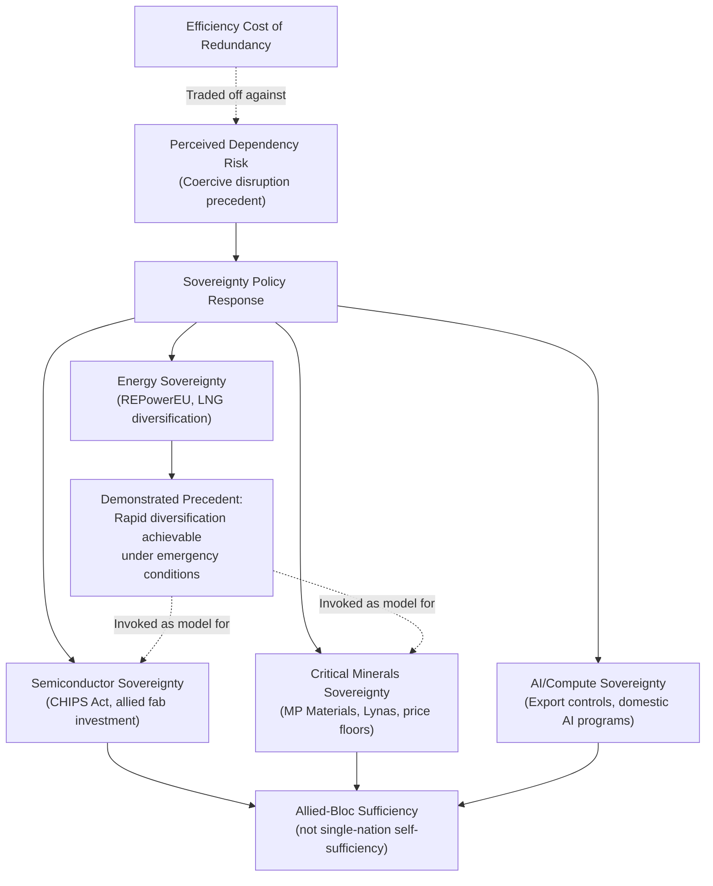

## Technology Sovereignty and the Pursuit of Self-Sufficient Supply Chains

### Overview

Technology sovereignty refers to a state's or bloc's pursuit of independent control over the design, production, and supply of strategically critical technologies — semiconductors, AI compute, critical minerals, energy infrastructure — reducing dependence on foreign suppliers perceived as geopolitically unreliable or coercive. It represents the policy-level, systemic response to the pattern of chokepoint vulnerability documented across this course's case studies, and increasingly functions as an organizing principle for industrial policy across multiple major economies simultaneously.

### Conceptual Foundation

**Key Points**

- Technology sovereignty sits at the intersection of national security policy and industrial policy, treating supply chain dependency in designated critical technologies as a strategic vulnerability comparable to military capability gaps, not merely an economic efficiency question
- The concept gained substantial policy momentum directly from the accumulated pattern of this course's case studies: the 2025 rare earth export controls demonstrated mineral-input coercion risk, semiconductor export control regimes demonstrated compute-access coercion risk, and the Russia-Ukraine energy crisis demonstrated energy-dependency coercion risk — together establishing a general pattern rather than isolated incidents
- Sovereignty framing represents a deliberate departure from decades of comparative-advantage-driven trade theory, which treats specialization and interdependence as efficient; sovereignty policy explicitly accepts efficiency losses in exchange for reduced dependency risk

$$\text{Sovereignty Policy Logic}: \quad \text{Cost}_{\text{redundant domestic capacity}} < \text{Expected Cost}_{\text{coercive supply disruption}}$$

This mirrors the efficiency-resilience trade-off framework introduced in the Japan 2011 case study, but elevated from firm-level operational decision-making to national industrial policy.

### Domains of Pursued Sovereignty

#### Semiconductor Sovereignty

- Encompasses both leading-edge logic chip fabrication capacity and the upstream equipment/materials supply chain (EUV lithography, specialty chemicals) required to operate fabs domestically
- The US CHIPS Act and comparable EU and Japanese semiconductor subsidy programs represent direct policy instruments pursuing this goal, incentivizing fab construction within national or allied-bloc borders
- Genuine full sovereignty (a completely self-contained domestic semiconductor supply chain, from raw silicon to finished advanced chip) remains distant for essentially any single nation given the depth of specialization embedded in the current global semiconductor value chain; policy in practice pursues **allied-bloc sufficiency** rather than single-nation self-sufficiency [Inference — this characterization reflects the practical scope of announced programs rather than their stated rhetorical ambitions, which sometimes claim broader self-sufficiency goals]

#### Critical Minerals Sovereignty

- Directly responsive to the dynamics documented in the 2025 rare earth export controls case study: US Department of Defense investment in MP Materials (Mountain Pass) and the US-Japan Framework for Securing the Supply of Critical Minerals represent concrete sovereignty-pursuit instruments
- Price floor mechanisms (the $110/kg NdPr floor established in Pentagon agreements with both MP Materials and Lynas) function as a sovereignty-support policy tool distinct from conventional trade protection — designed specifically to insulate domestic/allied producers from the predatory pricing risk that a dominant incumbent supplier could otherwise use to undercut nascent competitors
- The EU's Critical Raw Materials Act represents a parallel European sovereignty instrument, driven by the European Parliament's characterization of Chinese rare earth controls as coercive given China's quasi-monopolistic supply position

#### AI and Compute Sovereignty

- Extends beyond chip manufacturing to encompass control over AI model development capability, training compute access, and specialized AI talent — the full stack examined in the AI supply chain case study
- Compute sovereignty is complicated by the energy-intensity dimension: sovereign AI compute ambitions directly intersect with grid capacity and energy policy, creating a secondary sovereignty dependency (energy self-sufficiency) nested within the primary one
- Fragmented international AI governance (divergent US, EU, and Chinese regulatory approaches) both reflects and reinforces the absence of a unified sovereignty consensus in this domain

#### Energy Sovereignty

- The most mature and extensively tested domain, given the multi-decade history of energy security policy and its acute demonstration in the European response to the Russia-Ukraine war (REPowerEU, LNG import diversification, accelerated renewable deployment)
- Illustrates a key lesson directly transferable to other sovereignty domains: rapid diversification (LNG substitution) proved more achievable than the multi-year timelines initially assumed once genuine political will and emergency regulatory fast-tracking were applied — a precedent sovereignty advocates in semiconductor and mineral policy frequently invoke, though the underlying technical substitutability differs substantially by sector [Inference — the transferability of the energy-sector diversification speed to sectors with fundamentally different capital and technical barriers, such as leading-edge fabs, is contested]

### Structural Diagram: Sovereignty Pursuit Architecture

### Costs and Trade-offs of Sovereignty Pursuit

**Key Points**

- Redundant domestic or allied-bloc production capacity typically carries higher unit costs than the previously optimized global specialization pattern it replaces, at least during the buildout and early-scale phase — a direct instantiation of the efficiency-resilience trade-off
- Sovereignty policy can generate its own escalatory dynamics: as one bloc pursues sovereignty in a given technology, it can accelerate the perceived necessity of parallel sovereignty pursuit by rival blocs, contributing toward the "full bifurcation" scenario quadrant discussed in the scenario planning case study
- Genuine technical and capital barriers mean sovereignty ambitions frequently exceed near-term achievable capacity — as documented in the rare earth case study, even well-funded programs (MP Materials, Lynas) anchor only a modest share of non-Chinese supply and face a persistent structural deficit in specific critical materials (e.g., the cited 10,000-tonne NdPr deficit), illustrating that sovereignty is typically a multi-year-to-multi-decade trajectory rather than a rapidly achievable state

### Allied-Bloc Coordination as the Practical Sovereignty Model

- In practice, most current sovereignty policy pursues coordination among allied or aligned nations rather than genuine single-nation self-sufficiency, reflecting the practical infeasibility of complete national self-containment for most advanced technology supply chains
- Examples include the US-Japan Critical Minerals Framework, allied semiconductor manufacturing coordination, and NATO-adjacent Arctic security coordination (see the Arctic geopolitics case study) — each representing a "sovereignty" pursued at the bloc level rather than strictly the national level
- This bloc-level pattern aligns most closely with the "Managed Rivalry" and "Full Bifurcation" quadrants of the fragmentation scenario matrix discussed in the scenario planning case study, rather than a return to fully autarkic national economies

### Behavioral and Forecasting Caveats

The ultimate achievable scope of technology sovereignty — whether allied-bloc coordination proves sufficient to meaningfully reduce coercion risk, or whether persistent structural deficits (as in critical minerals) leave meaningful residual dependency regardless of policy investment — is [Speculation] given the multi-decade timelines involved and the early stage of most current sovereignty programs. Claims about the relative cost-effectiveness of sovereignty pursuit versus continued reliance on diversified but still globally-integrated sourcing are contested among trade economists and are not settled by the case evidence available as of this course's coverage period.

### Related Topics

- Comparative advantage theory and its tension with sovereignty-driven industrial policy
- US CHIPS Act and EU Chips Act: comparative program design and outcomes
- Allied-bloc supply chain coordination frameworks and their institutional durability
- The efficiency-resilience trade-off as a unifying framework across sovereignty domains
- Historical precedent: autarky and self-sufficiency policies in 20th-century economic history
- Full bifurcation scenario risk and its relationship to sovereignty policy escalation