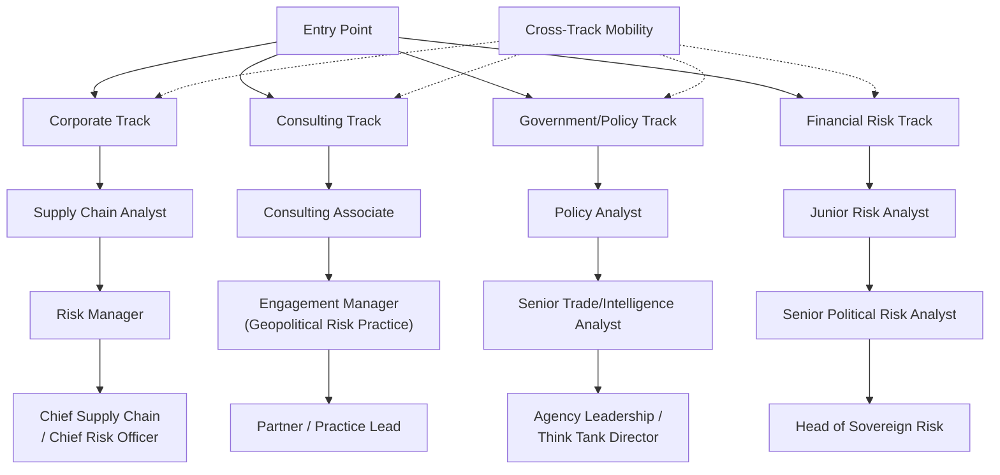

## Career Paths in Supply Chain Geopolitics and Risk Consulting

### Overview

Supply chain geopolitics has matured into a distinct professional field spanning corporate risk functions, specialized consulting practices, government and intelligence-adjacent analysis, and financial/investment risk assessment. Demand for this expertise has grown directly in response to the pattern of disruptions documented throughout this course — the field did not exist in its current form prior to the accumulation of events like the 2011 Japan earthquake, the Russia-Ukraine energy crisis, and the rare earth export controls, each of which drove organizations to formalize risk functions that had previously been informal or absent.

### Core Functional Roles

#### Corporate Supply Chain Risk Management

- **Supply chain risk analyst/manager**: embedded within a corporation's procurement, operations, or strategy function, responsible for ongoing multi-tier supplier mapping, disruption monitoring, and scenario-based contingency planning — directly applying the mapping and visibility lessons from the Japan 2011 case study
- **Geopolitical risk officer**: a more senior, cross-functional role synthesizing geopolitical analysis (sanctions regimes, export control developments, conflict monitoring) into actionable guidance for sourcing, market entry/exit, and inventory policy decisions
- **Trade compliance specialist**: focused specifically on navigating export control regimes (such as the extraterritorial rules examined in the rare earth case study), sanctions screening, and customs/tariff compliance — a role with directly regulatory, legally precise responsibilities distinct from broader strategic risk analysis

#### Consulting and Advisory

- **Strategy consulting (supply chain/geopolitical risk practice)**: major strategy and management consulting firms maintain dedicated practices advising corporate clients on sourcing diversification, scenario planning (applying the methodology from the scenario planning case study), and crisis response
- **Specialized geopolitical risk consultancies**: boutique firms focused specifically on political risk assessment, often staffed by former government, intelligence, or academic political science professionals, providing country- and sector-specific risk assessment as a standalone product
- **Insurance and reinsurance risk modeling**: actuarial and risk modeling roles at firms like those referenced in the Red Sea case study (e.g., Allianz Commercial's shipping risk assessments) that price political and physical risk into war-risk insurance, trade credit insurance, and related products

#### Government and Policy-Adjacent Roles

- **Trade policy analyst**: within government trade ministries, commerce departments, or legislative research bodies, analyzing the impact of proposed export controls, tariffs, or trade agreements — directly analogous to the MOFCOM policy analysis and CSIS/think-tank analysis cited throughout the rare earth and Red Sea case studies
- **Intelligence and defense-adjacent analysis**: roles within national security agencies or defense-industrial base offices focused specifically on supply chain vulnerability assessment for defense-critical materials (rare earths, semiconductors), a function with direct institutional linkage to the Pentagon investment activity documented in the critical minerals case study
- **Multilateral and think-tank research**: positions at organizations such as CSIS, the European Parliament's research service (cited extensively in this course's rare earth and Red Sea case studies), or similar bodies producing policy-facing analysis

#### Financial and Investment Risk Roles

- **Sovereign and political risk analysts** at investment banks, asset managers, or credit rating agencies, assessing how geopolitical supply chain risk translates into country risk premiums, sector-specific investment risk, and credit assessments
- **ESG and supply chain due diligence analysts**, increasingly incorporating geopolitical resilience assessment alongside traditional environmental and labor-practice due diligence in investment screening

### Illustrative Career Progression Pathways

### Foundational Skill Requirements

**Key Points**

- **Multi-tier supply chain mapping and visibility tools**: technical familiarity with supply chain mapping software and methodologies, directly responsive to the Tier 2/3 visibility gap identified as the central lesson of the Japan 2011 case study
- **Geopolitical and regional expertise**: deep knowledge of specific regions or bilateral relationships (US-China trade policy, EU-Russia energy relations, Middle East security dynamics) that recurs as directly relevant across nearly every case study in this course
- **Regulatory and legal literacy**: ability to read and interpret export control notices, sanctions designations, and trade agreements — the kind of primary-source analysis reflected in this course's direct citation of MOFCOM notices and EU regulations
- **Quantitative and scenario modeling skills**: comfort with the expected-cost and scenario-probability frameworks introduced in the JIT fragility and scenario planning case studies, including basic risk-modeling and decision-analysis techniques
- **AI and data-tool fluency**: increasingly essential given the AI-driven risk-detection and forecasting applications discussed in the AI resilience case study — familiarity with how predictive models are built, their limitations, and how to interpret model output critically rather than uncritically

### Relevant Academic and Credentialing Pathways

- **Formal education**: degrees in international relations, political science, economics, supply chain management, or area studies (regional/language expertise) provide foundational grounding; increasingly, joint or interdisciplinary programs combining supply chain management with international affairs are emerging as a direct response to the field's cross-disciplinary nature
- **Professional certifications**: supply chain-specific credentials (e.g., APICS/ASCM certifications) provide operational grounding, though geopolitical risk expertise specifically is less standardized around a single certification body and more commonly built through a combination of academic training and applied experience
- **Language and regional expertise**: given the centrality of China, Russia, the Middle East, and the EU across this course's case studies, proficiency in relevant languages and deep regional knowledge represents a significant differentiator for roles requiring primary-source analysis (as opposed to reliance on translated secondary reporting)

### Emerging Specialization Areas

- **Critical minerals and rare earth specialists**: a narrowly defined but high-demand specialization directly responsive to the dynamics documented in the 2025 rare earth export controls case study, requiring combined expertise in mining/materials science fundamentals and trade policy
- **AI supply chain and export control specialists**: an emerging niche at the intersection of technology policy and traditional trade compliance, addressing the extraterritorial and technology-transfer-focused control regimes discussed in the AI supply chain case study
- **Climate-adaptive supply chain strategists**: specialists integrating the climate risk taxonomy (acute, chronic, transition risk) from the climate adaptation case study into corporate site-selection and sourcing decisions
- **Maritime and chokepoint security analysts**: specialists tracking chokepoint-specific risk (Red Sea, Strait of Hormuz, Arctic routes, Taiwan Strait) for shipping, insurance, and logistics clients

### Behavioral and Forecasting Caveats

The relative growth trajectory and compensation structure of specific roles within this field are [Unverified] without reference to current labor market data specific to a given region or sector, and vary substantially by employer type, seniority, and geographic market. The degree to which formal credentialing will standardize around specific certifications versus remain a heterogeneous, experience-driven field is [Inference], reflecting the field's continued relative youth and rapid evolution alongside the disruption events that have driven its growth.

### Related Topics

- Supply chain mapping software and multi-tier visibility platforms
- Political risk assessment methodologies used by specialized consultancies
- Trade compliance certification pathways and export control training programs
- Think tank and policy research career entry points (CSIS, Clingendael, European Parliament research service)
- Sovereign risk and country risk premium modeling in investment finance
- Interdisciplinary graduate programs combining supply chain management and international affairs