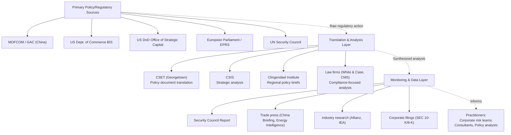

## Key Institutions, Think Tanks, and Research Centers in the Field

### Overview

Supply chain geopolitics draws on a distinct institutional ecosystem spanning multilateral bodies, national government agencies, academic and policy think tanks, and specialized industry research organizations. Several of these institutions have already appeared as primary sources throughout this course's case studies, reflecting their status as the field's principal producers of authoritative analysis.

### Multilateral and International Institutions

**Key Points**

- **United Nations Security Council**: produces binding and non-binding resolutions directly relevant to supply chain security, exemplified by Resolution 2722 and its renewals addressing Houthi attacks on Red Sea shipping, and related monitoring mechanisms via Secretary-General reporting
- **International Maritime Organization (IMO)**: the primary body governing maritime shipping regulation, currently developing the Marine Autonomous Surface Ship (MASS) Code addressed in the autonomous shipping case study, alongside its longstanding role in vessel safety and navigation standards
- **World Trade Organization (WTO)**: the foundational institution for multilateral trade rules, whose relative capacity or incapacity to manage escalating export control disputes is directly relevant to the "Negotiated Multipolarity" versus "Full Bifurcation" scenario pathways discussed in the scenario planning case study
- **International Energy Agency (IEA)**: a key source of energy market and critical minerals data, cited as a data source in European Parliament analysis of rare earth dependency in the critical minerals case study

### Regional and National Government Bodies

- **US Department of Commerce, Bureau of Industry and Security**: administers US export control policy, the primary US-side counterpart to the Chinese MOFCOM actions examined in the rare earth case study
- **China's Ministry of Commerce (MOFCOM)**: the originating authority for the 2025 rare earth export control notices analyzed in detail in this course, alongside China's General Administration of Customs (GAC), which co-issues and tracks trade data
- **US Department of Defense, Office of Strategic Capital**: the institutional vehicle for US critical minerals sovereignty investment (MP Materials, Lynas agreements) documented in both the rare earth and technology sovereignty case studies
- **European Parliament and its Research Service (EPRS)**: produces the policy analysis and resolutions on rare earth dependency and critical raw materials cited extensively in this course, representing the EU's primary legislative-research institutional voice on these issues
- **US Maritime Administration (MARAD)**: issues the maritime security advisories governing vessel risk designations cited in the Red Sea shipping crisis case study
- **UN Security Council Report**: a specialized monitoring and analysis body producing detailed monthly forecasts on Security Council agenda items, including the ongoing Red Sea situation

### Academic and Policy Think Tanks

#### Security and Strategic Studies

- **Center for Strategic and International Studies (CSIS)**: a leading US think tank producing detailed analysis on rare earth supply chains, defense-industrial base vulnerabilities, and broader geopolitical risk — cited directly in this course's rare earth export controls case study
- **Center for Security and Emerging Technology (CSET), Georgetown University**: specializes in translation and analysis of Chinese policy documents (including the MOFCOM rare earth notices) and technology-security intersection research, providing primary-source translation services critical to Western policy analysis
- **Clingendael Institute (Netherlands Institute of International Relations)**: produces detailed policy briefs on Arctic geopolitics and the Northern Sea Route, exemplified by its 2026 three-part series on NSR strategic dynamics cited in the Arctic case study

#### Trade and Economic Policy

- **Resources for the Future (RFF)**: an economics-focused research organization applying game-theoretic and policy-analysis frameworks to critical minerals trade disputes, as referenced in the rare earth case study's game-theory analysis of Chinese export restriction strategy
- Various national and regional economic research institutes producing sector-specific trade impact analysis (referenced generally across the energy, minerals, and Red Sea case studies via industry and legal-advisory publications)

### Legal and Regulatory Advisory Institutions

- **Major international law firms with trade/export control practices** (e.g., White & Case, CMS): produce detailed legal analysis of export control notices and their extraterritorial implications, functioning as a critical translation layer between raw regulatory text and business-actionable compliance guidance — directly cited in this course's analysis of the MOFCOM Notice 61/62 extraterritorial jurisdiction provisions
- **Specialized trade publications** (e.g., China Briefing, Energy Intelligence Group): provide ongoing monitoring and update services tracking fast-moving regulatory and market developments, particularly valuable given how frequently sanctions, export controls, and trade agreements shift status (as seen in the rapid April-October-November 2025 rare earth control timeline)

### Industry and Insurance Research Bodies

- **Allianz Commercial (Safety and Shipping Review)**: produces authoritative annual maritime risk assessment incorporating Arctic shipping trends, chokepoint risk, and broader marine insurance risk pricing — cited in both the Arctic geopolitics and Red Sea case studies
- **Corporate investor relations and SEC filings** (e.g., MP Materials' 10-K and shareholder disclosures): function as primary-source data for critical minerals capacity and strategic positioning, offering directly verifiable operational detail beyond secondary reporting
- **Supply chain industry trade press** (Supply Chain 24/7, Logistics Management, Food Logistics): track operational and technology adoption trends (autonomous shipping, AI/automation deployment) at a granularity and currency not typically available from academic or government sources

### Institutional Ecosystem Diagram

### How These Institutions Interact: A Case Study Illustration

**Example**

The rare earth export controls episode illustrates the typical institutional information flow:

1. MOFCOM issues the primary regulatory notice (Nos. 55–62 of 2025)
2. CSET produces an English translation and technical breakdown within days
3. Law firms (White & Case) publish client-facing compliance analysis of the extraterritorial and 50% Rule provisions
4. CSIS and the European Parliament's research service produce broader strategic and economic impact analysis
5. Trade press (China Briefing, Reuters) tracks the evolving status (escalation, suspension) in near-real-time
6. Corporate risk teams and consultants synthesize this multi-layered institutional output into client- or organization-specific guidance

This layered structure — primary source, technical translation, strategic analysis, ongoing monitoring — recurs across nearly every case study in this course and represents the standard information architecture practitioners in this field rely on.

### Behavioral and Forecasting Caveats

Institutional relevance and output quality in this field shift over time with funding, staffing, and mandate changes; the specific institutions cited above reflect their prominence within the source material underlying this course's case studies as of the current period, not a permanent or exhaustive ranking. Newer or more specialized institutions may emerge as specific sub-fields (AI supply chain governance, space resource law) mature beyond their current early stage, as discussed in the corresponding case studies.

### Related Topics

- Primary-source regulatory document translation and analysis practices
- Think tank funding models and their relationship to policy independence
- Trade press and real-time regulatory monitoring services
- SEC corporate disclosure requirements as a supply chain intelligence source
- Comparative institutional roles: US vs. EU vs. Chinese policy research architecture
- Building an internal institutional-monitoring function within a corporate risk team