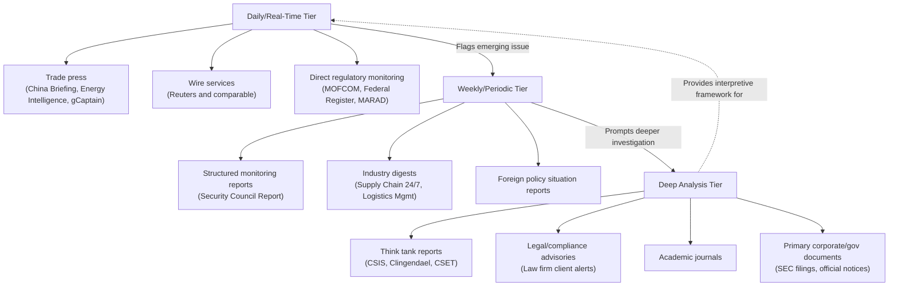

## Essential Publications, Journals, and Ongoing Reading Practice

### Overview

Maintaining current expertise in supply chain geopolitics requires a deliberate, multi-tiered reading practice, since the field's fast-moving regulatory and event-driven developments (as demonstrated across this course's case studies — the rare earth control suspension changing status within a single month, the Red Sea crisis pausing and resuming multiple times) quickly outdate static knowledge. This item outlines the publication categories and reading cadence practices that sustain professional currency in the field.

### Publication Category Framework

**Key Points**

- No single publication type provides complete coverage; effective practice requires deliberately layering sources across different update frequencies and analytical depths, mirroring the institutional information-flow structure described in the previous item (primary source → translation/analysis → strategic synthesis → ongoing monitoring)
- Reading practice should be organized around **frequency tiers**: daily/real-time monitoring, weekly synthesis, and periodic deep-dive strategic analysis — treating these as complementary rather than substitutable

### Tier 1: Daily and Real-Time Monitoring Sources

- **Specialized trade and sector press**: publications such as China Briefing (China regulatory tracking), Energy Intelligence Group (energy and shipping markets), and gCaptain (maritime industry news) provide near-real-time updates on regulatory status changes and market events — essential for catching fast-moving developments like the April-October-November 2025 rare earth control timeline documented in this course
- **Wire services and financial news**: Reuters, and comparable wire services, provide primary breaking coverage of trade data releases, sanctions actions, and market-moving events, often serving as the fastest available source before deeper analysis follows
- **Government and regulatory primary sources**: direct monitoring of official channels (MOFCOM announcements, US Federal Register export control updates, MARAD maritime advisories) provides unmediated access to the actual regulatory text, avoiding potential distortion introduced by secondary reporting

### Tier 2: Weekly and Periodic Synthesis Publications

- **Security Council Report's Monthly Forecast**: exemplifies a structured periodic synthesis product, providing regular assessment of UN Security Council agenda items (including ongoing Red Sea monitoring) at a cadence suited to tracking slower-moving multilateral processes
- **Sector-specific industry digests**: publications covering logistics and supply chain technology (Supply Chain 24/7, Logistics Management) aggregate weekly developments across autonomous shipping, AI adoption, and broader operational trends
- **Foreign policy and international affairs weeklies**: general international affairs publications with dedicated geopolitics/security coverage (national security-focused newsletters and situation reports) provide broader context connecting individual supply chain events to overarching strategic dynamics

### Tier 3: Deep Analytical and Strategic Publications

- **Think tank policy briefs and reports**: longer-form analysis from institutions such as CSIS, Clingendael, and CSET (introduced in the previous item) provides the strategic depth and historical context that daily monitoring cannot supply — exemplified by Clingendael's three-part Arctic strategy series or CSIS's one-year retrospective analysis of rare earth export restrictions
- **Legal and regulatory advisory publications**: law firm client alerts and compliance-focused analysis (as produced by firms like White & Case and CMS) provide the precise regulatory interpretation needed for the technical extraterritorial jurisdiction and licensing-mechanism details covered in this course's rare earth case study
- **Academic and peer-reviewed journals**: scholarly outlets in international political economy, trade policy, and supply chain management provide the theoretical and methodological grounding (e.g., game-theoretic analysis of export control strategy, as referenced via Resources for the Future's analytical brief) that connects individual events to generalizable frameworks
- **Corporate and institutional primary documents**: SEC filings (10-K, 8-K, ARS), investor presentations, and official government policy documents provide directly verifiable operational and strategic detail, avoiding the interpretive layer inherent in secondary analysis

### Reading Practice Architecture Diagram

### Establishing a Sustainable Reading Cadence

**Example**

A representative weekly reading practice structure for a working supply chain risk professional:

1. **Daily (10–15 min)**: scan 2–3 trade press or wire service sources for sector-relevant headlines; flag anything requiring deeper follow-up
2. **Weekly (30–60 min)**: read one structured synthesis publication relevant to current focus areas (e.g., a Security Council Report monthly forecast during an active Red Sea monitoring period)
3. **Monthly (2–3 hours)**: read one or two think tank deep-dive reports or academic articles relevant to ongoing strategic questions, prioritizing publications directly addressing current live issues (e.g., reading a rare earth retrospective during a period of active US-China negotiation)
4. **As-triggered**: when a significant event occurs (a new export control notice, a chokepoint attack), pull the primary regulatory or government document directly rather than relying solely on secondary summary, following the institutional information-flow pattern described in the previous item

### Source Triangulation Practice

**Key Points**

- Given the demonstrated pattern of rapidly evolving and sometimes contested facts (e.g., the White House and Chinese government offering differing characterizations of licensing commitments in the November 2025 rare earth truce, as documented in this course's rare earth case study), effective reading practice requires deliberate triangulation across sources with different institutional perspectives rather than reliance on a single outlet
- Distinguishing between primary regulatory text, neutral wire reporting, and analysis with an institutional viewpoint (government-affiliated, industry-affiliated, or advocacy-affiliated) is a core critical-reading skill for this field, since framing and emphasis can differ substantially across source types covering the same underlying event
- Maintaining awareness of a source's typical update lag (real-time wire versus monthly think-tank cycle) helps calibrate how current any given piece of analysis actually is relative to fast-moving developments

### Behavioral and Forecasting Caveats

The specific publications named throughout this item reflect sources referenced across this course's case studies and are illustrative rather than an exhaustive or definitively ranked list; the broader universe of relevant sector-specific and regional publications is considerably larger and should be tailored to an individual practitioner's specific regional and sectoral focus areas. Publication quality, editorial focus, and accessibility (paywall status, translation availability) change over time and were not independently re-verified beyond their appearance in this course's underlying source material.

### Related Topics

- Critical source evaluation and institutional-bias-aware reading practices
- Building a personal or team-based news monitoring and alert system
- Primary-source document literacy (reading regulatory notices, SEC filings, UN resolutions directly)
- Academic journals in international political economy and trade policy
- Translating fast-moving trade press coverage into structured risk-team briefings
- Comparative regional press landscapes (US, EU, Chinese state and independent media) for geopolitical monitoring