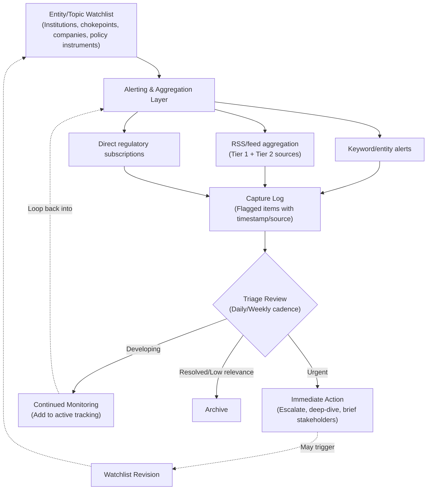

## Building a Personal Geopolitical Monitoring System

### Overview

A personal geopolitical monitoring system is a deliberately constructed set of tools, sources, and routines that converts the reading practice described in the previous item into a structured, low-friction habit capable of surfacing relevant developments before they become urgent. Unlike ad hoc news consumption, an effective monitoring system is designed around specific tracked entities and topics, uses layered alerting to match urgency to attention, and includes a lightweight capture mechanism so that signals are not lost between observation and action.

### Design Principles

**Key Points**

- **Signal-to-noise optimization**: the system should be scoped narrowly enough to track entities and topics genuinely relevant to the practitioner's responsibilities (specific regions, sectors, chokepoints, or regulatory regimes), rather than attempting comprehensive global coverage, which produces unsustainable volume and attention fatigue
- **Tiered urgency routing**: not every tracked development warrants the same response speed; the system should distinguish between developments requiring same-day awareness (an active export control notice, a chokepoint attack) and those suited to weekly or monthly review (a think tank strategic forecast)
- **Redundant source coverage for critical topics**: for the highest-priority tracked issues, deliberately monitor multiple source types (primary regulatory, wire service, specialized trade press) simultaneously, applying the triangulation practice described in the previous item, since single-source monitoring creates blind spots to framing bias or reporting lag

### Core System Components

#### Entity and Topic Watchlist

- Define a specific, bounded watchlist of tracked entities: named institutions (MOFCOM, specific regulatory bodies), geographic chokepoints (Bab el-Mandeb, Strait of Hormuz, the Northern Sea Route), named companies (critical suppliers, key competitors), and policy instruments (specific sanctions regimes, export control notice series)
- Review and revise the watchlist periodically — entities that generated the highest-value signals in one period (e.g., MOFCOM during the 2025 rare earth escalation) may recede in relative importance while others emerge, requiring active curation rather than a static list

#### Alerting and Aggregation Layer

- **Keyword and entity-based alerts**: configured search alerts (via search engines, news aggregators, or specialized monitoring platforms) tied to specific watchlist entities, providing push notification when new content matches
- **RSS/feed aggregation**: subscribing directly to the feeds of Tier 1 and Tier 2 sources identified in the previous item's publication framework, consolidated into a single reading interface to reduce the friction of checking multiple sites individually
- **Government and regulatory direct-source monitoring**: subscribing directly to official notification channels (regulatory agency mailing lists, Federal Register-equivalent services) for the specific instruments most relevant to the practitioner's tracked topics, ensuring primary-source access without dependence on secondary reporting speed

#### Capture and Triage Workflow

- A lightweight capture mechanism (a running log, a tagged note-taking system) to record flagged developments at the moment of observation, preventing loss of signal during a busy period
- A regular triage routine — reviewing captured items on a set cadence (daily quick-scan, weekly deeper review) — to sort flagged items into: requires immediate action, requires monitoring for further development, or can be archived as resolved/no longer relevant

### System Architecture Diagram

### Applying the System to This Course's Case Studies

**Example**

An illustrative watchlist entry and monitoring configuration, using the rare earth export controls case study as a template:

1. **Watchlist entities**: MOFCOM, GAC, specific notice numbers (55–58, 61–62 of 2025), MP Materials, Lynas, relevant DoD offices
2. **Tier 1 monitoring**: alerts configured for "MOFCOM rare earth," direct subscription to China Briefing's regulatory tracking updates
3. **Tier 2 monitoring**: periodic review of European Parliament EPRS publications on critical raw materials
4. **Tier 3 monitoring**: quarterly review of CSIS and CSET rare earth-focused publications for strategic context
5. **Triage outcome example**: the November 7, 2025 suspension announcement would trigger an "urgent" triage classification (material status change requiring stakeholder briefing), while a routine monthly export volume data release might be classified "developing" (relevant context, no immediate action required)

This structure would have allowed a practitioner to track the full April–October–November 2025 escalation-and-suspension cycle in near-real-time rather than discovering the sequence of events retrospectively.

### Calibrating System Scope to Role

**Key Points**

- A corporate supply chain risk analyst's watchlist should be scoped tightly around the specific suppliers, regions, and product categories relevant to their organization's actual sourcing footprint, prioritizing depth over breadth
- A policy analyst or think tank researcher may require broader topical coverage across multiple regions and sectors but can accept less granular depth on any single tracked entity, since their output is typically comparative or synthetic rather than operationally specific
- A generalist building early-career expertise (see the career paths item) benefits from an intentionally broader watchlist during the learning phase, narrowing toward specialization as career focus develops — mirroring the specialization areas (critical minerals, AI supply chains, maritime chokepoints) identified in that item

### Common Failure Modes

- **Watchlist sprawl**: adding entities and topics without corresponding removal, eventually producing unmanageable alert volume that degrades signal quality and leads to alert fatigue and disengagement
- **Single-source dependency**: relying on one aggregator or one publication type for a high-priority topic, creating vulnerability to that source's blind spots, delays, or discontinuation
- **Capture without triage**: accumulating flagged items without a consistent review cadence, which defeats the purpose of capture by allowing genuinely urgent signals to sit unreviewed alongside routine ones
- **Static watchlist**: failing to periodically revisit and revise tracked entities as the practitioner's role, organizational priorities, or the broader geopolitical landscape shifts — a monitoring system built around 2023-era priorities would have been poorly positioned to catch the 2025 rare earth escalation without active updating

### Behavioral and Forecasting Caveats

The specific tools and platforms suited to implementing this system (alerting services, aggregation software, note-taking systems) change over time and were intentionally described here at the functional/architectural level rather than as specific product recommendations, since particular tools are far more likely to become outdated than the underlying design principles. The optimal balance between monitoring breadth and depth is inherently role- and organization-specific, and the guidance above should be treated as a starting framework for individual calibration rather than a fixed prescription.

### Related Topics

- RSS and feed aggregation tool selection criteria
- Building organizational (team-level) versus individual monitoring systems
- Alert fatigue and attention management in high-volume information environments
- Structured note-taking and knowledge management systems for ongoing research practice
- Translating personal monitoring output into formal risk-team briefing formats
- Watchlist design for specific sub-specializations (critical minerals, maritime chokepoints, AI governance)