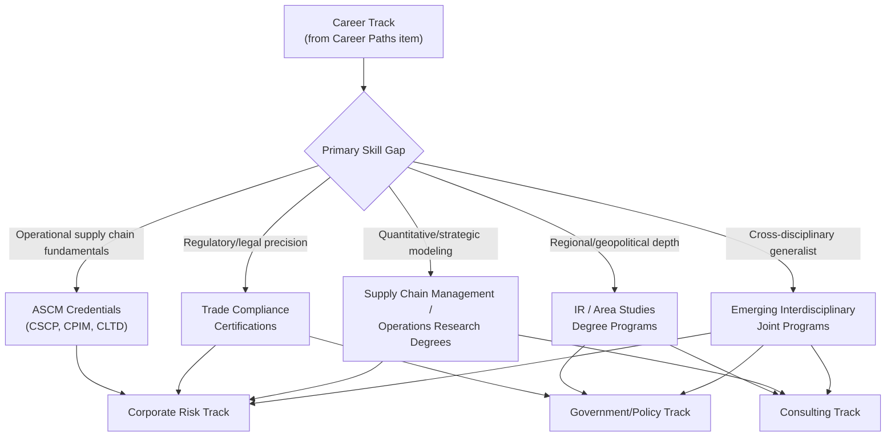

## Professional Certifications and Academic Programs in the Field

### Overview

Unlike more mature professional fields with a single dominant credential, supply chain geopolitics draws on a hybrid landscape of established supply chain management certifications, international affairs and political science degree programs, specialized trade compliance credentials, and emerging interdisciplinary offerings. No single certification currently captures the full cross-disciplinary scope the field requires, meaning practitioners typically combine credentials from multiple tracks.

### Established Supply Chain Management Certifications

#### APICS Certified Supply Chain Professional (CSCP)

- Administered by the Association for Supply Chain Management (ASCM), the CSCP is among the most widely recognized global credentials for supply chain professionals, covering an eight-module body of knowledge
- Module 7, **Supply Chain Risk**, and Module 2, **Global Supply Chain Networks**, are the components most directly relevant to geopolitical risk practice, though the full curriculum (demand forecasting, sourcing, internal operations, logistics, relationships, optimization/sustainability/technology) provides essential operational grounding that geopolitical analysis alone does not supply
- Format: the learning system is typically delivered via instructor-led courses (in-person or virtual, often spanning 5–13 sessions depending on provider and chapter), self-paced study materials, and a certification exam; regional ASCM chapters offer varying schedules and pricing, generally in the range of $2,900–$4,250 depending on membership status and bundle inclusions (exam voucher, retake allowance)
- ASCM materials cite salary increases of up to 33–41% and a certified-professional earnings premium of approximately 27% over non-certified peers, though such figures should be treated as organization-published marketing statistics rather than independently verified labor market data [Unverified]
- The CSCP curriculum has continued to incorporate emerging technology content (ERP, IoT, AI adoption for visibility and forecasting) in its ongoing updates, reflecting the same technology-resilience themes covered in this course's AI and autonomous logistics case studies

#### Other ASCM/APICS Credentials

- **CPIM (Certified in Planning and Inventory Management)**: focused more narrowly on internal operations, planning, and inventory — a complementary rather than substitute credential to CSCP for professionals whose roles emphasize operational planning alongside risk assessment
- **CLTD (Certified in Logistics, Transportation and Distribution)**: relevant for practitioners whose focus skews toward the physical movement and routing decisions central to case studies like the Red Sea crisis and autonomous shipping

### Trade Compliance and Export Control Credentials

- Specialized certifications in export control and trade compliance (offered by organizations focused specifically on customs and international trade law) provide the precise regulatory literacy needed to interpret instruments like the MOFCOM Notice 61/62 extraterritorial provisions examined in this course's rare earth case study
- These credentials are typically narrower in scope than CSCP but deeper in regulatory-legal technical detail, making them a natural complement for practitioners in trade compliance-specific roles (see the career paths item) rather than a substitute for broader supply chain or geopolitical training

### Academic Degree Programs

#### International Relations and Political Science

- Traditional international relations, political science, and area studies degrees (undergraduate and graduate) provide the geopolitical analysis, regional expertise, and historical grounding foundational to interpreting events like the Russia-Ukraine energy crisis or Arctic geopolitical contestation
- Regional specialization tracks (China studies, Russian/Eurasian studies, Middle East studies) paired with language training offer the primary-source analytical capability increasingly valued for roles requiring direct interpretation of non-English regulatory or policy documents

#### Supply Chain Management and Operations Degrees

- Graduate programs in supply chain management, operations research, or logistics (often housed within business schools) provide the quantitative and operational grounding underlying frameworks like the JIT fragility and scenario planning methodologies covered in this course
- These programs increasingly incorporate risk management and resilience-focused coursework as a response to the same disruption pattern (2011 Japan, COVID-19, 2021 Texas storm) that has driven broader field growth

#### Emerging Interdisciplinary Programs

- A growing number of institutions have begun offering joint or interdisciplinary programs explicitly combining supply chain/operations management with international affairs, trade policy, or security studies — a direct academic response to the cross-disciplinary skill set identified in the career paths item
- These programs remain less standardized and less numerous than either parent discipline's traditional offerings, reflecting the field's continued relative youth [Inference — the pace at which such interdisciplinary programs will proliferate and standardize is not established with confidence]

### Credential and Program Selection Framework

### Combining Credentials: A Practical Pattern

**Example**

A representative credentialing pathway for a corporate geopolitical risk officer role (see career paths item):

1. Undergraduate degree in international relations or political science with a regional concentration (e.g., East Asian studies, given China's centrality across this course's case studies)
2. Several years of operational experience in procurement, sourcing, or supply chain operations, building the practical foundation the CSCP curriculum formalizes
3. CSCP certification, specifically to gain structured grounding in Module 7 (Supply Chain Risk) and Module 2 (Global Supply Chain Networks) alongside the broader operational body of knowledge
4. Ongoing informal education through the reading practice and monitoring system described in the two preceding items, substituting for a lack of any single comprehensive "geopolitical risk" academic credential

### Assessing Credential Value

**Key Points**

- No certification or degree alone qualifies a practitioner for this field's full scope; the interdisciplinary nature documented throughout this course (spanning trade law, regional politics, supply chain operations, and increasingly AI/technology literacy) means credential combinations, not single credentials, define practical readiness
- Employer and program-published salary premium statistics (such as ASCM's cited 27–41% figures) should be treated as directional marketing claims rather than independently verified data, and actual value varies substantially by role, region, seniority, and whether the certification is paired with relevant experience
- The absence of a single dominant, universally recognized "geopolitical risk" credential — in contrast to the well-established CSCP for operational supply chain management — reflects the field's continued formation as a distinct discipline, consistent with the institutional and publication landscape described in the two preceding items

### Behavioral and Forecasting Caveats

Specific program costs, schedules, and curriculum details (such as those cited for CSCP) are subject to change by administering organizations and regional chapters, and the figures presented here reflect a snapshot as of the current period rather than a guaranteed current offering. Claims about salary premiums associated with specific certifications are [Unverified] as independently confirmed labor market data and are sourced from certifying-body promotional material. The trajectory of interdisciplinary program development is [Speculation], given the field's early stage and the absence of long-run outcome data for such programs.

### Related Topics

- ASCM/APICS credential comparison: CSCP vs. CPIM vs. CLTD
- Export control and trade compliance certification bodies and exam structures
- Regional and area studies graduate programs relevant to supply chain geopolitics
- Building a self-directed learning plan absent a single unifying credential
- Employer perspectives on credential value versus demonstrated experience
- Comparative international credentialing landscapes (US ASCM vs. European and Asian equivalents)