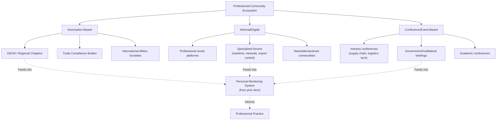

## Professional Communities and Networks in Trade and Geopolitics

### Overview

Beyond formal credentials and publications, sustained expertise in supply chain geopolitics depends on active participation in professional communities — peer networks that provide practitioner-level insight, informal early warning, and career development opportunities that neither solo reading practice nor formal education fully replicate. This item catalogs the community types relevant to the field and how they complement the monitoring and credentialing infrastructure described in the preceding items.

### Why Professional Communities Matter in This Field

**Key Points**

- Formal publications (see the publications item) typically lag real-time developments by hours to weeks; practitioner networks often surface operationally relevant signal — a supplier's informal report of delayed shipments, a colleague's on-the-ground observation — faster than published analysis, complementing rather than replacing the monitoring system described in that item
- The interdisciplinary nature of this field (spanning trade law, regional politics, supply chain operations, and technology policy, as established in the career paths and certifications items) means no single professional association fully represents practitioners; effective network-building typically requires deliberate engagement across multiple, only partially overlapping communities
- Peer communities provide a check against the source-triangulation blind spots discussed in the publications item — practitioners in different functional roles (compliance, operations, policy) often notice different early signals from the same underlying event

### Association-Based Professional Communities

#### Supply Chain Management Associations

- **ASCM (Association for Supply Chain Management) and its regional/local chapters**: beyond administering the CSCP and related certifications discussed in the previous item, ASCM chapters host regular in-person and virtual events, study groups, and networking sessions that provide ongoing peer contact for certified and certifying professionals
- Local chapter structures (evident in the regional CSCP program scheduling patterns — Atlanta, Colorado, Wisconsin, New Jersey chapters each running their own course cadences) mean practitioner communities often form around geographic or metro-area hubs in addition to national or global association membership
- Chapter-level events (study sessions, guest speaker programs) function as a lower-commitment entry point for practitioners early in their credentialing journey to begin building peer relationships before or alongside formal certification

#### Trade and Compliance Professional Bodies

- Organizations focused specifically on customs, export control, and trade compliance provide a professional community distinct from the broader supply chain management associations, oriented around the regulatory-legal technical depth discussed in the certifications item
- These bodies often provide members with direct access to compliance officers and legal practitioners actively working through developments like the MOFCOM extraterritorial jurisdiction provisions examined in this course's rare earth case study, offering practitioner-level interpretation ahead of formal published legal analysis

#### International Affairs and Policy Communities

- Membership organizations and professional societies in international relations and foreign policy provide a parallel community oriented toward the geopolitical and regional-expertise dimension of the field, complementing the operationally focused supply chain associations
- Think tank-affiliated fellow and associate programs (at institutions such as those discussed in the institutions item — CSIS, Clingendael) often include structured alumni or affiliate networks that extend engagement beyond a single published report or event

### Informal and Digital Communities

**Key Points**

- Professional social platforms (particularly those oriented around career and industry content) host active discussion communities among supply chain, trade policy, and geopolitical risk practitioners, often surfacing practitioner commentary and debate on breaking developments faster than formal publication cycles
- Specialized online forums and discussion groups oriented around specific sub-domains (maritime shipping, critical minerals, export controls) provide narrower but often deeper practitioner engagement than general-purpose professional networks
- Newsletter and podcast communities built around specific trade press or think tank publications (referenced in the publications item) frequently include comment sections, reader Q&A, or companion discussion spaces that function as a lightweight community layer around otherwise one-directional published content

### Conference and Event-Based Networks

- Industry conferences focused on supply chain management, logistics technology, and trade policy provide concentrated, time-bound opportunities for network-building, often featuring the same institutions and practitioners cited throughout this course (industry speakers on autonomous logistics, panel discussions on critical minerals policy)
- Government and multilateral-affiliated events (briefings, public hearings, and comment periods associated with bodies like those discussed in the institutions item) offer a distinct networking channel oriented toward policy and regulatory practitioners specifically
- Academic conferences in international political economy, trade policy, and operations research provide a channel for engaging with the academic and journal-based research discussed in the publications item, useful particularly for practitioners bridging applied and scholarly work

### Community Ecosystem Diagram

### Building a Deliberate Network Strategy

**Example**

A representative network-building approach for a practitioner early in the corporate risk track (see career paths item):

1. Join a local ASCM chapter, attending events even before pursuing CSCP certification, to begin building peer relationships in a low-commitment setting
2. Identify and engage with two or three specialized digital communities aligned to a chosen specialization area (e.g., a critical minerals-focused forum, given the field's growing specialization documented in the career paths item)
3. Attend at least one relevant industry or policy conference annually, prioritizing events featuring institutions already identified as authoritative in the reading practice (CSIS, Clingendael-affiliated events, or sector-specific trade conferences)
4. Maintain light-touch engagement with think tank affiliate or alumni networks where accessible, even without formal fellowship status, through public events and mailing lists

### Community Engagement as a Complement to Formal Credentials

**Key Points**

- Professional communities and formal credentials (see the certifications item) serve complementary rather than substitutable functions: certifications provide structured, verifiable knowledge baselines, while communities provide ongoing, informal, current-event-responsive peer exchange that no static curriculum can fully replicate
- Given the field's continued formation as a distinct discipline (noted in the certifications item's discussion of the absence of a single unifying credential), professional communities currently play an outsized role in field-specific knowledge transfer relative to more mature, single-credential professions
- Community engagement also functions as a practical extension of the personal monitoring system described in the previous item — peer networks frequently serve as an informal, high-trust node in the alerting and triangulation layers of that system

### Behavioral and Forecasting Caveats

Specific platforms, associations, and forums relevant to this field evolve over time, and this item intentionally describes community types and functions rather than naming specific current platforms or membership organizations, since particular digital communities in particular are subject to rapid change in relevance and activity level. The relative value of association-based versus informal digital communities for a given practitioner is [Inference], dependent substantially on individual role, regional context, and specialization area, and is not established by any single authoritative source.

### Related Topics

- ASCM regional chapter structures and local event programming
- Trade compliance professional bodies and their member benefit structures
- Think tank fellow and affiliate program networks
- Building cross-functional internal networks within a single organization
- Conference selection strategy for early-career versus senior practitioners
- Digital community moderation and信号quality in specialized professional forums