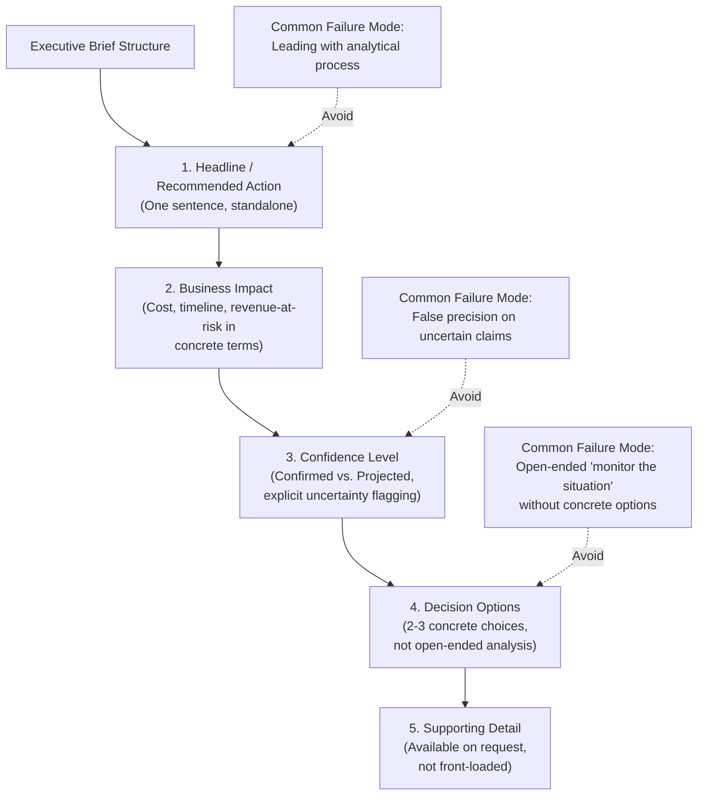

## Translating Geopolitical Analysis into Executive Decision Making

### Overview

Geopolitical analysis has limited organizational value until it is translated into a form executives can act on: concrete decisions about sourcing, inventory, market entry/exit, and capital allocation, made under time pressure and competing priorities. This translation function is arguably the field's most consequential practical skill, since even excellent analysis (of the kind produced by the institutions and publications discussed in earlier items) fails to influence outcomes if it does not reach decision-makers in an actionable form at the right moment.

### Why Translation Is a Distinct Skill from Analysis

**Key Points**

- Analytical depth and executive communication are different competencies: the detailed regulatory parsing needed to understand MOFCOM Notice 61's extraterritorial provisions (as examined in the rare earth case study) is not the same skill as condensing that analysis into a one-page decision brief an executive can act on in minutes
- Executives operate under continuous competing-priority pressure; geopolitical risk is one of many inputs competing for limited attention alongside financial, operational, and customer-facing concerns, meaning analysis must earn its relevance rather than assume it
- Poor translation is a common and costly failure mode: technically excellent analysis that arrives too late, at excessive length, or without a clear decision recommendation frequently fails to influence outcomes regardless of its underlying quality

### Core Translation Principles

#### Lead with the Decision, Not the Analysis

- Executive-facing communication should open with the recommended action or key implication, not the analytical process that produced it — reversing the structure typical of academic or deep-dive analytical writing (of the kind discussed in the publications item's Tier 3 sources)
- A useful test: can the first sentence of the communication stand alone as something an executive could act on or repeat to their own leadership, without needing the supporting paragraphs to make sense of it

#### Calibrate Confidence and Uncertainty Explicitly

- Given this field's frequent reliance on [Inference] and [Speculation]-level claims about future trajectories (as flagged throughout this course's case studies), executive communication must convey confidence level clearly rather than presenting uncertain projections with false precision
- Distinguish explicitly between what is confirmed (e.g., "China suspended the October 2025 rare earth controls through November 2026") and what is projected (e.g., whether the suspension will be extended or allowed to lapse) — collapsing this distinction misleads decision-makers about the actual risk they are accepting

#### Quantify Impact in Business Terms, Not Geopolitical Terms

- Translate geopolitical developments into the specific business metrics executives use to make decisions: cost impact, timeline impact, revenue-at-risk, or capital requirement — as illustrated by the Red Sea case study's translation of shipping disruption into concrete freight rate premiums ($800–$1,500 per 40ft container) and transit-time impacts (10–14 additional days) rather than leaving the analysis at the level of "Houthi attacks continue"
- This mirrors the expected-cost framework introduced in the JIT fragility case study — executive decision-making is best served by explicit cost-of-disruption estimates set against cost-of-mitigation options, not qualitative risk narratives alone

### Structuring an Executive Brief

### Matching Communication Format to Decision Urgency

**Key Points**

- **Crisis/urgent decisions** (e.g., an active chokepoint attack affecting in-transit shipments, as in the Red Sea case study): require extremely condensed, immediately actionable communication — often a single paragraph or verbal briefing focused entirely on the recommended immediate action, with detailed analysis deferred until after the urgent decision is made
- **Strategic/planning decisions** (e.g., whether to pursue supply chain diversification in response to structural rare earth dependency risk): warrant a more developed brief incorporating the scenario planning framework discussed in that case study, presenting multiple options with their robustness across plausible future scenarios rather than a single urgent recommendation
- **Ongoing monitoring updates** (e.g., periodic status updates on an evolving situation like the multi-phase Red Sea crisis or the rare earth escalation-suspension cycle): benefit from a consistent, recurring brief format that allows executives to quickly identify what has changed since the last update, rather than requiring them to re-read full context each time

### Applying the Framework: A Worked Example

**Example**

Translating the November 2025 rare earth export control suspension (from the rare earth case study) into an executive brief:

*Poor translation (analysis-first, low actionability):*

"China's MOFCOM issued Notices 55-58 and 61-62 in October 2025, introducing extraterritorial jurisdiction provisions and a 50% Affiliates Rule that created presumptive denial for listed-entity subsidiaries. Following the Xi-Trump summit, a reciprocal suspension was negotiated..."

*Effective translation (decision-first, business terms, confidence-calibrated):*

"**Recommendation**: Maintain current sourcing diversification investment (no acceleration needed) but continue tracking through Q4 2026. **Why**: China suspended the October 2025 export controls affecting [specific component category] through November 2026 — confirmed. **Risk**: The suspension is a negotiated pause, not a resolution; the underlying regulatory mechanism remains in place and could be reactivated with limited notice — this is a genuine, not resolved, risk. **Decision options**: (1) maintain current pace of alternate-supplier qualification, (2) accelerate given the 2027 renewal uncertainty, (3) pause diversification spend and reassess closer to the November 2026 deadline. **Recommended**: Option 1, revisit in Q3 2026 as the suspension deadline approaches."

### Building Executive Trust and Credibility Over Time

- Consistent accuracy in confidence calibration — being explicit and correct about what is confirmed versus projected, and being willing to say "this is genuinely uncertain" rather than manufacturing false confidence — builds the credibility that makes future recommendations more readily acted upon
- Following up on prior predictions and flagged risks (whether they materialized or not) demonstrates accountability and helps executives calibrate how much weight to place on future analysis from the same source, functioning as an informal track record
- Over-alerting on low-confidence or low-impact developments erodes the same credibility that under-alerting on genuine risks does — the triage discipline described in the personal monitoring system item applies equally to what gets escalated to executive attention

### Behavioral and Forecasting Caveats

The specific brief structure and worked example presented here illustrate general principles rather than a single universally correct format; effective executive communication style varies by organizational culture, executive preference, and decision context, and should be adapted accordingly. Claims about which communication approaches most effectively influence executive decision-making are grounded in general business communication practice rather than field-specific empirical study, and the degree to which any single framework generalizes across organizations is [Inference].

### Related Topics

- Risk quantification methods: translating qualitative geopolitical risk into expected-cost figures
- Crisis communication protocols for time-sensitive supply chain disruption events
- Building organizational credibility and track record as a risk function
- Board-level versus operational-executive communication format differences
- Scenario-based decision briefs and robustness-tested option presentation
- Post-event review practices for calibrating future analytical confidence